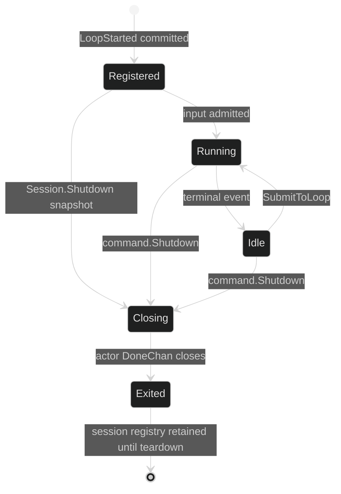

# Live Loop controllers

The session registry owns every loop handle for the session, including child
loops created by delegation. `ActiveLoop` is a mutable default target for
`Submit`; it is not a separate worker and changing it does not stop any loop.

## Loop views

The data-plane methods have exact signatures:

```go
ActiveLoop() loop.Handle
Loop(uuid.UUID) (loop.Handle, bool)
LoopController(uuid.UUID) (loop.Controller, bool)
SetActiveLoop(context.Context, uuid.UUID) error
```

The read-only handle is:

```go
type Handle interface {
	ID() uuid.UUID
	Mode() ModeName
	Model() model.Model
}
```

`Loop` returns a registered handle even when an idle child remains in the
registry. The boolean is false only when the UUID is not registered. A handle's
`Mode` and `Model` are updated from the actor's committed change reply, so the
view does not run ahead of durable state.

## Active selection

`SetActiveLoop` serializes active-loop selection with shutdown. It refuses a
missing ID, an exited actor, a closing session, or a faulted session. A change
to a different loop publishes `event.ActiveLoopChanged` before changing the
in-memory default. Re-selecting the current loop is a no-op.

```go
func sendToFocused(ctx context.Context, c session.SessionController, blocks []content.Block) error {
	h := c.ActiveLoop()
	if h == nil {
		return fmt.Errorf("no active loop")
	}
	if _, err := c.SubmitToLoop(ctx, h.ID(), blocks); err != nil {
		return err
	}
	return nil
}
```

The focused UUID is sampled by the caller in this example. A later
`SetActiveLoop` does not retarget the already-created command.

## Controller ownership

The exact trusted loop mutation interface is:

```go
type Controller interface {
	Handle
	SetMode(context.Context, ModeName) error
	Change(context.Context, ...Change) error
	Interrupt(context.Context) error
}
```

`SetMode` and `Change` are actor operations at a turn boundary. A failed batch
is not partially applied. `Interrupt` covers the selected loop and every loop
below it in the delegation tree; use the session's `Interrupt` for all live
loops.

```go
loopID := c.ActiveLoop().ID()
controller, ok := c.LoopController(loopID)
if !ok {
	return fmt.Errorf("loop %s is no longer registered", loopID)
}
if err := controller.SetMode(ctx, loop.ModeName("review")); err != nil {
	var change *loop.ChangeError
	if errors.As(err, &change) {
		return fmt.Errorf("mode change %s: %w", change.Kind, err)
	}
	return err
}
```

## Loop lifetime

The session retains child handles after a completed agent turn. `RunAgent` is
an internal orchestration helper and closes its event subscription, not the
sub-loop. `Shutdown` snapshots every registered loop and sends each one a
shutdown command before the final session cancellation. This is why callers
must not assume that an idle handle can be garbage-collected independently.



## Source and proof

- [`Session` loop methods](https://github.com/looprig/harness/blob/main/internal/sessionruntime/session.go)
- [`loop.Handle` and `loop.Controller`](https://github.com/looprig/harness/blob/main/pkg/loop/controller.go)
- [`active-loop and controller contract`](https://github.com/looprig/harness/blob/main/pkg/session/session.go)
- [`loop registry and lifecycle tests`](https://github.com/looprig/harness/blob/main/internal/sessionruntime/session_test.go)
