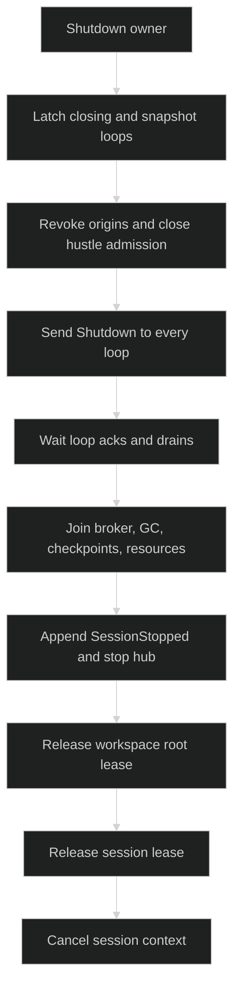

# Shutdown

`SessionController.Shutdown` is the owned teardown transaction. It closes
admission, reaches every registered loop, joins resources and durable event
publication, then releases workspace and session ownership. It is safe to call
from more than one goroutine, but every caller should still use one shared
controller lifetime.

## Shutdown contract

```go
func (s SessionController) Shutdown(context.Context) error
```

The first caller becomes the teardown owner. Later callers wait for the same
cleanup result. A nil context is treated as `context.Background()` by the
runtime. Shutdown returns a `*session.SessionError` with
`SessionContextDone` when its own cleanup error or the caller's context error
must be reported; the cleanup itself is not detached when a caller cancels.

## Teardown order

The order is load-bearing:

1. Serialize with active-loop selection, latch `closing`, and snapshot every
   registered loop under the same lock used by `NewLoop` registration.
2. Revoke collaboration origins, stop permission reviews, close hustle
   admission, and send `command.Shutdown` to every loop in the snapshot.
3. Wait for each reached loop's acknowledgement and actor drain, then join
   hustle terminal audit, finalizers, and blocking activity.
4. Close collaboration broker, stop offload GC, stop checkpoints, and fully
   shut down session resources while the hub and journal are still live.
5. Stop the hub, which appends/delivers `SessionStopped` before it stops
   publication.
6. Release the exclusive workspace root lease, then the session lease, and
   cancel `sessionCtx` last.



## Concurrent callers

Only one cleanup owner runs. A second call waits on `shutdownDone`, then sees
the same aggregate cleanup result. If the second caller's context is already
cancelled, its context error is combined after shared cleanup completes; it
does not interrupt or reorder the first caller's teardown.

```go
var wg sync.WaitGroup
errs := make(chan error, 2)
for i := 0; i < 2; i++ {
	wg.Add(1)
	go func() {
		defer wg.Done()
		errs <- controller.Shutdown(context.Background())
	}()
}
wg.Wait()
close(errs)
for err := range errs {
	if err != nil {
		return err
	}
}
```

## Caller context

Loop, checkpoint, hub, and durable-I/O phases receive private deadlines based
on validated component bounds. The caller context is diagnostic at the outer
boundary. Lease release uses fresh bounded contexts and is attempted exactly
once. A shutdown error can be a single underlying typed error or a
`shutdownErrorSet` joined error; use `errors.As` to inspect each cause.

```go
if err := controller.Shutdown(ctx); err != nil {
	var se *session.SessionError
	if errors.As(err, &se) {
		log.Printf("shutdown session error: %v", se)
	}
	return err
}
```

After shutdown, submits and active-loop changes fail closed, and no new loop
can be registered. The durable `SessionStopped` event remains in history for
the next restore attempt.

## Source and proof

- [`Session.Shutdown` and ordering](https://github.com/looprig/harness/blob/main/internal/sessionruntime/session.go)
- [`shutdown cleanup phases`](https://github.com/looprig/harness/blob/main/internal/sessionruntime/shutdown_cleanup.go)
- [`shutdown error taxonomy`](https://github.com/looprig/harness/blob/main/pkg/session/errors.go)
- [`shutdown lifecycle tests`](https://github.com/looprig/harness/blob/main/internal/sessionruntime/session_test.go)
- [`concurrent shutdown tests`](https://github.com/looprig/harness/blob/main/internal/sessionruntime/lifecycle_test.go)
