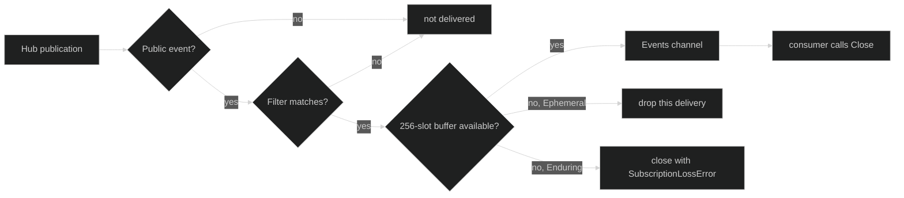

# Subscriptions

`Session.SubscribeEvents` attaches a consumer to the session hub. The filter
is evaluated before the subscription's bounded egress send. Delivery is a live
view, not proof that a value was persisted.

## Filter contract

The exact filter types are:

```go
type EventFilter struct {
	Ephemeral LoopScope
	Enduring  LoopScope
}

type LoopScope struct {
	All   bool
	Loops map[uuid.UUID]struct{}
}

func (s LoopScope) Matches(loopID uuid.UUID) bool
func ShouldDeliver(filter EventFilter, ev Event) bool
```

Public session-scoped events bypass loop selection. Public loop-scoped events
select `Ephemeral` or `Enduring` by the event's class. Internal events never
enter ordinary subscriptions. A zero `LoopScope` matches no loop; use
`All: true` or a non-empty UUID set deliberately.

| Event class | `Delivery.JournalSeq` | Overflow policy |
| --- | ---: | --- |
| Ephemeral | `0` | drop for this slow subscriber |
| Enduring | assigned ledger sequence | fail the subscriber with `SubscriptionLossError` |

## Delivery contract

The exact consumer interface is:

```go
type Subscription interface {
	Events() <-chan Delivery
	Close() error
	Err() error
}

type Delivery struct {
	Event          Event
	JournalSeq     uint64
	EventID        string // public event ID; empty unless PublicBody is set
	PublicBody     []byte // committed canonical public body, cloned per subscriber
	CoveredThrough uint64 // equals JournalSeq when committed
}

func (d Delivery) Committed() bool
```

On the ordinary `SubscribeEvents` stream the public fields may be empty; it
promises nothing about bytes and also serves sessions with no persistence.

The concrete hub channel is bounded to 256 values. `Close` is idempotent and
intentional, so `Err` remains nil. If an Enduring value cannot enter the
buffer, the hub closes the channel and stores `*hub.SubscriptionLossError` in
`Err`. A consumer must resync from durable history after that error.

## Committed public events

A consumer that joins a durable history tail to the live stream, such as a
Host serving viewers, needs every live delivery to carry the exact bytes the
journal stored. Ask for that stream through the optional capability, which
reports `false` when the session's persistence cannot supply the bytes:

```go
provider, ok := live.(session.CommittedPublicEventProvider)
if !ok {
	return errors.New("session does not report committed public events")
}
source, ok := provider.CommittedPublicEvents()
if !ok {
	return errors.New("session persistence cannot report committed bytes")
}
sub, err := source.SubscribeCommittedPublicEvents(event.EventFilter{
	Enduring: event.LoopScope{All: true},
})
```

On this stream every delivery is `Committed()`, and Ephemeral events are
skipped. A `*hub.SubscriptionLossError` needs different handling depending on
its cause. A nil `Cause` is egress overflow, so resubscribe and resync. A cause
of `hub.ErrCommittedBodyMissing` or `hub.ErrCommitEventMismatch` is a broken
invariant, and resubscribing would loop forever. Check with `errors.Is` before
retrying.

## Bounded lifecycle



`SessionStopped` is an event, not a subscription terminator. The channel closes
only on intentional close, hub-forced loss, or hub teardown. A subscriber that
sees a closed channel must inspect `Err` before declaring a clean end.

## Consumer example

```go
func consume(ctx context.Context, s session.Session, loopID uuid.UUID) error {
	sub, err := s.SubscribeEvents(event.EventFilter{
		Ephemeral: event.LoopScope{Loops: map[uuid.UUID]struct{}{loopID: {}}},
		Enduring:  event.LoopScope{All: true},
	})
	if err != nil {
		return err
	}
	defer sub.Close()

	for {
		select {
		case <-ctx.Done():
			return ctx.Err()
		case d, ok := <-sub.Events():
			if !ok {
				return sub.Err()
			}
			if d.Event.Class() == event.Enduring {
				log.Printf("durable seq=%d type=%T", d.JournalSeq, d.Event)
			}
		}
	}
}
```

The last handled Enduring journal sequence is the correct replay cursor. It
is distinct from `Header.EventID`, which remains the event's idempotency and
causal identity.

## Source and proof

- [`EventFilter` and matching](https://github.com/looprig/harness/blob/main/pkg/event/filter.go)
- [`Subscription` and `Delivery`](https://github.com/looprig/harness/blob/main/pkg/event/event.go)
- [`EventSubscription` and loss error](https://github.com/looprig/harness/blob/main/pkg/hub/subscription.go)
- [`CommittedPublicEventSource` and provider](https://github.com/looprig/harness/blob/main/pkg/session/session.go)
- [`Session.SubscribeEvents`](https://github.com/looprig/harness/blob/main/internal/sessionruntime/session.go)
- [`subscription and overflow tests`](https://github.com/looprig/harness/blob/main/pkg/hub/subscription_test.go)
