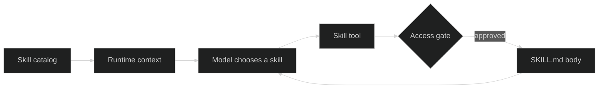

# Skills overview

A skill is a named Markdown procedure that a model can load when the current task needs it. The reusable implementation lives in `github.com/looprig/tools/skill`; Harness supplies the tool execution, gate, Loop, and Session boundaries around it. This keeps a focused procedure out of every model request while still making its name and purpose discoverable.

## How skills fit

The catalog advertises metadata, not bodies. The model calls `Skill` with `{ "name": "weather-briefing" }`; the tool prepares an access request and returns the authorized body as a tool result. Register the Skill tool with [Loop tools](/docs/guides/harness/loop/tools-and-tool-limits) just like any other tool.

## Choose a source

| Source | Location | Trust model | Typical use |
| --- | --- | --- | --- |
| Embedded | `skills/<name>/SKILL.md` in the application binary | Curated by the application and restricted by a per-agent allow-set | Stable product procedures |
| Workspace | `.skills/<name>/SKILL.md` under a workspace root | Project-controlled and untrusted | Repository-specific conventions |

Embedded names win if both sources contain the same name. Workspace bodies are snapshotted during call preparation so the approved bytes cannot be replaced before execution.

Continue with [SKILL.md format](/docs/guides/harness/skills/skill-md-format), then follow the complete [Weather Assistant](/docs/examples/weather-assistant) to see a model load a skill and call a domain tool in one turn.

## Source and proof

- [Skill tool implementation](https://github.com/looprig/tools/blob/main/skill/skill.go)
- [Embedded loader](https://github.com/looprig/tools/blob/main/skill/skill_loader.go)
- [Workspace discovery](https://github.com/looprig/tools/blob/main/skill/skill_metadata.go)
