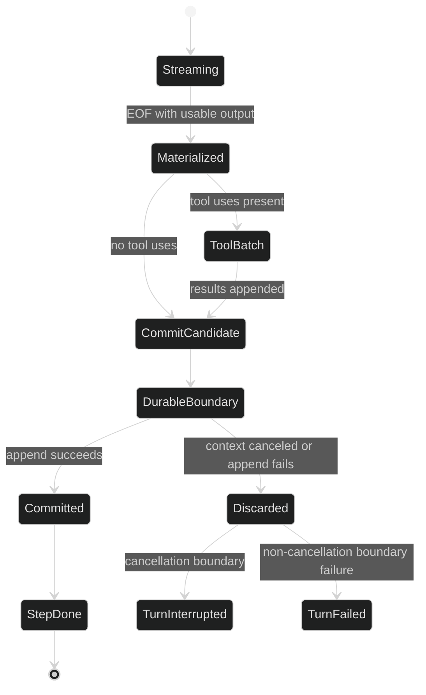

# Commit Boundary

`event.StepDone` is the durable commit record for a completed conceptual Step. It is emitted by the loop actor at the same boundary where the finalized Step group is appended to the loop's committed history. A `StepDone` event is therefore an authoritative record, not an optimistic progress notification.

## Public record

```go
type StepDone struct {
	enduring
	loopScoped
	Header
	Messages content.AgenticMessages `json:"messages,omitempty"`
	Captures []ToolResultCapture     `json:"captures,omitempty"`
}
```

`Captures` is present only when the Rig wires tool-result capture; it normally has one entry per tool-result message and locates any retained full result. The `Header.Coordinates` identity contract is strict. A valid StepDone needs non-zero `SessionID`, `LoopID`, `TurnID`, `StepID`, and `EventID`; `StepID` without `TurnID` is invalid. `event.ValidateEvent` also requires the message-group shape described in [Tool Calls and Results](/docs/guides/harness/step/tool-calls-and-results).

## What commits

For a text-only Step, the commit candidate contains one assistant message. For a tool Step, it contains the assistant message followed by all tool-result messages. The actor performs these operations in order:

1. stamp the StepDone event with its producer coordinates and EventID;
2. preflight the durable context mutation;
3. run the checked durable event boundary;
4. append the candidate messages to committed loop history only after the boundary reports success; and
5. acknowledge the parked Turn goroutine.

The history clone and the event payload are independent allocations. A consumer cannot mutate the live history by modifying `StepDone.Messages`, and the runtime cannot mutate the payload after it has been published.



## Rollback scope

Rollback is step-granular, not whole-Turn. If the provider fails, the response is empty, a tool batch is canceled, or the commit handshake is canceled, the in-flight Step is discarded and no StepDone is emitted for it. One case keeps part of the Step: when a stream fails or is canceled after it delivered text, and the Turn has no output schema, the safe prefix (text and sealed reasoning, never a tool call) commits as a lone assistant message ending in a truncation or interruption notice. Any earlier StepDone records in the same Turn remain committed. The enclosing Turn then publishes `TurnFailed` for a non-cancellation error or `TurnInterrupted` when the Turn context was canceled.

This is the important distinction:

| Observation | Meaning |
| --- | --- |
| `TokenDelta` seen, no `StepDone` | Live output existed, but this Step did not reach the durable boundary. |
| `StepDone` seen | The finalized group committed and is part of loop history. |
| `TurnFailed` after earlier `StepDone` | Earlier Steps remain durable; only the current incomplete Step rolled back. |
| `TurnInterrupted` during commit | The current group did not commit; already committed groups remain. |

## Consumer pattern

```go
package example

import (
	"errors"
	"fmt"

	"github.com/looprig/harness/pkg/event"
)

func requireCommittedStep(ev event.Event) error {
	step, ok := ev.(event.StepDone)
	if !ok {
		return fmt.Errorf("not a committed step: %T", ev)
	}
	if err := event.ValidateEvent(step); err != nil {
		var invalid *event.InvalidEventError
		if errors.As(err, &invalid) {
			return fmt.Errorf("invalid StepDone field %s: %w", invalid.Field, err)
		}
		return err
	}
	return nil
}
```

Do not synthesize a missing `StepDone` from `TokenDelta` values. If you need replay or restore, consume the enduring event stream or journal. `event.MarshalEvent` has dedicated StepDone encoding and fails closed on malformed messages.

## Source and proof

- [StepDone definition and durable semantics](https://github.com/looprig/harness/blob/main/pkg/event/turn.go)
- [Event identity and StepDone message validation](https://github.com/looprig/harness/blob/main/pkg/event/validate.go)
- [Durable event codec and StepDone wire form](https://github.com/looprig/harness/blob/main/pkg/event/marshal.go)
- [Actor commit handshake and StepDone publication](https://github.com/looprig/harness/blob/main/internal/loopruntime/loop.go)
- [Step commit cancellation atomicity proof](https://github.com/looprig/harness/blob/main/internal/loopruntime/output_lifecycle_test.go)
- [Enduring StepDone delivery proof](https://github.com/looprig/harness/blob/main/pkg/event/filter_test.go)
