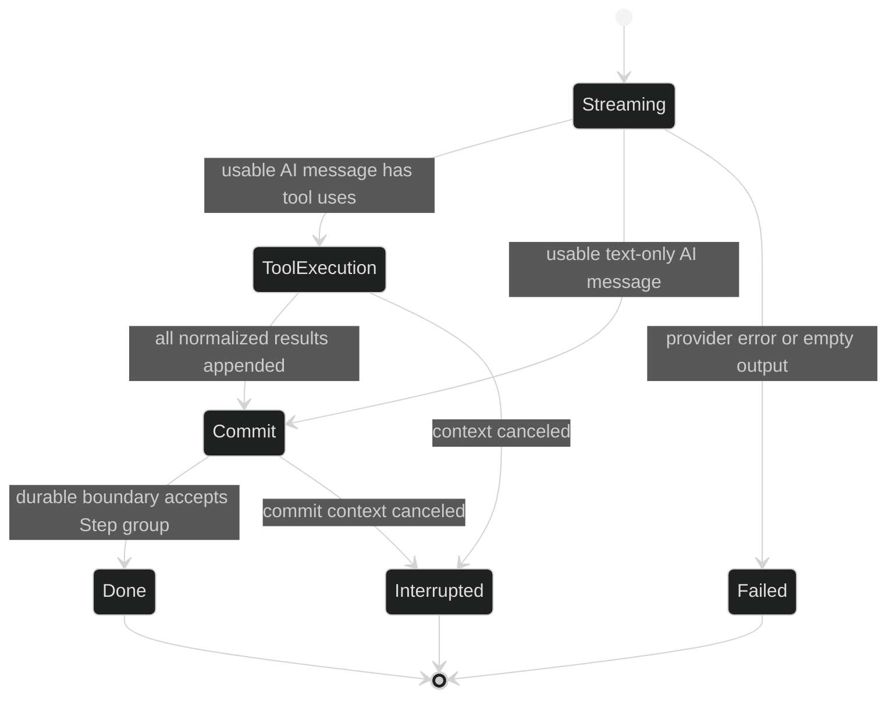

# Failure and Cancellation

Step failure is reported by the enclosing Turn. Harness has no separate public per-Step lifecycle event. The current Step either reaches the `StepDone` commit boundary or is discarded; the Turn then emits the exact terminal event that explains why execution stopped.

## Failure mapping

| Cause in the current Step | In-flight Step | Turn result |
| --- | --- | --- |
| Provider `Stream` or `Next` returns a non-cancellation error | No `StepDone` | `event.TurnFailed{Err: original typed error}` |
| Stream reaches EOF with no usable text, thinking, or tool use | No assistant message | `event.TurnFailed` with `*event.EmptyResponseError` |
| Tool iteration or call limit is exceeded | Tool Step is not committed | `event.TurnFailed` with `*event.ToolLimitError` |
| A Step hook or inference hook guard refuses | No Step commit | `event.TurnFailed` with a safe hook error |
| Step context is canceled while streaming, executing, or committing | Current Step is discarded | `event.TurnInterrupted` |

`TurnFailed.Err` retains the typed in-memory cause for `errors.As`. Its durable codec projects an error-safe representation because arbitrary Go errors do not have a stable JSON shape. `TurnInterrupted` carries no error field; the context cancellation is represented by the event kind.

## Cancellation and rollback

The submit call's context controls command delivery only. Once a command is admitted, the loop derives the Turn context from its own loop lifetime. `Session.Interrupt` or shutdown cancels that Turn context. The commit handshake also selects on cancellation, so a goroutine parked waiting for `StepDone` publication is released.

Rollback stops at the current Step. Earlier `StepDone` records and their committed history remain. A tool batch that is canceled before its result group commits produces neither a partial StepDone nor partial tool-result history.



## Classify the terminal

```go
package example

import (
	"errors"
	"fmt"

	"github.com/looprig/harness/pkg/event"
)

func classifyTurnTerminal(ev event.Event) error {
	switch terminal := ev.(type) {
	case event.TurnFailed:
		var empty *event.EmptyResponseError
		if errors.As(terminal.Err, &empty) {
			return fmt.Errorf("model returned no usable output: %w", empty)
		}
		var limit *event.ToolLimitError
		if errors.As(terminal.Err, &limit) {
			return fmt.Errorf("tool budget exhausted: %w", limit)
		}
		return fmt.Errorf("turn failed: %w", terminal.Err)
	case event.TurnInterrupted:
		return fmt.Errorf("turn interrupted")
	default:
		return nil
	}
}
```

An in-process hook can distinguish `hook.OutcomeDenied`, `hook.OutcomeFailed`, and `hook.OutcomeCanceled`, but those are observation results, not durable Step outcomes. If a guard panics, `hook.Runner` fails closed with `*hook.GuardError`; the Turn still owns the public terminal event.

## Queued inputs after failure

When a Turn ends abnormally, the actor resolves still-queued inputs with `event.InputCancelled` instead of silently dropping them. The reason is `event.CancelTurnFailed` for a failed Turn and `event.CancelTurnInterrupted` for an interrupted Turn. The returned input may be retried by the caller. See [Queued Input and Folding](/docs/guides/harness/turn/queued-input-and-folding) for the queue boundary.

## Source and proof

- [Step stream failure and cancellation mapping](https://github.com/looprig/harness/blob/main/internal/loopruntime/step.go)
- [Turn rollback, commit cancellation, and terminal mapping](https://github.com/looprig/harness/blob/main/internal/loopruntime/turn.go)
- [Actor queue return and terminal handling](https://github.com/looprig/harness/blob/main/internal/loopruntime/loop.go)
- [TurnFailed and TurnInterrupted definitions](https://github.com/looprig/harness/blob/main/pkg/event/turn.go)
- [Typed event errors](https://github.com/looprig/harness/blob/main/pkg/event/errors.go)
- [Provider, empty-response, and canceled-context proofs](https://github.com/looprig/harness/blob/main/internal/loopruntime/step_test.go)
- [Terminal commit cancellation atomicity proof](https://github.com/looprig/harness/blob/main/internal/loopruntime/output_lifecycle_test.go)
