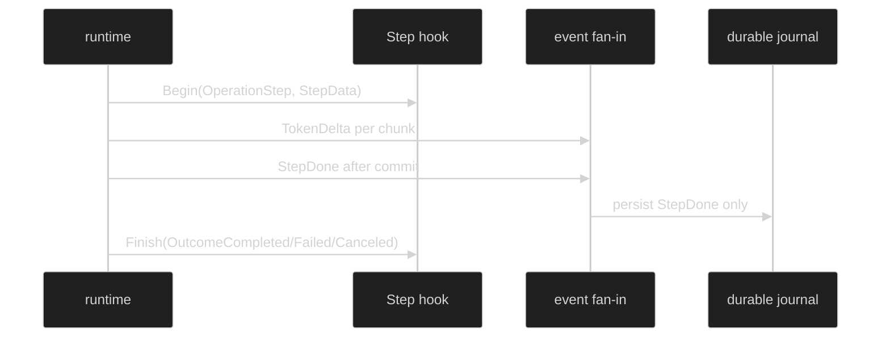

# Hooks and Events

A Step is observed through two deliberately different surfaces. Hooks are synchronous, in-process interception points. Events are the session fan-in records used by live consumers and durable replay. Neither surface introduces a public `Step` type.

## Step hook contract

```go
// From github.com/looprig/harness/pkg/hook.
type Operation uint8

const (
	OperationTurn Operation = iota + 1
	OperationStep
	OperationInference
	OperationCompaction
	OperationToolCall
	OperationGateWait
	OperationToolExecution
	OperationJournalAppend
)

type StepIndex uint64

type StepData struct {
	Index StepIndex
}
```

`hook.Call.Operation` is `OperationStep`; `hook.Call.Step` is the matching non-nil payload. The call also carries `StartedAt`, `Coordinates`, `AgentName`, and `Cause`. `Coordinates.StepID` is the event-correlation identity. `StepData.Index` is the zero-based ordinal within the parent Turn and is not stored in `StepDone`.

An around observer is registered with `hook.Around{Operation: hook.OperationStep, Begin: ...}`. Begin callbacks run in registration order. Their returned contexts are chained while preserving the previous context's cancellation and deadline. Finish callbacks run in reverse registration order and exactly once, even if a guard blocks the operation. A callback receives an independent cloned snapshot.

## Event contract

```go
// From github.com/looprig/harness/pkg/event.
type StepDone struct {
	enduring
	loopScoped
	Header
	Messages content.AgenticMessages `json:"messages,omitempty"`
	Captures []ToolResultCapture     `json:"captures,omitempty"`
}

type TokenDelta struct {
	ephemeral
	loopScoped
	Header
	TurnIndex TurnIndex `json:"turn_index,omitzero"`
	Chunk     content.Chunk `json:"-"`
}
```

`TokenDelta` is live and droppable. `StepDone` is enduring and must not be silently dropped. Both require the full session, loop, turn, and step coordinates at validation time. The `StepDone` message group is the authoritative committed Step result.

## Guard and observer outcomes

`hook.Outcome` is a closed in-process classification:

```go
type Outcome uint8

const (
	OutcomeCompleted Outcome = iota + 1
	OutcomeDenied
	OutcomeFailed
	OutcomeCanceled
)
```

A validated `*hook.Denial` is an intentional guard refusal. Other guard failures are `*hook.GuardError`; a callback panic is logged and observers fail open, while a guard or denial-classification panic fails closed. The runtime maps the operation result to the enclosing Turn terminal. No separate per-Step failure or cancellation event is published.

## Compile a Step observer

```go
package example

import (
	"context"
	"fmt"

	"github.com/looprig/harness/pkg/hook"
)

func compileStepObserver() (*hook.Runner, error) {
	return hook.Compile(hook.Set{Around: []hook.Around{{
		Operation: hook.OperationStep,
		Begin: func(ctx context.Context, call hook.Call) (context.Context, hook.FinishFunc) {
			if call.Step == nil {
				return ctx, nil
			}
			fmt.Printf("step %d id=%v\n", call.Step.Index, call.Coordinates.StepID)
			return ctx, func(result hook.Result) {
				fmt.Printf("step outcome=%v error=%v\n", result.Outcome, result.Err)
			}
		},
	}}})
}
```

The runtime owns the `Start` and `Finish` calls. An application should not call a finish callback itself after installing the compiled runner. Keep callbacks concurrency-safe: different operations may run concurrently, and `Call` and `Result` are read-only snapshots.

## Connect hooks to events

Use the hook for low-latency policy and timing, and the event stream for consumer-visible state:



Do not derive durability from a hook outcome. The hook can report completion before or after an external observer receives the durable record; `StepDone` and its journal sequence are the state transition consumers can replay.

## Source and proof

- [Operation, StepIndex, and Hook Set definitions](https://github.com/looprig/harness/blob/main/pkg/hook/hook.go)
- [Call, StepData, and Result snapshots](https://github.com/looprig/harness/blob/main/pkg/hook/data.go)
- [Hook Runner ordering, panic, and cancellation behavior](https://github.com/looprig/harness/blob/main/pkg/hook/runner.go)
- [Hook configuration and denial errors](https://github.com/looprig/harness/blob/main/pkg/hook/errors.go)
- [StepDone and TokenDelta definitions](https://github.com/looprig/harness/blob/main/pkg/event/turn.go)
- [Hook ordering around inference and durable commit](https://github.com/looprig/harness/blob/main/internal/loopruntime/step_hooks_test.go)
- [Hook runner contract proofs](https://github.com/looprig/harness/blob/main/pkg/hook/runner_test.go)
