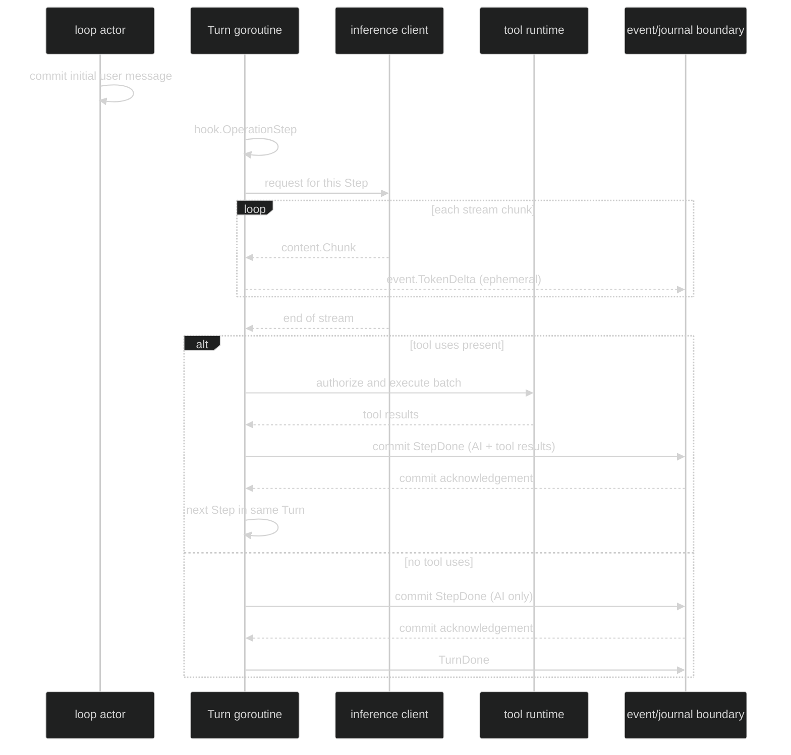

# Step

A Step is one model request/response cycle inside a Turn. It is a conceptual boundary, not a public `Step` type or package. A cycle may produce an assistant message with tool uses, execute the admitted tool call batch, append tool-result messages, and then let the enclosing Turn start another Step. A text-only assistant message ends the Turn.

The public API deliberately splits the boundary into observation and durable records:

| Need | Public surface | What it tells you |
| --- | --- | --- |
| Observe the boundary in process | `hook.OperationStep`, `hook.StepData`, `hook.StepIndex` | The step-local index and full operation coordinates in a hook snapshot. |
| Render live model output | `event.TokenDelta` | One ephemeral `content.Chunk` from the active Step. |
| Read committed Step history | `event.StepDone` | The finalized assistant message followed by its tool-result messages. |
| Correlate all Step records | `event.Header.Coordinates` | `SessionID`, `LoopID`, `TurnID`, and `StepID`; Step events require all four IDs. |

There is no separate public per-Step start, failure, or completion event. A failed or interrupted in-flight Step is represented by the enclosing Turn terminal and normally has no `StepDone` record. The exception is a stream cut short after the model already produced text: the safe prefix commits as a `StepDone` ending in a truncation notice before the terminal, as described in [Failure and cancellation](/docs/guides/harness/step/failure-and-cancellation).

## How it works

Harness builds the request from the committed loop history plus the Turn's staged messages. It starts the Step hook, starts the inference hook, and streams chunks. The runtime materializes exactly one assistant message. If that message contains tool uses, the runtime prepares and authorizes the calls, executes the admitted batch, appends one `content.ToolResultMessage` for each result, and commits the complete group. The actor publishes `StepDone` only at that commit point.



## Observe a Step

```go
// ObserveStepEvents subscribes before submitting so the live fan-in cannot
// race past the first enduring event. The caller owns session construction.
package example

import (
	"context"
	"fmt"

	"github.com/looprig/harness/pkg/event"
	"github.com/looprig/harness/pkg/session"
)

func observeStepEvents(ctx context.Context, live session.Session) error {
	sub, err := live.SubscribeEvents(event.EventFilter{
		Ephemeral: event.LoopScope{All: true},
		Enduring:  event.LoopScope{All: true},
	})
	if err != nil {
		return fmt.Errorf("subscribe: %w", err)
	}
	defer sub.Close()

	inputID, err := live.Submit(ctx, nil)
	if err != nil {
		return fmt.Errorf("submit: %w", err)
	}
	fmt.Println("submitted", inputID)
	for delivery := range sub.Events() {
		switch e := delivery.Event.(type) {
		case event.TokenDelta:
			fmt.Printf("turn=%d step=%v chunk=%T\n", e.TurnIndex, e.StepID, e.Chunk)
		case event.StepDone:
			fmt.Printf("committed step=%v messages=%d\n", e.StepID, len(e.Messages))
		case event.TurnDone, event.TurnFailed, event.TurnInterrupted:
			return nil
		}
	}
	return fmt.Errorf("event subscription closed: %v", sub.Err())
}
```

`event.EventFilter` chooses loop producers separately for ephemeral and enduring events. `TokenDelta` is ephemeral, so a filter that only asks for enduring events will still receive `StepDone` and terminal events but not live chunks. `SubscribeEvents` has no replay; subscribe before `Submit` when the first event matters.

## Step boundaries

`hook.StepData.Index` is zero-based within its Turn. The event stream does not carry a public step-index field. Use `StepID` in the event header to correlate `TokenDelta`, tool/gate events, and `StepDone`; use `hook.StepData.Index` when a hook needs the ordinal. `event.TokenDelta.TurnIndex` is the parent Turn counter, not the Step index.

The durable rule is simple: `StepDone` means the complete group was accepted at the actor-owned commit boundary. A live `TokenDelta` can be dropped without making the journal incomplete because the later `StepDone` is authoritative.

## Source and proof

- [Hook operation and Step index definitions](https://github.com/looprig/harness/blob/main/pkg/hook/hook.go)
- [Hook StepData and Call snapshots](https://github.com/looprig/harness/blob/main/pkg/hook/data.go)
- [TokenDelta and StepDone event definitions](https://github.com/looprig/harness/blob/main/pkg/event/turn.go)
- [Step request, streaming, and commit implementation](https://github.com/looprig/harness/blob/main/internal/loopruntime/turn.go)
- [Step stream and failure proof](https://github.com/looprig/harness/blob/main/internal/loopruntime/step_test.go)
- [Step hook ordering and discarded-step proof](https://github.com/looprig/harness/blob/main/internal/loopruntime/step_hooks_test.go)
