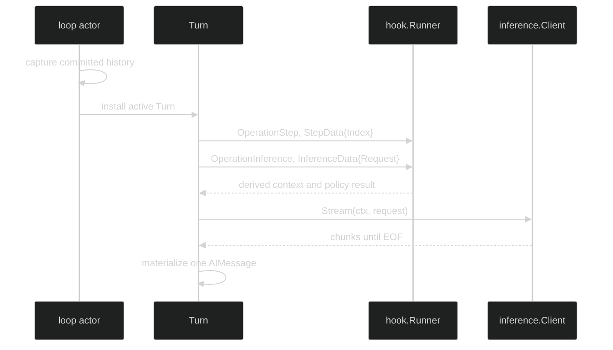

# Model Request

The model request is the inference part of a conceptual Step. Its concrete fields and validation rules are defined by the [Inference request contract](/docs/guides/inference/requests). Harness does not publish a `Step` object or a request event. In-process consumers can inspect the request through `hook.OperationInference`; Step-level policy and timing use `hook.OperationStep`.

## Request construction

For each Step, the Turn runtime builds a fresh request from:

1. a defensive clone of the committed loop history captured at Turn start;
2. the Turn's staged user and completed Step messages; and
3. an optional volatile runtime-context tail appended at the end of the request.

The tail is request-only. It is not added to `StepDone`, loop history, or the system prompt. A Turn-level context provider is consulted once and its result is reused for every Step in that Turn. A model or tool configuration change that arrives mid-Turn is captured by the next Turn, not by the current request.



## Public hook payloads

These are the relevant exported definitions:

```go
// From github.com/looprig/harness/pkg/hook.
type StepIndex uint64

type StepData struct {
	Index StepIndex
}

type InferenceData struct {
	Request      *inference.Request
	AIMessage    *content.AIMessage
	StreamResult *stream.StreamResult
}

type Call struct {
	Operation   Operation
	StartedAt   time.Time
	Coordinates identity.Coordinates
	AgentName   identity.AgentName
	Cause       identity.Cause
	Turn        *TurnData
	Step        *StepData
	Inference   *InferenceData
	// Compaction, ToolCall, GateWait, ToolExecution, and JournalAppend
	// are the other operation payloads in this closed union.
}
```

`InferenceData.Request` is populated when the inference operation begins. Its terminal fields are filled later: `AIMessage` is the completed assistant message when one exists, and `StreamResult` is the provider's terminal metadata when supplied. Hook snapshots are cloned before callbacks run, so a callback cannot mutate the runtime's request or message graph through the snapshot.

`hook.OperationStep` receives only the Step boundary data. It has `Call.Coordinates.StepID` and `Call.Step.Index`, but no inference request. Use both operations when a policy needs to relate ordinal, identity, request, and terminal result.

## Observing a request

```go
package example

import (
	"context"
	"fmt"

	"github.com/looprig/harness/pkg/hook"
)

func requestObserver() (*hook.Runner, error) {
	return hook.Compile(hook.Set{Around: []hook.Around{
		{
			Operation: hook.OperationStep,
			Begin: func(ctx context.Context, call hook.Call) (context.Context, hook.FinishFunc) {
				fmt.Printf("step index=%d id=%v\n", call.Step.Index, call.StepID)
				return ctx, nil
			},
		},
		{
			Operation: hook.OperationInference,
			Begin: func(ctx context.Context, call hook.Call) (context.Context, hook.FinishFunc) {
				if call.Inference.Request != nil {
					fmt.Printf("request messages=%d tools=%d\n",
						len(call.Inference.Request.Messages), len(call.Inference.Request.Tools))
				}
				return ctx, func(result hook.Result) {
					fmt.Printf("inference outcome=%v ai=%v\n",
						result.Outcome, result.Inference.AIMessage != nil)
				}
			},
		},
	}}})
}
```

The snippet is intentionally a compiled hook set, not a fake `Step` constructor. The production composition root installs the runner in the runtime configuration. A callback must treat `Call` and `Result` as read-only snapshots. `Result.Err` is a trusted in-process error and must be classified or redacted before crossing a logging or telemetry boundary.

## Failure before a request

`ValidateCall` rejects an unknown operation or a payload union with zero, multiple, or mismatched operation payloads using `*hook.CallError`. A guard on `OperationInference` can return a validated `*hook.Denial`; other guard errors become `*hook.GuardError`. The enclosing Turn publishes `TurnFailed` or `TurnInterrupted` as appropriate. There is no durable model-request failure event and no separate per-Step failure event.

## Source and proof

- [Hook operation, StepIndex, and operation constants](https://github.com/looprig/harness/blob/main/pkg/hook/hook.go)
- [Call, StepData, InferenceData, and validation](https://github.com/looprig/harness/blob/main/pkg/hook/data.go)
- [Hook validation errors and denial contract](https://github.com/looprig/harness/blob/main/pkg/hook/errors.go)
- [Request assembly and per-Step inference](https://github.com/looprig/harness/blob/main/internal/loopruntime/turn.go)
- [Inference stream and terminal message proof](https://github.com/looprig/harness/blob/main/internal/loopruntime/step.go)
- [Hook snapshots and request isolation proof](https://github.com/looprig/harness/blob/main/pkg/hook/runner_test.go)
