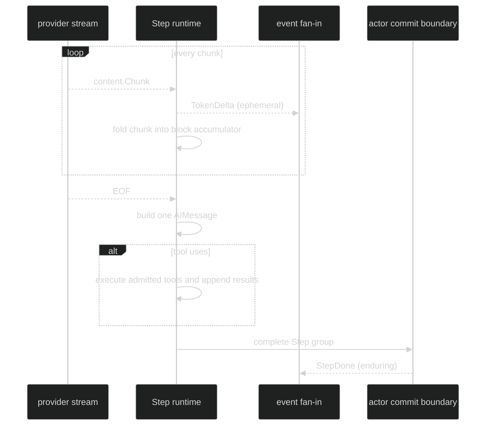

# Streaming Response

Harness exposes live provider chunks as `event.TokenDelta`. The [Inference streaming guide](/docs/guides/inference/streaming) explains the underlying stream reader, chunk variants, accumulation, and terminal result. `TokenDelta` is an ephemeral event for rendering, not a durable transcript record. The enclosing Step later materializes the chunks into one assistant message and commits that message, with tool results when present, as `event.StepDone`.

## Public shape

```go
// From github.com/looprig/harness/pkg/event.
type TokenDelta struct {
	ephemeral
	loopScoped
	Header
	TurnIndex TurnIndex `json:"turn_index,omitzero"`
	Chunk     content.Chunk `json:"-"`
}
```

The embedded `Header` carries `Coordinates`. A live Step event has `SessionID`, `LoopID`, `TurnID`, and `StepID`; `TurnIndex` is the parent Turn counter. `Chunk` is a sealed `content.Chunk` value and intentionally has no JSON codec. The event is live-only, so `event.MarshalEvent` rejects it with `*event.EphemeralNotPersistableError` instead of silently serializing a lossy value.

## Ordering and ownership

For every provider chunk, the runtime publishes `TokenDelta` before folding that chunk into the Step's internal block accumulator. The stream test observes this ordering by checking that the accumulator is still empty when the callback sees the event. At EOF, the runtime materializes one `content.AIMessage`. A stream with only empty chunks still produces one `TokenDelta` per chunk, then fails with `*event.EmptyResponseError` and produces no `StepDone`. A stream that fails or is canceled after delivering text commits its safe prefix, with a notice block, as a `StepDone` before the Turn terminal, so the text a user watched arrive stays in history.



## Subscribe to the live stream

```go
package example

import (
	"context"
	"fmt"

	"github.com/looprig/harness/pkg/event"
	"github.com/looprig/harness/pkg/session"
)

func streamTurn(ctx context.Context, live session.Session) error {
	sub, err := live.SubscribeEvents(event.EventFilter{
		Ephemeral: event.LoopScope{All: true},
		Enduring:  event.LoopScope{All: true},
	})
	if err != nil {
		return err
	}
	defer sub.Close()

	if _, err := live.Submit(ctx, nil); err != nil {
		return err
	}
	for delivery := range sub.Events() {
		switch e := delivery.Event.(type) {
		case event.TokenDelta:
			// A consumer may render e.Chunk immediately. It must not assume
			// this event will be replayed after reconnect.
			fmt.Printf("step=%v chunk=%T\n", e.StepID, e.Chunk)
		case event.StepDone:
			fmt.Printf("authoritative step messages=%d\n", len(e.Messages))
		case event.TurnDone, event.TurnFailed, event.TurnInterrupted:
			return nil
		}
	}
	return sub.Err()
}
```

`EventFilter.Ephemeral` controls delivery of `TokenDelta`. A subscriber that sets only `Enduring` receives `StepDone` and terminal events but no stream chunks. Session-scoped events bypass loop scopes, while `TokenDelta` is loop-scoped and matched against the producing loop ID.

## Do not use chunks as state

Treat chunks as a display path. A dropped chunk does not imply that the Step was dropped. The durable source is `StepDone.Messages`, and the durable Turn result is `TurnDone.Message`, `TurnFailed`, or `TurnInterrupted`. There is no separate per-Step completion event and no durable token stream.

## Source and proof

- [TokenDelta definition and class contract](https://github.com/looprig/harness/blob/main/pkg/event/turn.go)
- [Event classes, delivery, and ephemeral persistence errors](https://github.com/looprig/harness/blob/main/pkg/event/event.go)
- [Event filtering by class and loop](https://github.com/looprig/harness/blob/main/pkg/event/filter.go)
- [MarshalEvent fail-closed handling for ephemeral events](https://github.com/looprig/harness/blob/main/pkg/event/marshal.go)
- [Chunk publication before accumulation and empty-response behavior](https://github.com/looprig/harness/blob/main/internal/loopruntime/step_test.go)
- [Filter behavior for TokenDelta and StepDone](https://github.com/looprig/harness/blob/main/pkg/event/filter_test.go)
