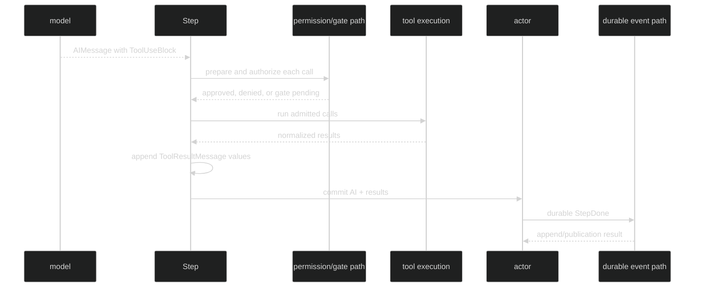

# Tool Calls and Results

Tool work belongs to the conceptual Step that produced the model's [tool-use blocks](/docs/guides/inference/content-blocks/tool-use/). The Step's durable message group is one assistant message followed by the tool-result messages for that batch. There is no public `Step` runtime type and no separate Step completion event.

## The message group

```text
StepDone.Messages
  [0] *content.AIMessage       role=assistant, may contain ToolUseBlock values
  [1:] *content.ToolResultMessage role=tool, one per normalized result
```

`ToolResultMessage.ToolUseID` pairs a result with the model's tool-use ID. `ToolResultMessage.IsError` preserves whether the tool result was an error, including pre-execution failures such as malformed arguments, denied permission, or an unavailable tool. A final text-only Step commits a one-message group with no tool results.

`event.ValidateEvent` enforces this shape at the durable boundary: `Messages` must be non-empty, element zero must be a non-nil assistant `*content.AIMessage`, and every later element must be a non-nil tool-role `*content.ToolResultMessage`. A hand-built record that violates the shape returns `*event.InvalidEventError` with `FieldMessages` and `RuleInvalid`.

## Live and durable tool surfaces

| Surface | Class | Use |
| --- | --- | --- |
| `event.PermissionRequested` | Enduring | A tool call is waiting for an interactive permission decision. |
| `event.PermissionDecided` | Enduring | A non-gated approve or deny decision. |
| `event.UserInputRequested` | Enduring | A tool is waiting for free-form user input. |
| `event.ToolCallStarted` | Ephemeral | An approved call began executing; includes bounded summary. |
| `event.ToolCallCompleted` | Ephemeral | Execution finished; includes bounded preview and `IsError`. |
| `event.StepDone` | Enduring | Finalized assistant and tool-result message group. |

```go
// From github.com/looprig/harness/pkg/event.
type ToolCallStarted struct {
	ephemeral
	loopScoped
	Header
	ToolExecutionID uuid.UUID `json:"tool_execution_id,omitzero"`
	ToolName        string    `json:"tool_name,omitempty"`
	Summary         string    `json:"summary,omitempty"`
}

type ToolCallCompleted struct {
	ephemeral
	loopScoped
	Header
	ToolExecutionID uuid.UUID `json:"tool_execution_id,omitzero"`
	IsError         bool      `json:"is_error,omitzero"`
	ResultPreview   string    `json:"result_preview,omitempty"`
}

type StepDone struct {
	enduring
	loopScoped
	Header
	Messages content.AgenticMessages `json:"messages,omitempty"`
}
```

Tool lifecycle chatter is intentionally droppable. The durable Step group is the replayable result. Permission and user-input requests are enduring so an operator can answer a gate even if a live subscriber was briefly unavailable.

## Execution and commit

The runtime first materializes the assistant message and keeps a raw executable view of tool uses. It then authorizes and runs the batch. The tool result messages are appended only after the batch returns. Only the complete group is offered to the actor's commit handshake.



Malformed model tool arguments have two views. The stored assistant message rewrites invalid JSON input to `{}` so committed history remains encodable. The raw executable view retains the invalid input so execution can return a model-visible error rather than silently changing what the model asked for. This is why inspecting only the stored `AIMessage` is not a reliable way to diagnose an invalid call.

## Read committed results

```go
package example

import (
	"fmt"

	"github.com/looprig/core/content"
	"github.com/looprig/harness/pkg/event"
)

func printStep(e event.StepDone) {
	for index, message := range e.Messages {
		switch m := message.(type) {
		case *content.AIMessage:
			fmt.Printf("message[%d] assistant blocks=%d\n", index, len(m.Blocks))
		case *content.ToolResultMessage:
			fmt.Printf("message[%d] tool=%s error=%v\n", index, m.ToolUseID, m.IsError)
		}
	}
}
```

The `StepDone` payload is a consumer-owned clone. It must not be used to mutate live loop history. The same rule applies to hook snapshots and to messages returned from other event APIs.

## Source and proof

- [StepDone, tool-call resolution, and token event definitions](https://github.com/looprig/harness/blob/main/pkg/event/turn.go)
- [Ephemeral tool lifecycle event definitions](https://github.com/looprig/harness/blob/main/pkg/event/tool.go)
- [StepDone message validation](https://github.com/looprig/harness/blob/main/pkg/event/validate.go)
- [Tool execution, raw calls, and result message assembly](https://github.com/looprig/harness/blob/main/internal/loopruntime/turn.go)
- [Malformed tool input sanitation proof](https://github.com/looprig/harness/blob/main/internal/loopruntime/step_test.go)
- [Enduring versus ephemeral classification proof](https://github.com/looprig/harness/blob/main/pkg/event/header_test.go)
