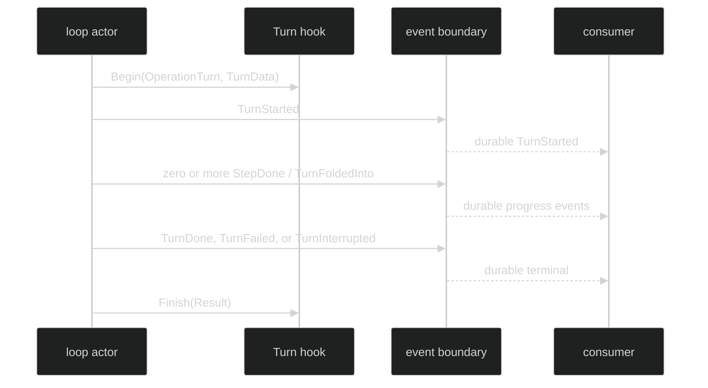

# Hooks and Events

Hooks and events expose different boundaries. A Turn hook is an in-process
observation of the runtime operation. The event stream is the durable and live
consumer surface. A hook cannot replace a journal event, and an event consumer
cannot assume that an in-process hook was installed.

## Turn hook contract

The public operation enum and payloads are intentionally separate from the
runtime's internal Turn state:

```go
// pkg/hook/hook.go and pkg/hook/data.go
type Operation uint8

const OperationTurn Operation = iota + 1

type TurnData struct {
	Index event.TurnIndex
	Input *content.UserMessage
}

type Call struct {
	Operation   Operation
	StartedAt   time.Time
	Coordinates identity.Coordinates
	AgentName   identity.AgentName
	Cause       identity.Cause
	Turn        *TurnData
	// Other operation payloads are nil for OperationTurn.
}

type Result struct {
	Call
	EndedAt time.Time
	Outcome Outcome
	Err     error
}
```

`Call.Turn` is the only operation-specific payload for a Turn call. `Index` is
the loop-local `event.TurnIndex`; it is not a global session sequence. `Call`
and `Result` are read-only snapshots. The runner clones reference-backed values
before invoking callbacks, so a hook must treat them as input and must not use
them to mutate runtime state.

The runner exposes four terminal classifications:

| `hook.Outcome` | Meaning at the operation boundary |
| --- | --- |
| `OutcomeCompleted` | The Turn reached a durable terminal boundary without an operation error. |
| `OutcomeDenied` | A guard returned a typed intentional denial. |
| `OutcomeFailed` | A guard, provider, hook, or durable boundary failed. |
| `OutcomeCanceled` | The Turn context ended through cancellation. |

The runtime still publishes the exact event terminal set. `Outcome` is hook
telemetry, not an additional event type.

## Event surfaces

Turn-related events have these public fields and delivery properties:

| Event | Class and scope | Payload or correlation |
| --- | --- | --- |
| `TurnStarted` | Enduring, loop-scoped, Reply | `TurnIndex`, initial `*content.UserMessage`, submit ID in `Cause.CommandID`. |
| `TurnFoldedInto` | Enduring, loop-scoped, Reply | `TurnIndex`, folded `*content.UserMessage`, submit ID. |
| `InputQueued` | Ephemeral, loop-scoped, Reply | Submit ID; live receipt only. |
| `TurnRejected` | Enduring, loop-scoped, Reply | `RejectQueueFull`, `RejectShuttingDown`, or `RejectInternal`. |
| `InputCancelled` | Enduring, loop-scoped, Reply | `TurnIndex`, `CancelReason`, returned message, submit ID. |
| `StepDone` | Enduring, loop-scoped | Finalized assistant and tool-result group; full step coordinates. |
| `TokenDelta` | Ephemeral, loop-scoped | `TurnIndex` and non-persisted `content.Chunk`. |
| `TurnDone` | Enduring terminal, loop-scoped | Complete AI message and checked usage. |
| `TurnFailed` | Enduring terminal, loop-scoped | Typed in-memory error, projected on the wire. |
| `TurnInterrupted` | Enduring terminal, loop-scoped | `TurnIndex`; no error payload. |

Every loop-scoped Turn or terminal event carries `SessionID`, `LoopID`, and
`TurnID` with a zero `StepID`; `StepDone` and `TokenDelta` also carry `StepID`.
`event.ReplyTo()` reads `Header.Cause.CommandID` for the command-outcome rows.

## Ordering and outcomes

For a normal Turn, the lifecycle ordering is:



The Begin callback runs before `TurnStarted` publication, so a guard can deny
the operation before the initial Turn event. The Finish callback runs after the
terminal boundary has been acknowledged, even when the terminal itself carries
an error. Around observers begin in registration order and finish in reverse
order. Every returned finish callback is invoked once, including a guard-denied
operation.

An observer panic is logged and fails open. A guard panic and a denial
classification panic fail closed as a typed `*hook.GuardError`. The returned
context keeps the parent cancellation and deadline even if a Begin callback
returns a detached context. These rules make hooks useful for metrics and
policy without letting an observer silently change event durability.

## Compile a Turn observer

Install a compiled `hook.Runner` in the session configuration. The example only
records metadata and keeps the callback concurrency-safe:

```go
var mu sync.Mutex
var turns []hook.Result

runner, err := hook.Compile(hook.Set{
	Around: []hook.Around{{
		Operation: hook.OperationTurn,
		Begin: func(ctx context.Context, call hook.Call) (context.Context, hook.FinishFunc) {
			if call.Turn == nil {
				return ctx, nil
			}
			return ctx, func(result hook.Result) {
				mu.Lock()
				turns = append(turns, result)
				mu.Unlock()
			}
		},
	}},
})
if err != nil {
	return err
}
// Pass runner through the rig/session option that installs hook.Runner.
_ = runner
```

A guard is synchronous and allowed for `OperationTurn`:

```go
runner, err := hook.Compile(hook.Set{
	PolicyRevision: "policy-2026-08",
	Guards: []hook.Guard{{
		Operation: hook.OperationTurn,
		Check: func(ctx context.Context, call hook.Call) error {
			if call.Turn != nil && call.Turn.Input == nil {
				return hook.Deny("missing_input", "turn input is required")
			}
			return nil
		},
	}},
})
```

`PolicyRevision` is mandatory when guards are present and forbidden when the
set has no guards. Validate and compile the set before publishing a session;
configuration errors are returned before runtime dispatch.

## Source and proof

- [`pkg/hook/hook.go`](https://github.com/looprig/harness/blob/main/pkg/hook/hook.go) defines `OperationTurn`, `Outcome`, `Around`, `Guard`, and the compile-time policy rules.
- [`pkg/hook/data.go`](https://github.com/looprig/harness/blob/main/pkg/hook/data.go) defines `Call`, `Result`, `TurnData`, `StepData`, and the operation payload invariant.
- [`pkg/hook/runner.go`](https://github.com/looprig/harness/blob/main/pkg/hook/runner.go) defines callback ordering, context preservation, panic handling, and exactly-once finish behavior.
- [`pkg/event/turn.go`](https://github.com/looprig/harness/blob/main/pkg/event/turn.go) defines the event payloads and lifecycle classes listed above.
- [`pkg/event/event.go`](https://github.com/looprig/harness/blob/main/pkg/event/event.go) defines `ReplyTo`, event class, scope, and terminal semantics.
- [`internal/loopruntime/loop.go`](https://github.com/looprig/harness/blob/main/internal/loopruntime/loop.go) places Turn hook begin before `TurnStarted` and finish after the durable terminal boundary.
- [`turn_hooks_test.go`](https://github.com/looprig/harness/blob/main/internal/loopruntime/turn_hooks_test.go) proves hook/event ordering and finish acknowledgement behavior.

This page reserves the approved Harness navigation structure. Turn hooks observe the conceptual boundary in process; durable events include `TurnStarted`, `TurnDone`, `TurnFailed`, and `TurnInterrupted`.
