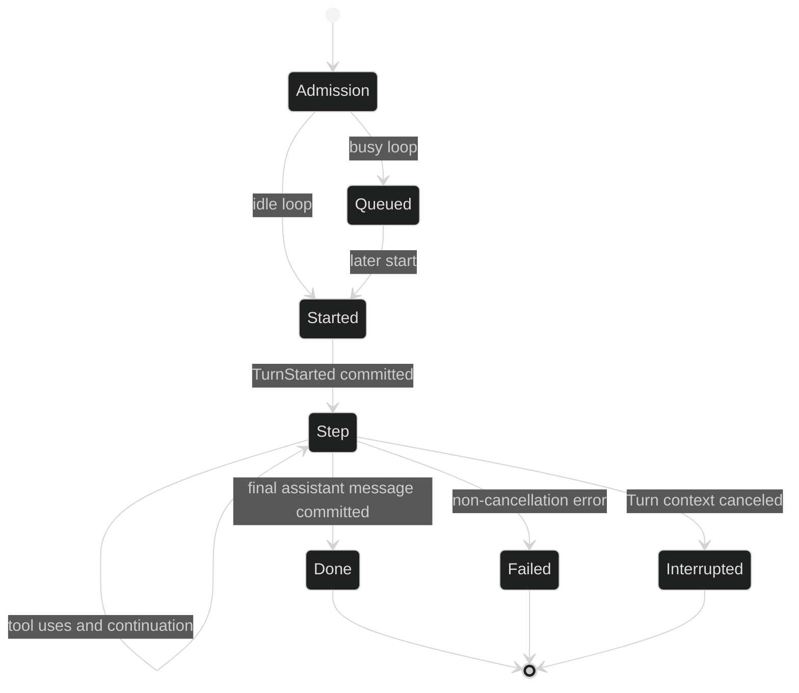

# Turn

A Turn is one bounded execution started by one user input after admission. It contains one or more steps, each a conceptual Step boundary, until the model returns a final answer, the runtime interrupts, or the Turn fails. A Turn is a concept, not a public `Turn` type or package.

## Lifecycle

`Session.Submit` and `Session.SubmitToLoop` are fire-and-forget admission calls. They return a command ID only after the command is handed to a live loop. `event.TurnStarted` is the first enduring Turn event and carries that command ID in `Header.Cause.CommandID`. Tool-use Steps can repeat inside the same Turn. The Turn ends with exactly one of `TurnDone`, `TurnFailed`, or `TurnInterrupted`.



`event.TurnIndex` is a loop-local counter carried by Turn and stream events. It is not globally unique across loops; pair it with `Header.Coordinates.LoopID` and `TurnID`. The runtime tests show a newly constructed loop's first Turn is index 1 and a restored loop's next Turn is its persisted index plus one. `hook.TurnData.Index` carries the same Turn index to an in-process Turn hook.

## Observe turns

```go
package example

import (
	"context"
	"fmt"

	"github.com/looprig/core/content"
	"github.com/looprig/harness/pkg/event"
	"github.com/looprig/harness/pkg/session"
)

func waitForTurn(ctx context.Context, live session.Session) error {
	sub, err := live.SubscribeEvents(event.EventFilter{
		Ephemeral: event.LoopScope{All: true},
		Enduring:  event.LoopScope{All: true},
	})
	if err != nil {
		return fmt.Errorf("subscribe: %w", err)
	}
	defer sub.Close()

	inputID, err := live.Submit(ctx, []content.Block{
		&content.TextBlock{Text: "Summarize the project"},
	})
	if err != nil {
		return fmt.Errorf("submit: %w", err)
	}
	for delivery := range sub.Events() {
		if reply, ok := delivery.Event.(event.Reply); ok && reply.ReplyTo() == inputID {
			fmt.Printf("input %v resolved by %T\n", inputID, delivery.Event)
		}
		switch delivery.Event.(type) {
		case event.TurnDone:
			return nil
		case event.TurnFailed, event.TurnInterrupted:
			return fmt.Errorf("turn ended with %T", delivery.Event)
		}
	}
	return fmt.Errorf("event subscription closed: %v", sub.Err())
}
```

Subscribe before submitting because the live hub does not replay an event to a later subscriber. A successful `Submit` does not mean a Turn started or completed. The returned ID is only the correlation ID for the eventual reply event.

## Terminal events

The terminal set is closed and exact:

| Event | Meaning | Durable fields |
| --- | --- | --- |
| `event.TurnDone` | Final assistant response committed successfully. | `TurnIndex`, complete `Message`, checked aggregate `Usage`. |
| `event.TurnFailed` | Non-cancellation failure. | `TurnIndex`, typed in-memory `Err` that is projected by the wire codec. |
| `event.TurnInterrupted` | Turn context was canceled. | `TurnIndex`; no error payload. |

All three are `Enduring`, `terminal`, loop-scoped events. They report `EndsTurn() == true`. The terminal set is closed; use event type switches, not names inferred from UI state.

## Source and proof

- [Session submit and event subscription contracts](https://github.com/looprig/harness/blob/main/pkg/session/session.go)
- [Turn event definitions and TurnIndex](https://github.com/looprig/harness/blob/main/pkg/event/turn.go)
- [Event lifecycle classes and terminal marker](https://github.com/looprig/harness/blob/main/pkg/event/event.go)
- [Turn start and terminal actor lifecycle](https://github.com/looprig/harness/blob/main/internal/loopruntime/loop.go)
- [Submit fire-and-forget proof](https://github.com/looprig/harness/blob/main/internal/sessionruntime/submit_test.go)
- [Restored TurnIndex sequencing proof](https://github.com/looprig/harness/blob/main/internal/loopruntime/restored_test.go)
