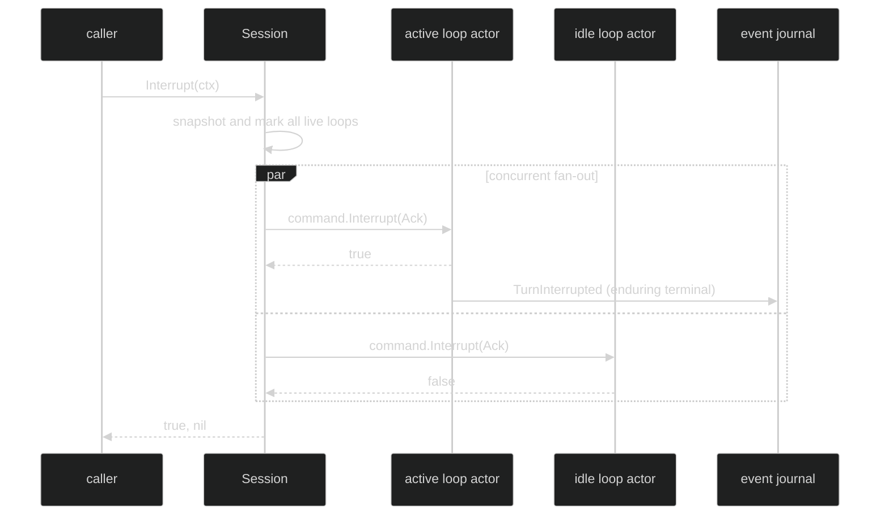

# Interruptions

An interruption cancels the current conceptual Turn through the session control
plane. The durable terminal event is `event.TurnInterrupted`. It is distinct
from shutdown, from a client retract of queued input, and from a provider
failure. The event stream, not a point-to-point reply, is the source of the
turn's outcome.

## Interrupt contract

The public data-plane contract is small and deliberately session-scoped:

```go
// pkg/session/session.go
type Session interface {
	Submit(context.Context, []content.Block) (uuid.UUID, error)
	SubmitToLoop(context.Context, uuid.UUID, []content.Block) (uuid.UUID, error)
	SubscribeEvents(event.EventFilter) (event.Subscription, error)
	Interrupt(context.Context) (bool, error)
}
```

`Interrupt` returns `true` if at least one live loop reported that a running
Turn was cancelled. It returns `false, nil` when every loop was idle. The
context bounds selection, fan-out, and acknowledgements; a slow actor cannot
make an unbounded interrupt call. A context failure is returned as the typed
session error rather than being represented as a turn event.

At the command boundary the loop receives an acknowledgement-bearing command:

```go
// pkg/command/interrupt.go
type Interrupt struct {
	Header
	Ack chan<- bool `json:"-"`
}
```

The acknowledgement is required. A malformed command is rejected locally by
validation. There is no durable command reply: the boolean is an in-process
control acknowledgement, while `TurnInterrupted` is the durable execution
outcome.

## Session-wide scope

The session implementation snapshots every registered live loop, marks each
interrupt-pending, then sends the command concurrently. Idle loops answer false
and are harmless. This means a call on a session with one active and one idle
loop returns true, and both loops still receive the command. It does not latch
session closing or tear down loops.



An entirely idle session is fail-quiet: the call returns `false, nil` and
publishes no terminal event. This is useful for UI stop buttons that may race
with normal completion.

## Queue disposition

Cancellation is cooperative. The running inference or tool boundary observes
the canceled Turn context and returns `event.TurnInterrupted`. The actor then
resolves queued work:

| Queued entry | Ordinary user interrupt | Machine continuation or hand-back |
| --- | --- | --- |
| Still in inbox | Retained for a later start after the loop reaches idle. | Removed with `InputCancelled{Reason: event.CancelTurnInterrupted}`. |
| In the draining buffer before a fold commit | Retained in FIFO order. | Returned with `InputCancelled{Reason: event.CancelTurnInterrupted}`. |
| Already folded | Remains part of the committed Turn. | Remains part of the committed Turn. |

The returned event carries the interrupted Turn ID in `Header.TurnID`; a pure
client retract outside a Turn instead has a zero Turn ID. If an interruption
happens while the actor is waiting for session admission, no running Turn was
cancelled, so the command acknowledgement is false even though queued machine
entries may be returned.

The loop commits the terminal event before its idle transition. Retained user
input is admitted only after the idle edge, which lets the session quiescence
barrier release the interrupt sweep before work starts again.

## Observe the interruption

Subscribe before submitting if the UI needs the full causal sequence. Filter on
`Enduring` because terminal events are durable; a live-only filter is not enough.

```go
sub, err := sess.SubscribeEvents(event.EventFilter{
	Enduring: event.LoopScope{All: true},
})
if err != nil {
	return err
}
defer sub.Close()

if _, err := sess.Submit(ctx, []content.Block{
	&content.TextBlock{Text: "perform the long operation"},
}); err != nil {
	return err
}

stopped, err := sess.Interrupt(ctx)
if err != nil {
	return err
}
if !stopped {
	// The Turn had already reached an idle boundary, or no loop was active.
	return nil
}

for delivery := range sub.Events() {
	if _, ok := delivery.Event.(event.TurnInterrupted); ok {
		// Stop rendering the active Turn. Queued input is resolved separately.
		break
	}
}
```

Do not synthesize a terminal event when `Interrupt` returns false. It only says
that no active Turn was canceled; the event stream remains authoritative for a
Turn that may have completed concurrently.

## Source and proof

- [`pkg/session/session.go`](https://github.com/looprig/harness/blob/main/pkg/session/session.go) defines `Session.Interrupt`.
- [`pkg/command/interrupt.go`](https://github.com/looprig/harness/blob/main/pkg/command/interrupt.go) defines the acknowledgement-bearing interrupt command.
- [`internal/sessionruntime/session.go`](https://github.com/looprig/harness/blob/main/internal/sessionruntime/session.go) implements the session-wide snapshot and concurrent fan-out.
- [`internal/sessionruntime/interrupt_test.go`](https://github.com/looprig/harness/blob/main/internal/sessionruntime/interrupt_test.go) proves idle fail-quiet behavior, multi-loop fan-out, and retained user input.
- [`internal/loopruntime/loop.go`](https://github.com/looprig/harness/blob/main/internal/loopruntime/loop.go) maps cancellation to terminal publication and queued-entry resolution.
- [`pkg/event/turn.go`](https://github.com/looprig/harness/blob/main/pkg/event/turn.go) defines `TurnInterrupted` and `InputCancelled`.

This page reserves the approved Harness navigation structure. Session interruption ends the conceptual Turn with the exact durable `event.TurnInterrupted` outcome.
