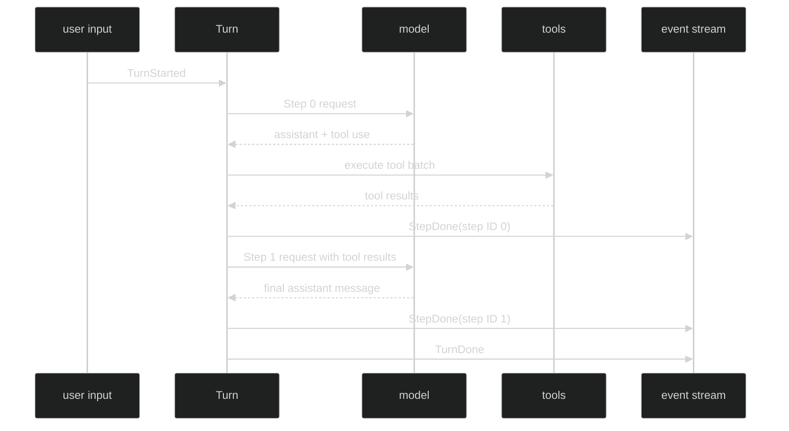

# Multiple Steps

One Turn can contain several Steps when the model requests tools. Each Step is one inference cycle. The model emits an assistant message with tool uses, Harness executes the admitted calls, commits that Step as `StepDone`, and sends the accumulated history, including tool results, into the next model request. The Turn ends when a Step produces no tool uses and its assistant message commits.

## Step sequence



`hook.StepData.Index` starts at zero for the first Step in a Turn and increments for each subsequent inference cycle. The event header's `StepID` is the durable identity; `event.TokenDelta.TurnIndex` remains the same parent Turn counter for all Steps. `event.StepDone` does not expose the ordinal as a field.

## What is committed per Step

| Step kind | `StepDone.Messages` | Next action |
| --- | --- | --- |
| Final answer | one assistant message | publish `TurnDone` after commit acknowledgement |
| Tool continuation | assistant message, then one tool-result message per result | fold eligible queued input, then issue another request |
| Failed or interrupted cycle | no event | publish Turn terminal; prior StepDone records remain |

Usage from each completed request is checked and summed into `TurnDone.Usage`. Loop cumulative accounting folds the StepDone messages once; consumers should not add `TurnDone.Usage` back into loop totals a second time.

## Consume all committed Steps

```go
package example

import (
	"context"
	"fmt"

	"github.com/looprig/harness/pkg/event"
	"github.com/looprig/harness/pkg/session"
)

func printTurnSteps(ctx context.Context, live session.Session) error {
	sub, err := live.SubscribeEvents(event.EventFilter{Enduring: event.LoopScope{All: true}})
	if err != nil {
		return err
	}
	defer sub.Close()
	if _, err := live.Submit(ctx, nil); err != nil {
		return err
	}
	for delivery := range sub.Events() {
		switch e := delivery.Event.(type) {
		case event.StepDone:
			fmt.Printf("turn=%v step=%v messages=%d\n", e.TurnID, e.StepID, len(e.Messages))
		case event.TurnDone:
			fmt.Printf("turn=%d usage=%+v\n", e.TurnIndex, e.Usage)
			return nil
		case event.TurnFailed, event.TurnInterrupted:
			return fmt.Errorf("terminal=%T", e)
		}
	}
	return sub.Err()
}
```

Do not infer that one `TurnStarted` implies one `StepDone`. Wait for the Turn terminal, and group StepDone records by `Header.Coordinates.TurnID` if you need a complete per-Turn view. A subscriber may miss ephemeral tool chatter but should rely on the enduring StepDone sequence.

## Partial-turn failure

The runtime commits each successful Step independently. If Step 0 commits and Step 1 fails, Step 0 remains in loop history and exactly one `TurnFailed` or `TurnInterrupted` ends the Turn. The failed Step has no `StepDone`, and the next input starts from the committed history that includes Step 0.

## Source and proof

- [Step and Turn message staging and per-Step loop](https://github.com/looprig/harness/blob/main/internal/loopruntime/turn.go)
- [Actor-owned incremental commit and terminal resolution](https://github.com/looprig/harness/blob/main/internal/loopruntime/loop.go)
- [StepDone message shape](https://github.com/looprig/harness/blob/main/pkg/event/validate.go)
- [TurnDone usage definition](https://github.com/looprig/harness/blob/main/pkg/event/turn.go)
- [Multi-Step tool continuation and agency proof](https://github.com/looprig/harness/blob/main/internal/loopruntime/agency_test.go)
- [Per-Step commit ordering proof](https://github.com/looprig/harness/blob/main/internal/loopruntime/step_hooks_test.go)
