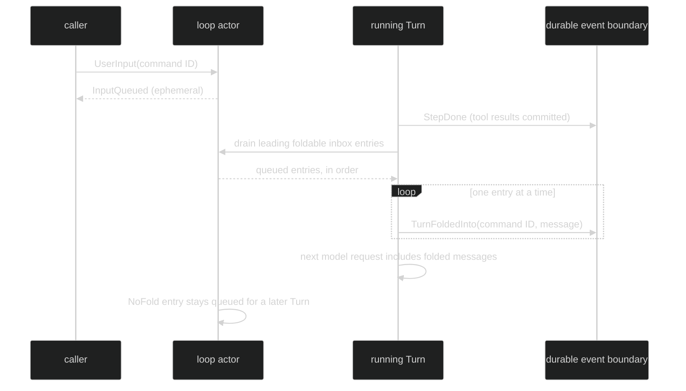

# Queued Input and Folding

Queueing is an actor-owned transition, not a second execution model. A submitted
message is first admitted to a loop inbox. It then resolves exactly once as a
`TurnStarted`, a `TurnFoldedInto`, an `InputCancelled`, or a `TurnRejected`
event. `InputQueued` is only the ephemeral receipt that says the inbox accepted
the message before that authoritative resolution is known.

## Queue model

The public event definitions are the contract:

```go
// pkg/event/turn.go, abbreviated only to leave out unexported mixins.
type InputQueued struct {
	Header
}

type TurnFoldedInto struct {
	Header
	TurnIndex event.TurnIndex
	Message   *content.UserMessage
}

type InputCancelled struct {
	Header
	TurnIndex event.TurnIndex
	Reason    event.CancelReason
	Message   *content.UserMessage
}

type TurnRejected struct {
	Header
	Reason event.RejectReason
}
```

The actual `InputQueued` type embeds the `ephemeral` and `loopScoped` mixins;
`TurnFoldedInto`, `InputCancelled`, and `TurnRejected` embed `enduring` and
`loopScoped`. Consequently the receipt can be dropped and reconstructed from a
later event, while the other outcomes must not silently disappear. Every
resolution carries the submit command ID in `Header.Cause.CommandID`, so a
consumer can correlate several queued messages without relying on arrival order.

## Folding boundary

The loop actor drains only at a mandatory tool-continuation boundary. The
current step has already committed its `StepDone` event and tool results before
the drain. Each leading foldable entry is appended after those results and
committed independently as a `TurnFoldedInto`; the next model request then sees
the folded user messages. A `command.UserInput` with `NoFold: true` stops the
leading drain and remains the first entry of a later Turn. FIFO order is
preserved.



The fold event is the commit point. If cancellation arrives while the actor has
moved an entry into its internal draining buffer but before that event commits,
the entry is still returned through `InputCancelled`; it is never treated as
folded merely because it was popped from the inbox.

## Cancellation

`event.CancelReason` is a closed set:

| Reason | Meaning | Turn ID in `Header` |
| --- | --- | --- |
| `CancelClientRetracted` | A client retracted an entry that was still in the inbox. | Zero, because no Turn owned it. |
| `CancelTurnInterrupted` | An abnormal interrupted Turn returned the queued entry. | The interrupted Turn ID. |
| `CancelTurnFailed` | A start, admission, persistence, or other failure returned the entry. | The active Turn ID when one exists. |

An input a Host admitted through `command.Admission` follows the same rules with one exception: when its loop shuts down or its context is canceled, it is carried over rather than returned, so no `InputCancelled` is published and a restored session replays it. An ordinary interrupt retains it like other user input, and a Turn failure or a retraction still resolves it visibly.

`TurnIndex` identifies the loop-local Turn that caused the resolution. It is not
globally unique across loops. A zero `Header.TurnID` on a client retract is
intentional and distinguishes it from an active-turn return.

## Retract a queued input

`command.CancelQueuedInput` is fire-and-forget. The loop actor, which owns the
inbox, compares `TargetCommandID` with queued entries and emits the durable
`InputCancelled{Reason: event.CancelClientRetracted}` when it removes one:

```go
// The command is routed to the target loop. It has no Ack channel.
instance.Commands <- command.CancelQueuedInput{
	Header: command.Header{CommandID: cancelCommandID},
	TargetCommandID: submitID, // InputQueued.Cause.CommandID
}
```

If the entry has already started or folded, the command is a no-op. The prior
`TurnStarted` or `TurnFoldedInto` is the evidence that won the race. This design
avoids a session-side check-then-remove race.

## Consume resolution events

Subscribe to both classes when a UI needs live progress and recovery evidence.
Match the command ID in the event header rather than assuming that an ephemeral
receipt is present:

```go
for delivery := range subscription.Events() {
	switch ev := delivery.Event.(type) {
	case event.InputQueued:
		// Live hint only. Do not persist this as the final state.
	case event.TurnStarted:
		if ev.Cause.CommandID == submitID {
			// The input owns a new Turn.
		}
	case event.TurnFoldedInto:
		if ev.Cause.CommandID == submitID {
			// The input became part of the current Turn's next request.
		}
	case event.InputCancelled:
		if ev.Cause.CommandID == submitID {
			// Inspect ev.Reason and ev.TurnID to explain the return.
		}
	case event.TurnRejected:
		if ev.Cause.CommandID == submitID {
			// Inspect ev.Reason: queue full, shutting down, or internal failure.
		}
	}
}
```

`InputQueued` cannot be marshaled for persistence because it is ephemeral. The
resolution event is the durable state. A normal `TurnDone` starts the next
queued entry, while `TurnFailed` or `TurnInterrupted` returns unresolved entries
instead of starting them automatically. Human entries are retained after an
ordinary interrupt; machine entries are returned with
`CancelTurnInterrupted`.

## Source and proof

- [`event/turn.go`](https://github.com/looprig/harness/blob/main/pkg/event/turn.go) defines the queue, fold, rejection, and cancellation event fields and classes.
- [`event/event.go`](https://github.com/looprig/harness/blob/main/pkg/event/event.go) defines `CancelReason`, `ReplyTo`, and enduring versus ephemeral delivery.
- [`command/cancel_queued_input.go`](https://github.com/looprig/harness/blob/main/pkg/command/cancel_queued_input.go) defines the fire-and-forget retract command.
- [`internal/loopruntime/loop.go`](https://github.com/looprig/harness/blob/main/internal/loopruntime/loop.go) owns the inbox, draining buffer, fold commit, and return paths.
- [`internal/loopruntime/turn.go`](https://github.com/looprig/harness/blob/main/internal/loopruntime/turn.go) proves folding occurs only after a completed tool step.
- [`submit_decision_test.go`](https://github.com/looprig/harness/blob/main/internal/loopruntime/submit_decision_test.go) and [`agency_test.go`](https://github.com/looprig/harness/blob/main/internal/loopruntime/agency_test.go) exercise admission, correlation, and agency propagation.

This page reserves the approved Harness navigation structure. Queue resolution is represented by the public `event.TurnFoldedInto` and `event.InputCancelled` event surfaces.
