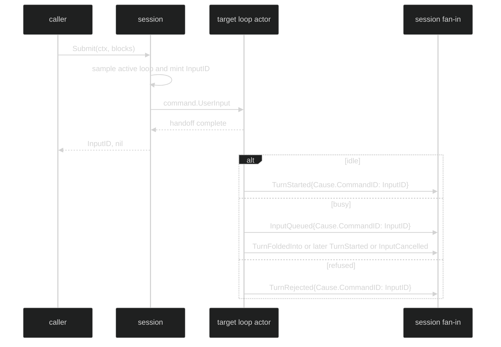

# Submit and Admission

Submission and Turn execution are separate boundaries. `Session.Submit` sends a human-authored `command.UserInput` to the current active loop and returns the minted input ID. It does not wait for `TurnStarted`, a queue decision, or a terminal event. `Session.SubmitToLoop` has the same semantics but addresses one specific registered loop.

## Public submit contract

```go
// From github.com/looprig/harness/pkg/session.
type Session interface {
	SessionID() uuid.UUID
	ActiveLoop() loop.Handle
	Loop(uuid.UUID) (loop.Handle, bool)
	Submit(context.Context, []content.Block) (uuid.UUID, error)
	SubmitToLoop(context.Context, uuid.UUID, []content.Block) (uuid.UUID, error)
	// Other data-plane and control-plane methods follow in the public interface.
}
```

The returned UUID is the submit command's `Header.CommandID`. Resolution events copy it to `Header.Cause.CommandID`, and every `event.Reply` exposes it through `ReplyTo()`.

The `context.Context` bounds the handoff to the loop command channel. Once the loop accepts the command, the Turn derives its own context from the loop lifetime. Canceling the submit context after the send does not cancel an admitted Turn.

## Admission outcomes

The actor decides against its own queue and lifecycle state, so there is no session-side time-of-check/time-of-use race:

| Loop state | Result event | Class | Meaning |
| --- | --- | --- | --- |
| Idle | `event.TurnStarted` | Enduring Reply | Input was committed as the Turn's initial user message. |
| Running, waiting for execution admission, or compaction-blocked | `event.InputQueued` | Ephemeral Reply | Input was accepted into the actor-owned inbox and awaits resolution. |
| Inbox at capacity | `event.TurnRejected{Reason: event.RejectQueueFull}` | Enduring Reply | Input was not admitted. |
| Shutting down | `event.TurnRejected{Reason: event.RejectShuttingDown}` | Enduring Reply | Input was not admitted. |
| Transient actor or ID failure | `event.TurnRejected{Reason: event.RejectInternal}` | Enduring Reply | Loop is healthy; caller may retry. |

`RejectUnspecified` is the zero sentinel and is not produced by the runtime. A successful method return means only that the command was handed to the loop. A non-nil method error means no usable correlation ID is returned: the UUID is zero for context cancellation, an exited loop, an unknown target, session fault, or ID generation failure.

Input that a Host applies as a runtime command (`runtimecommand.Applier`) is admitted differently when the loop declares `SupportsRuntimeAdmission`, as the native loop does. The loop decides on its own state and, if it takes the input, calls `command.Admission.Commit` to record the durable `applied` disposition before the input is queued or started. An input it declines publishes no `TurnRejected`; the disposition is recorded `refused` instead. On restore, an `applied` input with no durable event caused by it is replayed under its original runtime command ID, and it runs at most once.

## Submit to a selected loop

`Submit` samples the active loop once. `SubmitToLoop` does not follow later active-loop changes; it targets the UUID passed by the caller. Both public methods stamp `identity.AgencyUser` onto the command, so the resulting `TurnStarted`, `TurnFoldedInto`, or `InputCancelled` carries that agency in `Header.Cause.Agency`.



## Correlate the answer

```go
package example

import (
	"context"
	"fmt"

	"github.com/looprig/harness/pkg/event"
	"github.com/looprig/harness/pkg/session"
)

func submitAndCorrelate(ctx context.Context, live session.Session) error {
	sub, err := live.SubscribeEvents(event.EventFilter{Enduring: event.LoopScope{All: true}})
	if err != nil {
		return err
	}
	defer sub.Close()

	inputID, err := live.Submit(ctx, nil)
	if err != nil {
		return fmt.Errorf("handoff failed: %w", err)
	}
	for delivery := range sub.Events() {
		reply, ok := delivery.Event.(event.Reply)
		if !ok || reply.ReplyTo() != inputID {
			continue
		}
		switch reply.(type) {
		case event.TurnStarted, event.TurnFoldedInto, event.InputCancelled, event.TurnRejected:
			fmt.Printf("input %v resolved as %T\n", inputID, reply)
			return nil
		}
	}
	return sub.Err()
}
```

This example requests only enduring events. It will not see `InputQueued`, which is intentionally ephemeral. If the UI needs the immediate queue acknowledgement, include `Ephemeral: event.LoopScope{All: true}` in the filter and continue waiting for the later authoritative resolution event.

## Source and proof

- [Session interface and exact Submit signatures](https://github.com/looprig/harness/blob/main/pkg/session/session.go)
- [Submit implementation, transport errors, and agency](https://github.com/looprig/harness/blob/main/internal/sessionruntime/session.go)
- [UserInput command and no-fold fields](https://github.com/looprig/harness/blob/main/pkg/command/submit.go)
- [TurnRejected reasons and InputQueued classification](https://github.com/looprig/harness/blob/main/pkg/event/turn.go)
- [Submit decision and queue admission actor](https://github.com/looprig/harness/blob/main/internal/loopruntime/loop.go)
- [Fire-and-forget and target-loop proofs](https://github.com/looprig/harness/blob/main/internal/sessionruntime/submit_test.go)
