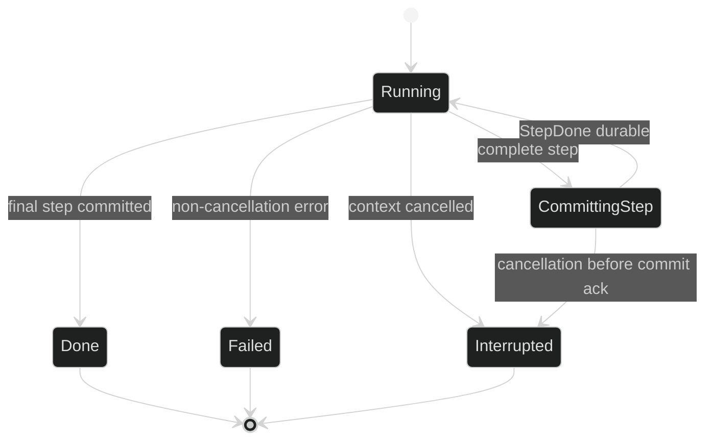

# Terminal Outcomes

Every conceptual Turn ends with exactly one of three public terminal event
types: `event.TurnDone`, `event.TurnFailed`, or `event.TurnInterrupted`. They
are enduring and terminal by construction. The terminal event closes the Turn's
per-turn stream, but it does not erase `StepDone` records that committed before
the terminal boundary.

## Terminal set

The public event shapes are exact:

```go
// pkg/event/turn.go, with lifecycle/scope mixins omitted from this excerpt.
type TurnDone struct {
	Header
	TurnIndex event.TurnIndex
	Message   *content.AIMessage
	Usage     content.Usage
}

type TurnFailed struct {
	Header
	TurnIndex event.TurnIndex
	Err       error // json:"-"; typed in memory
}

type TurnInterrupted struct {
	Header
	TurnIndex event.TurnIndex
}
```

`TurnDone` is successful completion and carries the complete AI response plus
the checked sum of usage from completed requests in the Turn. `TurnFailed`
carries the trusted in-process error so a caller can use `errors.As`; it is for
provider, validation, hook, admission, and other non-cancellation errors.
`TurnInterrupted` carries no error because cancellation is a control outcome,
not a provider diagnosis.

All three embed the unexported `terminal` mixin. That mixin supplies
`Class() == event.Enduring` and `EndsTurn() == true`, so a terminal record can
never be treated as droppable. There is no separate public event for a generic
per-Turn completion or cancellation state.

## Success payload

On a text-only final response, the runtime first commits the final `StepDone`
and then publishes `TurnDone`. `Message` is a cloned `*content.AIMessage`; it
is not a token stream and may include the final assistant blocks. `Usage` is
validated before publication:

```go
func renderSuccess(ev event.Event) error {
	done, ok := ev.(event.TurnDone)
	if !ok {
		return fmt.Errorf("want TurnDone, got %T", ev)
	}
	if done.Message == nil {
		return errors.New("TurnDone has no complete AI message")
	}
	if err := done.Usage.Validate(); err != nil {
		return fmt.Errorf("invalid TurnDone usage: %w", err)
	}
	return nil
}
```

The event validator also requires turn coordinates (`SessionID`, `LoopID`, and
`TurnID`) and a zero `StepID`. `TurnIndex` is loop-local; use the header IDs for
stable cross-loop correlation.

## Failure payload

The runtime returns `TurnFailed` for a non-cancellation error. The failed
in-flight step has not committed, so no `StepDone` is emitted for that step. A
prior step remains durable and visible. Examples include an empty model
response, a malformed final structured output, a tool limit, a hook denial, and
a provider error.

```go
var failed event.TurnFailed
for delivery := range subscription.Events() {
	switch ev := delivery.Event.(type) {
	case event.TurnFailed:
		failed = ev
		var empty *event.EmptyResponseError
		if errors.As(ev.Err, &empty) {
			// Ask the model or caller to retry with a non-empty response.
		}
		var limit *event.ToolLimitError
		if errors.As(ev.Err, &limit) {
			// Report a bounded tool-loop failure.
		}
	case event.TurnInterrupted:
		// No provider error should be shown for cooperative cancellation.
	}
}
```

`Err` is tagged `json:"-"` because arbitrary Go errors have no stable general
codec. `event.MarshalEvent` projects the live error to the stable wire form
used by the journal and reconstructs a typed restored error on decode. A
consumer must not expect the original error's concrete identity after a
restart.

## Interruption payload

When the Turn context is canceled, the runtime maps the cancellation to
`TurnInterrupted`, including cancellation while streaming, executing tools,
waiting for a gate, measuring a candidate request, draining queued input, or
waiting for a durable commit acknowledgement. The current incomplete step is
discarded. Previously committed steps and their `StepDone` events stay intact.



The terminal event is published before the loop's idle transition. Queue
resolution follows the terminal: normal success can chain the next queued user
input, while failure and interruption return unresolved entries through
`InputCancelled` according to their agency and cancellation reason.

## Durable projection

Use `event.MarshalEvent` only for enduring events:

```go
wire, err := event.MarshalEvent(ev)
if err != nil {
	var ephemeral *event.EphemeralNotPersistableError
	if errors.As(err, &ephemeral) {
		// TokenDelta and other live-only events are expected here.
	}
	return err
}
// Store wire in the journal; EventID and coordinates remain in the envelope.
_ = wire
```

Terminal events are marshalable. `TurnDone.Message` uses the content message
codec, `TurnFailed.Err` uses the error projection, and `TurnInterrupted` has no
interface-valued payload. `TokenDelta` is deliberately not part of durable
history, so replay reconstructs the committed message groups from `StepDone`
and the terminal record.

## Source and proof

- [`pkg/event/turn.go`](https://github.com/looprig/harness/blob/main/pkg/event/turn.go) defines the three terminal event fields and comments their runtime meaning.
- [`pkg/event/event.go`](https://github.com/looprig/harness/blob/main/pkg/event/event.go) defines the terminal lifecycle mixin and `EndsTurn` contract.
- [`pkg/event/validate.go`](https://github.com/looprig/harness/blob/main/pkg/event/validate.go) validates coordinates and `TurnDone.Usage`.
- [`pkg/event/marshal.go`](https://github.com/looprig/harness/blob/main/pkg/event/marshal.go) defines durable encoding and the `TurnFailed.Err` projection.
- [`internal/loopruntime/turn.go`](https://github.com/looprig/harness/blob/main/internal/loopruntime/turn.go) maps stream, tool, commit, and context outcomes to the terminal set.
- [`internal/loopruntime/loop.go`](https://github.com/looprig/harness/blob/main/internal/loopruntime/loop.go) orders terminal publication, idle transition, and queue resolution.

This page reserves the approved Harness navigation structure. The exact durable terminal events are `TurnDone`, `TurnFailed`, and `TurnInterrupted`.
