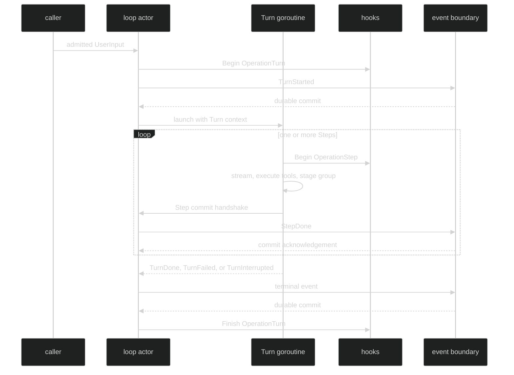

# Turn Lifecycle

The Turn lifecycle has one opening durable event and one exact durable terminal. The loop actor owns the opening and terminal state transitions. A Turn goroutine owns model streaming and tool continuation, but it sends each completed Step back to the actor for the durable commit.

## Opening boundary

For an admitted input, the actor mints a TurnID, builds `event.TurnStarted`, and publishes it through the checked event boundary before installing the active Turn. The event contains the exact initial `*content.UserMessage`, the loop-local `TurnIndex`, and the submit command ID in `Header.Cause.CommandID`. Only after the opening event commits does the actor append the user message to live loop history and launch Turn execution.

```go
// The public event shape is value-based. Runtime publications use event values,
// so consumers should type-switch on event.TurnStarted, not an invented pointer
// event or a separate Start reply.
type TurnStarted struct {
	enduring
	loopScoped
	Header
	TurnIndex TurnIndex            `json:"turn_index,omitzero"`
	Message   *content.UserMessage `json:"message,omitzero"`
}
```

`TurnStarted` is both an enduring event and a `event.Reply`. Its `ReplyTo()` is the submit command ID. It is not a separate transport acknowledgement.

## Running boundary

The Turn builds one request per conceptual Step. The current model configuration and tool set are captured at Turn start. Each successful Step commits a `StepDone`; a tool-using Step may then fold queued input and continue. A text-only Step commits and proceeds directly to the Turn terminal.



## Terminal and idle ordering

The actor keeps the Turn's coordinates while committing the terminal, then clears the active Turn state. On a normal terminal it resolves the next queued input or emits `LoopIdle`; the terminal is therefore observed before the loop's idle edge. A chained Turn does not emit `LoopIdle` between the prior `TurnDone` and the next `TurnStarted`.

The terminal set is closed:

| Terminal | Trigger | Current incomplete Step |
| --- | --- | --- |
| `event.TurnDone` | final assistant message committed | none |
| `event.TurnFailed` | provider, output, tool, hook, or durable failure | discarded |
| `event.TurnInterrupted` | Turn context canceled | discarded |

## Observe with a Turn hook

```go
package example

import (
	"context"
	"fmt"

	"github.com/looprig/harness/pkg/hook"
)

func compileTurnTimingHook() (*hook.Runner, error) {
	return hook.Compile(hook.Set{Around: []hook.Around{{
		Operation: hook.OperationTurn,
		Begin: func(ctx context.Context, call hook.Call) (context.Context, hook.FinishFunc) {
			fmt.Printf("turn index=%d id=%v input=%v\n",
				call.Turn.Index, call.TurnID, call.Turn.Input != nil)
			return ctx, func(result hook.Result) {
				fmt.Printf("turn outcome=%v error=%v\n", result.Outcome, result.Err)
			}
		},
	}}})
}
```

The Turn hook is for in-process observation and policy. The durable lifecycle is the event stream. A hook finish callback may report a failure caused by the terminal commit path, but it does not replace the terminal event.

## Source and proof

- [TurnStarted and terminal event definitions](https://github.com/looprig/harness/blob/main/pkg/event/turn.go)
- [TurnData and OperationTurn hook payload](https://github.com/looprig/harness/blob/main/pkg/hook/data.go)
- [Actor opening, active Turn installation, and terminal handling](https://github.com/looprig/harness/blob/main/internal/loopruntime/loop.go)
- [Turn execution and per-Step commit handshake](https://github.com/looprig/harness/blob/main/internal/loopruntime/turn.go)
- [Turn hook lifecycle proof](https://github.com/looprig/harness/blob/main/internal/loopruntime/turn_hooks_test.go)
- [Terminal-before-idle ordering proof](https://github.com/looprig/harness/blob/main/internal/sessionruntime/quiescence_test.go)
