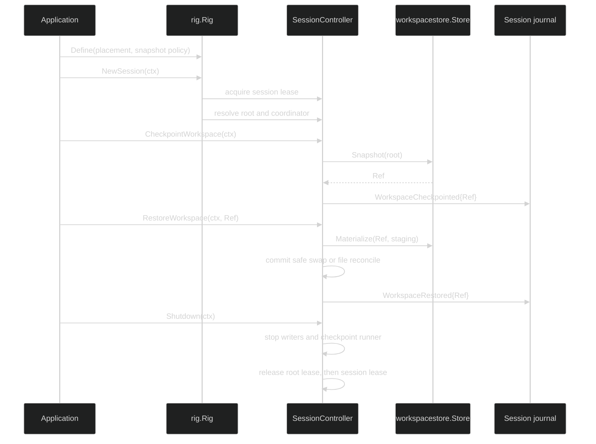

# Workspaces overview

A managed workspace is a filesystem tree owned by one Harness session. The
tree is separate from the conversation journal: `workspacestore.Store` keeps
immutable content-addressed archives, while a session placement decides which
live directory tools may use. A checkpoint records the archive `Ref` in the
session journal, so restore can find the same tree after a process restart.

## Placement modes

`rig` accepts at most one placement option. The option is resolved and
canonicalized while `rig.Define` builds the immutable rig.

| Option | Live root | Lease and consistency |
| --- | --- | --- |
| `WithExclusiveWorkspace(store, root, leaser)` | one canonical fixed `root` | one hashed root lease; checkpoints are quiescent |
| `WithSessionWorkspaces(store, baseDir)` | `baseDir/<sessionID>` | no root lease; each session is isolated and checkpoints are quiescent |
| `WithSharedWorkspace(store, root)` | one canonical fixed `root` | deliberately no root lease; checkpoints are fuzzy because other writers may exist |

The workspace store is a `*workspacestore.Store`, not a general directory
manager. The store owns blobs and archive limits; the session owns the live
root and the mutation coordinator.

## Define-time contract

```go
// workspaceStore and sessionStore are opened by the application over its
// storage backends. assistant is a loop.Definition.
runtime, err := rig.Define(
	rig.WithLoops(assistant),
	rig.WithPrimers("assistant"),
	rig.WithSessionStore(sessionStore),
	rig.WithSessionWorkspaces(workspaceStore, "/var/lib/my-agent/workspaces"),
	rig.WithSnapshots(rig.SnapshotPolicy{
		Trigger:  rig.SnapshotOnTurnDone,
		Priority: rig.SnapshotRequired,
	}),
)
if err != nil {
	// Inspect *rig.WorkspacePlacementError or *rig.SnapshotPolicyError
	// with errors.As; do not parse the error string.
	return err
}
```

Placement is required when any loop definition contains a tool with
`tool.RequiresWorkspace`; otherwise `Define` returns
`*rig.WorkspacePlacementError{Kind: rig.WorkspaceToolWithoutPlacement}`.
When snapshots are configured, a placement and policy are both required.
`SnapshotTriggerUnset` resolves to `SnapshotOnIdle`, a zero timeout resolves to
60 seconds, and a required policy is rejected for shared placement.

Other placement failures are typed `WorkspacePlacementError` values:
`WorkspaceMultiplePlacements`, `WorkspaceNilStore`, `WorkspaceNilLeaser`,
`WorkspaceEmptyRoot`, `WorkspaceCanonicalizeFailed`, and
`WorkspaceLeaseNameInvalid`. Persistence paths reported by the session store
or workspace store may not be equal to or below the managed root; a violation
is `*rig.PersistenceOverlapError`.

## Session control surface

The workspace methods are deliberately on the lifecycle view, not on the
ordinary data-plane `session.Session` interface.

```go
type SessionController interface {
	session.Session
	CheckpointWorkspace(context.Context) (workspacestore.Ref, error)
	RestoreWorkspace(context.Context, workspacestore.Ref) error
	Shutdown(context.Context) error
}
```

`CheckpointWorkspace` snapshots the configured root and durably appends
`event.WorkspaceCheckpointed`. `RestoreWorkspace` is an idle-time control
operation that changes the live tree and then appends `event.WorkspaceRestored`.
Without a managed placement both methods return
`*session.WorkspaceNotConfiguredError` and touch neither the filesystem nor the
journal.

## Lifecycle



The source contract is [`pkg/rig/workspace.go`](https://github.com/looprig/harness/blob/main/pkg/rig/workspace.go), [`pkg/rig/snapshot_policy.go`](https://github.com/looprig/harness/blob/main/pkg/rig/snapshot_policy.go), [`pkg/session/session.go`](https://github.com/looprig/harness/blob/main/pkg/session/session.go), and the lower-level [`pkg/workspacestore`](https://github.com/looprig/harness/tree/main/pkg/workspacestore) package. The placement and policy matrix is proved by [`pkg/rig/workspace_test.go`](https://github.com/looprig/harness/blob/main/pkg/rig/workspace_test.go) and [`pkg/rig/snapshot_policy_test.go`](https://github.com/looprig/harness/blob/main/pkg/rig/snapshot_policy_test.go).

## Source and proof

- [`workspace placement contract`](https://github.com/looprig/harness/blob/main/pkg/rig/workspace.go)
- [`snapshot policy`](https://github.com/looprig/harness/blob/main/pkg/rig/snapshot_policy.go)
- [`persistence fixture` (journal, snapshot, materialize, replay)](https://github.com/looprig/harness/blob/main/examples/persistence/example_test.go)
