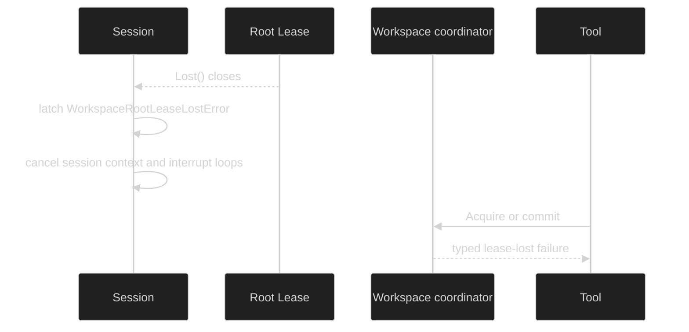

# Workspace leases

Only exclusive placement uses a workspace root lease. Per-session placement is
isolated by its UUID directory, and shared placement intentionally permits
humans, external tools, and other sessions to write without a root lease.

## Lease contract

Harness consumes the storage package's small lease interface:

```go
type Leaser interface {
	Acquire(context.Context, string) (Lease, error)
}

type Lease interface {
	Epoch() uint64
	Lost() <-chan struct{}
	Release(context.Context) error
}
```

`Acquire` is exclusive for a name. A successful lease has a monotonically
increasing epoch, a loss notification, and a context-bounded release. A backend
may reclaim a dead holder according to its native mechanism. The root lease
name is the hash described in [Bindings and roots](/docs/guides/harness/workspaces/bindings-and-roots).

## Acquisition and contention

The session journal lease is acquired first. Only then does NewSession resolve
an exclusive placement and call `Leaser.Acquire` for the root. This ordering
means a failed root acquisition can release the session lease without exposing
a partially constructed session.

```go
controller, err := runtime.NewSession(ctx)
if err != nil {
	var busy *rig.WorkspaceRootBusyError
	if errors.As(err, &busy) {
		// busy.Root is canonical and HolderEpoch identifies the current holder.
		log.Printf("workspace busy: %s epoch %d", busy.Root, busy.HolderEpoch)
	}
	return err
}
```

`WorkspaceRootBusyError` wraps the storage refusal and carries `Root` and
`HolderEpoch`. The failed construction path does not materialize a seed or bind
tools. The contention proof is [`internal/sessionruntime/workspace_placement_integration_test.go`](https://github.com/looprig/harness/blob/main/internal/sessionruntime/workspace_placement_integration_test.go).

## Lease loss

The exclusive session watches `Lease.Lost()`. Once it closes, the watcher
latches `*session.WorkspaceRootLeaseLostError`, closes admission, and cancels
the session context. The coordinator's `Healthy` check independently rejects a
structured mutator that races with loss. This is fail-closed: a process never
continues writing a root it no longer owns.



## Shutdown order

Shutdown stops Hustles, loops, process resources, checkpoint activity, and the
hub before releasing ownership. It releases the exclusive root lease exactly
once, then the session journal lease. Each release gets a fresh bounded cleanup
context; a release failure is logged and the backend TTL remains the backstop.
Repeated shutdown calls join the same teardown result.

The source is [`pkg/rig/workspace.go`](https://github.com/looprig/harness/blob/main/pkg/rig/workspace.go), [`internal/sessionruntime/lifecycle.go`](https://github.com/looprig/harness/blob/main/internal/sessionruntime/lifecycle.go), and [`internal/sessionruntime/session.go`](https://github.com/looprig/harness/blob/main/internal/sessionruntime/session.go). Lease-loss behavior is proved by [`internal/sessionruntime/workspace_fault_test.go`](https://github.com/looprig/harness/blob/main/internal/sessionruntime/workspace_fault_test.go); teardown ordering is covered by [`internal/sessionruntime/lifecycle_test.go`](https://github.com/looprig/harness/blob/main/internal/sessionruntime/lifecycle_test.go).

## Source and proof

- [`workspace lease placement`](https://github.com/looprig/harness/blob/main/pkg/rig/workspace.go)
- [`lease-loss proof`](https://github.com/looprig/harness/blob/main/internal/sessionruntime/workspace_fault_test.go)
- [`shutdown ownership order`](https://github.com/looprig/harness/blob/main/internal/sessionruntime/lifecycle_test.go)
