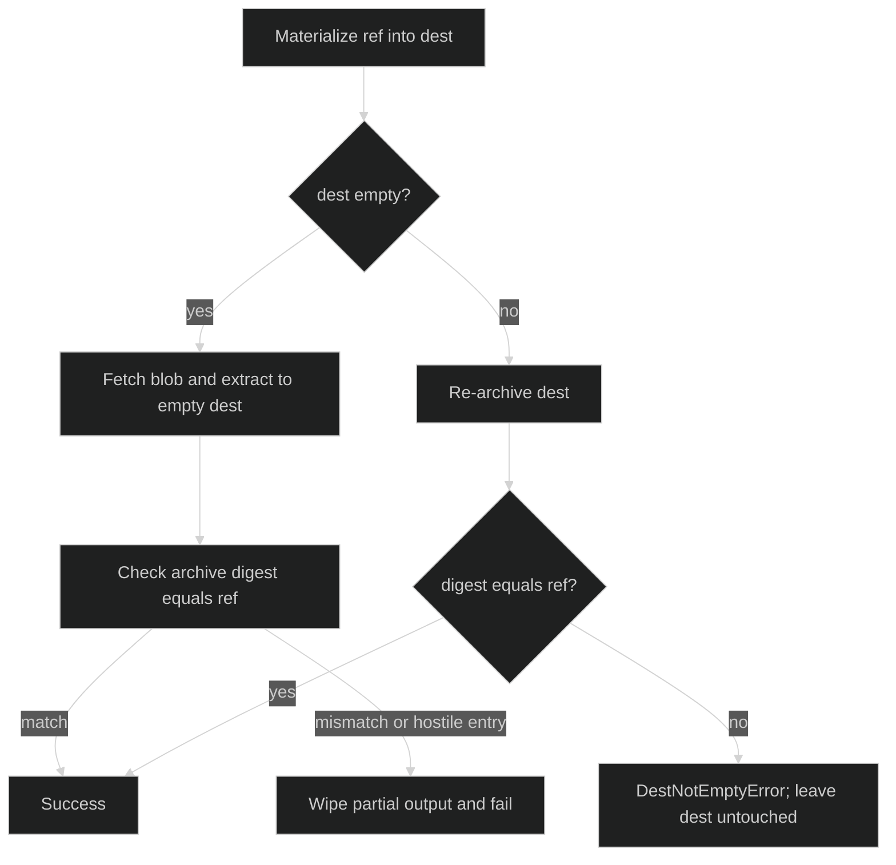

# Materialization

`workspacestore.Store.Materialize` turns one immutable `Ref` into a directory.
It never trusts an existing warm volume without re-archiving it, never wipes a
drifted non-empty destination, and verifies the fetched archive against the
content address before success.

## Store and options

```go
type Options struct {
	SpoolDir   string
	MaxEntries int64
	MaxBytes   int64
}

func Open(storage.Blobs, ...Option) (*Store, error)
func (s *Store) Materialize(context.Context, Ref, string) error
```

`WithSpoolDir` chooses where `Snapshot` writes its temporary archive.
`WithMaxEntries` and `WithMaxBytes` bound extraction; non-positive values select
the defaults of `1<<20` entries and `8<<30` extracted bytes. `Open` rejects a
nil blob backend with `*NilBlobsError` and canonicalizes the spool path.

Use `ParseRef` for refs received from an untrusted boundary. A valid ref is
exactly `v1:sha256:<64 lowercase hex>`.

## Truth path and warm reuse

The destination determines the safe path:

| Destination state | Behavior |
| --- | --- |
| missing or empty directory | fetch archive, extract, then verify the full compressed-stream digest |
| non-empty directory with matching deterministic archive digest | no-op verified reuse; no blob fetch |
| non-empty directory with a different digest | return `*DestNotEmptyError`; leave it untouched |
| existing non-directory | return `*MaterializeError` wrapping `*NotDirError` |

```go
if err := workspaceStore.Materialize(ctx, ref, root); err != nil {
	var drift *workspacestore.DestNotEmptyError
	if errors.As(err, &drift) {
		// Decide whether an operator may clear the volume. Materialize does not.
		return fmt.Errorf("workspace drift at %s: %w", drift.Dest, err)
	}
	return err
}
```

The session's seed path relies on this contract: it permits a seed only for a
per-session root or an empty exclusive root. Shared placement cannot be seeded.

## Extraction safety

Materialization extracts into a directory with least-privilege permissions and
rejects absolute or parent-traversing archive names, escaping symlinks, device,
FIFO, and hardlink entries. It measures actual entries read and bytes written,
not declared archive sizes. On an extraction or integrity failure, partial
output is removed and the destination remains a failed closed state.



## Typed failures

```go
var materialize *workspacestore.MaterializeError
if errors.As(err, &materialize) {
	var integrity *workspacestore.IntegrityError
	var limit *workspacestore.ArchiveLimitError
	var entry *workspacestore.ArchiveEntryError
	switch {
	case errors.As(err, &integrity):
		// Blob content did not match the Ref.
	case errors.As(err, &limit):
		// limit.Limit is ArchiveLimitEntries or ArchiveLimitBytes.
	case errors.As(err, &entry):
		// The archive entry violated the extraction boundary.
	}
	_ = materialize.Ref
}
```

`MaterializeError` wraps fetch, decompression, and extraction causes. The typed
`IntegrityError`, `ArchiveEntryError`, `ArchiveLimitError`, and
`DestNotEmptyError` fields are log-safe. The implementation is
[`pkg/workspacestore/materialize.go`](https://github.com/looprig/harness/blob/main/pkg/workspacestore/materialize.go), [`pkg/workspacestore/extract.go`](https://github.com/looprig/harness/blob/main/pkg/workspacestore/extract.go), and [`pkg/workspacestore/ref.go`](https://github.com/looprig/harness/blob/main/pkg/workspacestore/ref.go). Round-trip, drift, tamper, and limit proofs are in [`pkg/workspacestore/materialize_test.go`](https://github.com/looprig/harness/blob/main/pkg/workspacestore/materialize_test.go) and [`pkg/workspacestore/ref_test.go`](https://github.com/looprig/harness/blob/main/pkg/workspacestore/ref_test.go).

## Source and proof

- [`Store.Materialize`](https://github.com/looprig/harness/blob/main/pkg/workspacestore/materialize.go)
- [`safe archive extraction`](https://github.com/looprig/harness/blob/main/pkg/workspacestore/extract.go)
- [`materialization and ref tests`](https://github.com/looprig/harness/blob/main/pkg/workspacestore/materialize_test.go), [`ref tests`](https://github.com/looprig/harness/blob/main/pkg/workspacestore/ref_test.go)
- [`persistence fixture` (snapshot and materialize)](https://github.com/looprig/harness/blob/main/examples/persistence/example_test.go)
