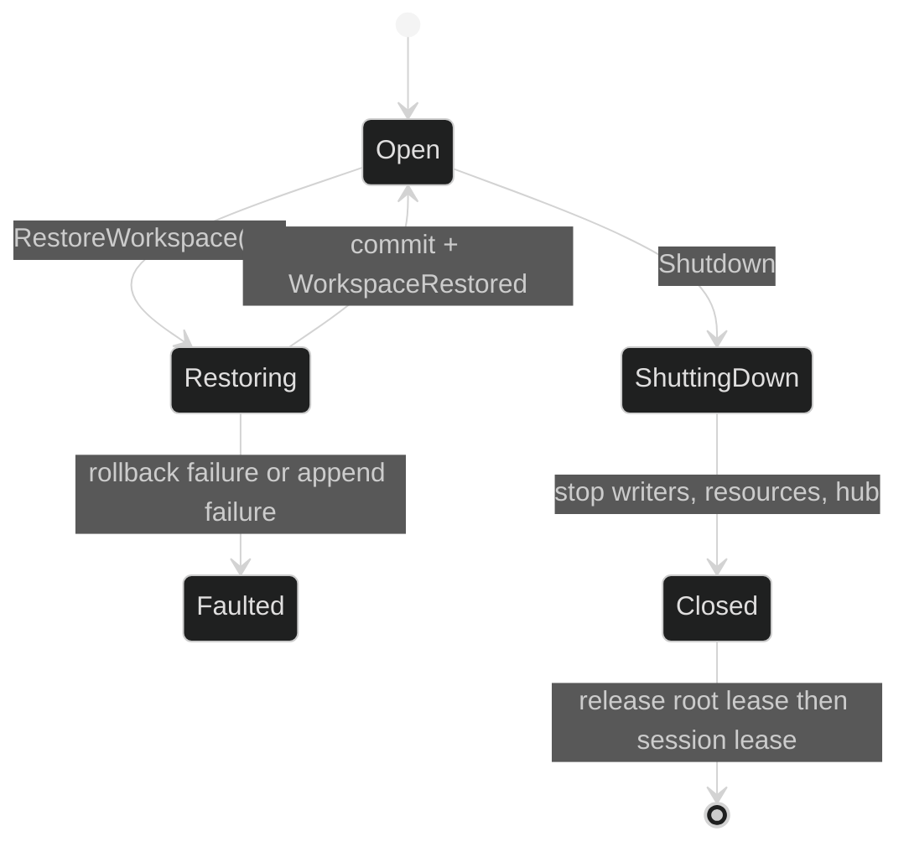

# Restore and cleanup

`SessionController.RestoreWorkspace` is an idle-time control operation. It
does not overwrite a live tree in place without coordination: it suspends new
process admission, drains writable permits, materializes into a protected
staging location, commits a safe swap or deterministic reconcile, and only then
records the new durable pointer.

## Restore contract

```go
import (
	"context"
	"errors"

	"github.com/looprig/core/uuid"
	"github.com/looprig/harness/pkg/loop"
	"github.com/looprig/harness/pkg/session"
	"github.com/looprig/harness/pkg/workspacestore"
)

type SessionController interface {
	session.Session
	SetActiveLoop(context.Context, uuid.UUID) error
	LoopController(uuid.UUID) (loop.Controller, bool)
	CheckpointWorkspace(context.Context) (workspacestore.Ref, error)
	RestoreWorkspace(context.Context, workspacestore.Ref) error
	Shutdown(context.Context) error
}

if err := controller.RestoreWorkspace(ctx, ref); err != nil {
	var materializeErr *workspacestore.MaterializeError
	if errors.As(err, &materializeErr) {
		// The public store error identifies the ref and destination cause.
	}
	return err
}
```

Consumers should match the public errors exposed by `pkg/session` and inspect
wrapped causes with `errors.As`. An unconfigured session returns
`*session.WorkspaceNotConfiguredError`. A canceled context, closing session,
faulted session, failed permit, unhealthy lease, failed swap, or failed durable
append is fail-closed.

## Admission and commit

The sequence is intentionally ordered:

1. Reject a canceled, closing, or faulted session.
2. Suspend new process admission.
3. Acquire the exclusive `WorkspaceOperationCheckpoint` permit. Existing
   read-only lifetimes may remain; writable lifetimes and mutations drain.
4. Check lease health, materialize and verify the target ref, and commit.
5. Append `event.WorkspaceRestored` after the filesystem commit.
6. Resume process admission on every return path.

If the event append fails after the tree changed, the session faults because the
live tree and durable pointer would otherwise disagree. If a fixed-root rollback
itself fails, `WorkspaceRestoreRollbackFailed` is escalated to a session fault.

## Placement-specific restore

Per-session roots use a verified whole-root swap:

```text
materialize ref -> sibling .<id>.staging
rename live root -> sibling .<id>.backup
rename staging -> live root
remove backup (or restore it if the second rename fails)
```

Exclusive and shared fixed roots are never renamed or recursively wiped. They
materialize into session-unique sibling scratch directories, build a regular-file
manifest, replace changed files, and delete files absent from the ref in sorted
order. Every touched file has a rollback copy. Symlinked components are refused
so a restore cannot write outside the root. Empty directories and non-regular
entries not represented by the archive are not pruned in the fixed-root path.

## Restoring a session on another Host

Session restore (`Rig.RestoreSession`) brings the tree back from the journal
rather than from the old directory. Before the session is built, it
materializes the ref named by the latest `WorkspaceCheckpointed` or
`WorkspaceRestored` into the placement's root, using the
[materialization](/docs/guides/harness/workspaces/materialization) truth path.
A failure is `*session.RestoreError{Kind: session.RestoreMaterializeFailed}`,
and the session does not come up. A non-empty root whose digest differs fails
closed with `*workspacestore.DestNotEmptyError` and is not cleared.

A per-session placement may restore under a different `baseDir` than the one
that wrote the session; the relocation is not treated as configuration drift.
Tools and the model keep seeing the same `LogicalRoot`
(`/sessions/<sessionID>/workspace`), and public events publish
`workspace_root` in that logical form rather than the Host's physical path.

Restore carries only what a checkpoint captured. A session with no checkpoint
comes up on an untouched (usually empty) root, and edits after the last
checkpoint are not recovered. A controller that implements
`session.WorkspaceReporter` reports this as `session.WorkspaceStatus`:
`HasCheckpoint`, `CheckpointSeq`, and `PostCheckpointEvents` describe the
boundary as of restore, and `PostCheckpointLoss()` is true when loop events
followed that checkpoint.

## Cleanup and events



`WorkspaceRestored` carries only the `Ref`; the prepared private payload is not
part of the public event stream. On a fresh session, `WithSeedSnapshot(ref)`
materializes before loop construction and journals a first
`WorkspaceCheckpointed{Trigger: SnapshotTriggerSeed}`. A seed is rejected for
shared placement, a non-empty root, or a ref that cannot materialize.

The implementation is [`internal/sessionruntime/workspace_restore.go`](https://github.com/looprig/harness/blob/main/internal/sessionruntime/workspace_restore.go), [`internal/sessionruntime/checkpoint.go`](https://github.com/looprig/harness/blob/main/internal/sessionruntime/checkpoint.go), and [`pkg/rig/session_options.go`](https://github.com/looprig/harness/blob/main/pkg/rig/session_options.go). End-to-end seed and rewind behavior is proved by [`pkg/rig/workspace_integration_test.go`](https://github.com/looprig/harness/blob/main/pkg/rig/workspace_integration_test.go) and [`internal/sessionruntime/restore_workspace_test.go`](https://github.com/looprig/harness/blob/main/internal/sessionruntime/restore_workspace_test.go).

## Source and proof

- [`workspace restore coordinator`](https://github.com/looprig/harness/blob/main/internal/sessionruntime/workspace_restore.go)
- [`checkpoint ordering`](https://github.com/looprig/harness/blob/main/internal/sessionruntime/checkpoint.go)
- [`restore integration tests`](https://github.com/looprig/harness/blob/main/internal/sessionruntime/restore_workspace_test.go), [`workspace tests`](https://github.com/looprig/harness/blob/main/pkg/rig/workspace_integration_test.go)
- [`persistence fixture` (store restore primitives)](https://github.com/looprig/harness/blob/main/examples/persistence/example_test.go)
