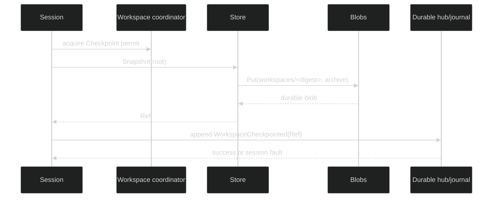

# Snapshots

Snapshots are deterministic gzip-tar archives stored under a content address.
The `Ref` is the resume token; the archive bytes are the immutable state. A
session checkpoint is the durable pointer that makes that ref part of session
history.

## Store snapshot contract

```go
type Ref string // v1:sha256:<64 lowercase hex>

func ParseRef(string) (Ref, error)

type Store struct { /* immutable backend and resolved Options */ }

func (s *Store) Snapshot(context.Context, string) (Ref, error)
func (s *Store) Delete(context.Context, Ref) error
func (s *Store) GC(context.Context, map[Ref]struct{}) ([]Ref, error)
```

`Snapshot` validates an existing directory, streams a deterministic archive to
the configured spool directory, hashes the complete archive, and uploads only
when the blob key is absent. Re-snapshotting unchanged content is therefore a
no-op upload. `SnapshotError` wraps the walk, archive, hash, or blob failure.

```go
ref, err := workspaceStore.Snapshot(ctx, liveRoot)
if err != nil {
	var snapErr *workspacestore.SnapshotError
	if errors.As(err, &snapErr) {
		log.Printf("snapshot root %s failed", snapErr.Root)
	}
	return err
}
fmt.Println("checkpoint candidate:", ref)
```

## Checkpoint event

The session-facing method performs the snapshot before publishing the pointer:

```go
ref, err := controller.CheckpointWorkspace(ctx)
if err != nil {
	var notConfigured *session.WorkspaceNotConfiguredError
	if errors.As(err, &notConfigured) {
		// The rig has no managed workspace.
	}
	return err
}
```

The durable event is:

```go
type WorkspaceCheckpointed struct {
	Header
	Ref         string
	Consistency SnapshotConsistency
	Trigger     SnapshotTriggerKind
}

const (
	SnapshotQuiescent SnapshotConsistency = 1
	SnapshotFuzzy     SnapshotConsistency = 2
)
```

`SnapshotQuiescent` means Harness-managed mutations were excluded by the
checkpoint permit. Shared placement always records `SnapshotFuzzy`. Manual and
seed checkpoints have a zero cause; idle, interrupt, turn-done, and step-done
checkpoints carry the corresponding machine event cause. `WorkspaceCheckpointed`
is session-scoped and enduring.

## Snapshot policy

```go
type SnapshotPolicy struct {
	Trigger  SnapshotTrigger
	Priority SnapshotPriority
	Timeout  time.Duration
}

const (
	SnapshotTriggerUnset SnapshotTrigger = iota
	SnapshotManual
	SnapshotOnIdle
	SnapshotOnTurnDone
	SnapshotOnStepDone
)

const (
	SnapshotBestEffort SnapshotPriority = iota
	SnapshotRequired
)
```

`WithSnapshots` is valid only with a placement. `SnapshotRequired` is rejected
for shared placement because external writers make a quiescent guarantee
impossible. A required boundary can fault the session on a failed checkpoint;
best effort reports the failed attempt and lets the runtime continue according
to its boundary policy.

## Ordering and failures



The blob is durable before the event is appended. A crash between those calls
can leave an unreferenced blob, which `Store.GC` may remove from the live ref
set; the reverse order is never used. A snapshot failure returns its typed
store error and appends no checkpoint event. The event definitions and
validation are in [`pkg/event/event.go`](https://github.com/looprig/harness/blob/main/pkg/event/event.go) and [`pkg/event/validate.go`](https://github.com/looprig/harness/blob/main/pkg/event/validate.go). The ordering proof is [`internal/sessionruntime/checkpoint_test.go`](https://github.com/looprig/harness/blob/main/internal/sessionruntime/checkpoint_test.go); policy and event-boundary proofs are in [`pkg/rig/snapshot_policy_test.go`](https://github.com/looprig/harness/blob/main/pkg/rig/snapshot_policy_test.go) and [`internal/sessionruntime/checkpoint_controller_test.go`](https://github.com/looprig/harness/blob/main/internal/sessionruntime/checkpoint_controller_test.go).

## Source and proof

- [`snapshot policy`](https://github.com/looprig/harness/blob/main/pkg/rig/snapshot_policy.go)
- [`checkpoint coordinator`](https://github.com/looprig/harness/blob/main/internal/sessionruntime/checkpoint.go)
- [`checkpoint ordering tests`](https://github.com/looprig/harness/blob/main/internal/sessionruntime/checkpoint_test.go), [`policy tests`](https://github.com/looprig/harness/blob/main/pkg/rig/snapshot_policy_test.go)
- [`persistence fixture` (snapshot and materialize)](https://github.com/looprig/harness/blob/main/examples/persistence/example_test.go)
