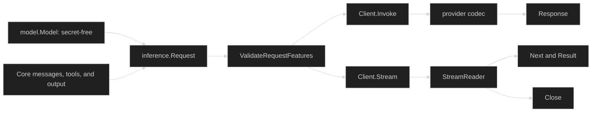

# Inference overview

Inference is the provider-neutral boundary between a model-serving client and the rest of Looprig. `inference.Client` exposes `Invoke` for one complete response and `Stream` for incremental `content.Chunk` values. A request carries a secret-free `model.Model`, system instructions, `content.AgenticMessages`, tools, an optional structured-output contract, tool choice, and sampling overrides.

## Provider-neutral contract

Build the request from Core content and a validated model. Keep credentials in the provider client or its authenticator; `model.Model` describes routing and local capability limits but does not carry an API key.

```go
package example

import (
	"context"

	"github.com/looprig/core/content"
	"github.com/looprig/inference"
	"github.com/looprig/inference/model"
)

func invoke(ctx context.Context, client inference.Client, selected model.Model) (*inference.Response, error) {
	if err := selected.Validate(); err != nil {
		return nil, err
	}
	req := inference.Request{
		Model: selected,
		Messages: content.AgenticMessages{
			&content.UserMessage{Message: content.Message{
				Role: content.RoleUser,
				Blocks: []content.Block{&content.TextBlock{Text: "Hello"}},
			}},
		},
	}
	if err := inference.ValidateRequestFeatures(req); err != nil {
		return nil, err
	}
	return client.Invoke(ctx, req)
}
```

The same request shape can be sent through `client.Stream`. The returned `stream.StreamReader` owns the response body: consume `Next` until it returns false, inspect `Result`, and call `Close` when the caller stops early. Structured output and tool calls remain request features, so validation happens before a provider codec attempts transport.

## One request lifecycle



## Choose a path

Use the nested guides as the canonical developer path:

| Need | Continue with |
| --- | --- |
| Construct content and message threads | [Content blocks](/docs/guides/inference/content-blocks/) and [Messages](/docs/guides/inference/messages/) |
| Describe and validate a model | [Models](/docs/guides/inference/models/) |
| Build a request | [Requests](/docs/guides/inference/requests/) |
| Read complete or incremental output | [Responses](/docs/guides/inference/responses/) and [Streaming](/docs/guides/inference/streaming/) |
| Enforce structured output | [Structured output](/docs/guides/inference/structured-output/) |
| Select a released provider adapter | [Providers](/docs/guides/inference/providers/) |
| Translate a wire format | [Codecs](/docs/guides/inference/codecs/) and [API formats](/docs/guides/inference/api-formats/) |
| Bound context and recover failures | [Context counting](/docs/guides/inference/context-counting/) and [Errors and cancellation](/docs/guides/inference/errors-and-cancellation/) |

Keep the client lifecycle separate from the Harness lifecycle: Inference owns model requests, provider codecs, responses, and streams; Harness owns turns, steps, tool execution, gates, and durable session events.

## Source

- [`inference.Client`, `Request`, and `Response`](https://github.com/looprig/inference/blob/main/client.go)
- [`model.Model` validation and secret-free identity](https://github.com/looprig/inference/blob/main/model/model.go)
- [`stream.StreamReader`](https://github.com/looprig/inference/blob/main/stream/stream.go)
- [`OutputSchema` and request feature validation](https://github.com/looprig/inference/blob/main/structured_result.go)

## Proof

- [Client request and response tests](https://github.com/looprig/inference/blob/main/client_test.go)
- [Model validation tests](https://github.com/looprig/inference/blob/main/model/model_test.go)
- [Stream reader tests](https://github.com/looprig/inference/blob/main/stream/stream_test.go)
