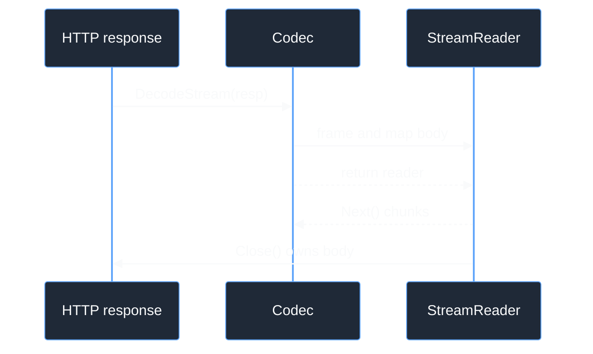

# Codec Architecture

The codec boundary is a typed composition of request encoding, response
decoding, and optional stream handling. It owns wire semantics only. The
transport owns HTTP status mapping, body limits, authorization, and the
request context.

## Ownership

```go
type EncodedRequest struct {
	Header http.Header
	Body   io.Reader // consumed exactly once
}

type RequestEncoder interface {
	EncodeRequest(inference.Request, RequestMode) (EncodedRequest, error)
}

type ResponseDecoder interface {
	DecodeResponse([]byte) (*inference.Response, error)
}

type StreamDecoder interface {
	DecodeStream(*http.Response) (*stream.StreamReader[content.Chunk], error)
}

type Codec interface {
	RequestEncoder
	ResponseDecoder
}
```

`Codec` intentionally does not embed `StreamDecoder`, so a non-streaming API
can satisfy the one-shot contract without a fake stream implementation.
`StreamingCodec` adds the optional decoder. `EncodedRequest.Body` is single-use;
the transport clears `http.Request.GetBody` and never retries it itself.

## Stream lifetime

`DecodeStream` takes ownership of `resp.Body`. A successful return transfers
close responsibility to the returned reader. If framing or decoder setup fails
before a reader is returned, the decoder must close the body. The reader exposes
chunks through `Next`, publishes terminal metadata only after clean `io.EOF`,
and requires callers to call `Close` even after EOF.



## Source and proof

- [`codec/contracts.go`](https://github.com/looprig/inference/blob/v0.9.2/codec/contracts.go)
- [`transport/client.go`](https://github.com/looprig/inference/blob/v0.9.2/transport/client.go)
- [`stream/stream.go`](https://github.com/looprig/inference/blob/v0.9.2/stream/stream.go)
- [`stream/chunkstream.go`](https://github.com/looprig/inference/blob/v0.9.2/stream/chunkstream.go)

Run `go test ./codec/... ./stream/... ./transport/...`.
