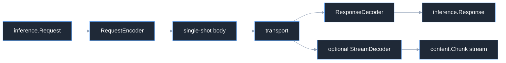

# Overview

Codecs are the only layer that knows a provider's JSON and stream dialect. A
codec maps the secret-free `inference.Request` and `inference.Response` types
to and from bytes; transport, routing, authorization, and cancellation remain
outside the codec.

## Boundary

The public contracts are deliberately split. `RequestEncoder` and
`ResponseDecoder` handle one-shot calls, while `StreamDecoder` is optional.
`ServerCodec` is the inverse boundary used by the gateway. A codec is expected
to be stateless and safe to share; only a returned `StreamEncoder` is
request-scoped.

## Choose a codec

| Package | Native endpoint shape | Streaming selection | Distinctive mapping |
| --- | --- | --- | --- |
| `codec/openaiapi` | `POST /v1/chat/completions` | JSON `stream: true` and SSE | string or multipart message content |
| `codec/openairesponses` | `POST /v1/responses` | JSON `stream: true` and typed SSE events | items, function calls, reasoning items |
| `codec/anthropicapi` | `POST /v1/messages` | JSON `stream: true` and SSE | top-level system, content blocks, cache breakpoints |
| `codec/geminiapi` | `:generateContent` | route changes to `:streamGenerateContent?alt=sse` | `contents` roles and function parts |
| `codec/bedrockconverse` | Converse body | route and response framing change | tagged Converse union, inline media |

Use the matching route builder with the codec. The generic transport must not
guess a path or replay a body.

## Source and proof

- [`codec/contracts.go`](https://github.com/looprig/inference/blob/v0.13.0/codec/contracts.go)
- [`codec/requestmode.go`](https://github.com/looprig/inference/blob/v0.13.0/codec/requestmode.go)
- [`codec` contract tests](https://github.com/looprig/inference/blob/v0.13.0/codec/contracts_test.go)

Run the contract tests with `go test ./codec/...`.
