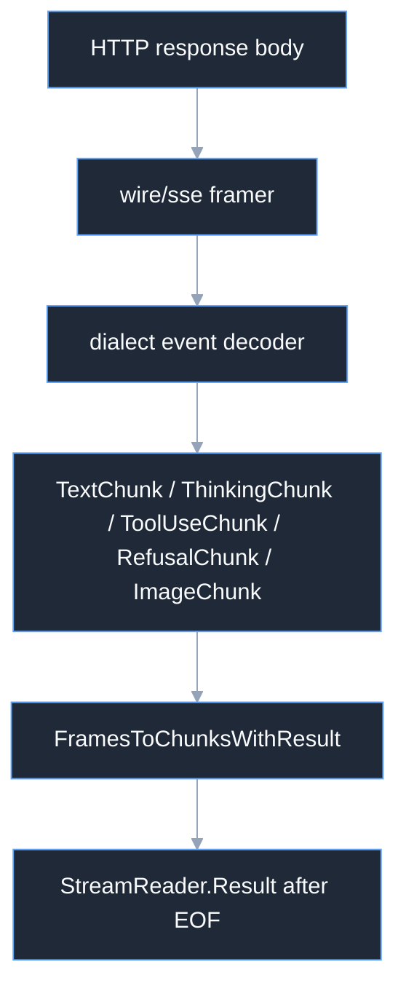

# Streaming Codecs

Streaming codecs separate raw framing from semantic chunk decoding. The SSE
framer produces `stream.StreamFrame`; a dialect decoder maps each frame to
`content.Chunk` values, and the shared adapter accumulates tool arguments and
terminal usage.

## Framing



OpenAI accepts either end-of-generation signal: the `[DONE]` terminal SSE data
payload or a reported finish reason. Anthropic authorizes a terminal result on
`message_stop`. Responses uses typed `response.completed`, and Gemini
authorizes on a candidate that reports a `finishReason`. Bedrock uses
event-stream frames and a metadata/message-stop sequence. A stream that ends
before its dialect's terminal marker is a typed `StreamDecodeError`, not a
clean end. Uninteresting or unknown-but-well-formed events are skipped, while a
frame whose JSON does not parse aborts the stream with a typed
`StreamEventDecodeError`; typed stream and provider errors still fail the
reader.

## Accumulation

`ToolUseChunk.Index` is the join key. OpenAI and Anthropic send argument
fragments, so the accumulator concatenates fragments by index. Gemini emits a
complete function call per part, and the stream-scoped collector rebases that
event's positional index onto a stream-wide sequence. `Codec.DecodeEvent` is
stateless; the rebasing state belongs to the stream collector.

```go
reader, err := client.Stream(ctx, req)
if err != nil {
	return err
}
defer reader.Close()
for {
	chunk, err := reader.Next()
	if errors.Is(err, io.EOF) {
		break
	}
	if err != nil {
		return err
	}
	fmt.Printf("%T\n", chunk)
}
result, ok := reader.Result()
if ok {
	fmt.Println(result.FinishReason)
}
```

## Source and proof

- [`codec/contracts.go`](https://github.com/looprig/inference/blob/v0.13.0/codec/contracts.go)
- [`stream/chunkstream.go`](https://github.com/looprig/inference/blob/v0.13.0/stream/chunkstream.go)
- [`openaiapi/stream.go`](https://github.com/looprig/inference/blob/v0.13.0/codec/openaiapi/stream.go)
- [`anthropicapi/stream.go`](https://github.com/looprig/inference/blob/v0.13.0/codec/anthropicapi/stream.go)

Run `go test ./codec/... ./stream/...`.
