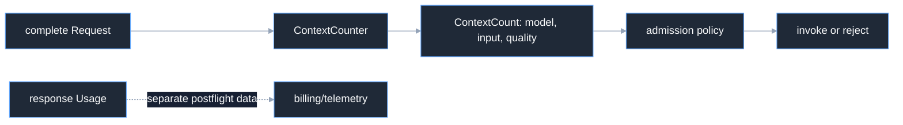

# Overview

Context counting is a preflight occupancy seam. It counts the complete
provider-neutral `inference.Request` before invocation so admission policy can
compare input tokens with a model context limit. It is not a response-usage
wrapper and it does not count generated output.

## Purpose

```go
type ContextCount struct {
	Model       model.ModelKey
	InputTokens content.TokenCount
	Quality     CountQuality
}

type ContextCounter interface {
	CountContext(context.Context, inference.Request) (ContextCount, error)
	CounterCapability() CounterCapability
}
```

`InputTokens` is the occupancy of the complete request, including system text,
conversation, tools, structured-output schema, and dialect-specific encoding.
`Quality` distinguishes provider-exact, local-exact, and heuristic estimates.

Harness consumes this preflight result for [context limits](/docs/guides/harness/loop/context-limits/)
and [automatic compaction thresholds](/docs/guides/harness/compaction/context-thresholds/).

## Flow



## Source and proof

- [`contextcount/contracts.go`](https://github.com/looprig/inference/blob/v0.9.2/contextcount/contracts.go)
- [`contextcount/estimator.go`](https://github.com/looprig/inference/blob/v0.9.2/contextcount/estimator.go)
- [`contextcount/estimator_test.go`](https://github.com/looprig/inference/blob/v0.9.2/contextcount/estimator_test.go)

Run `go test ./contextcount`.
