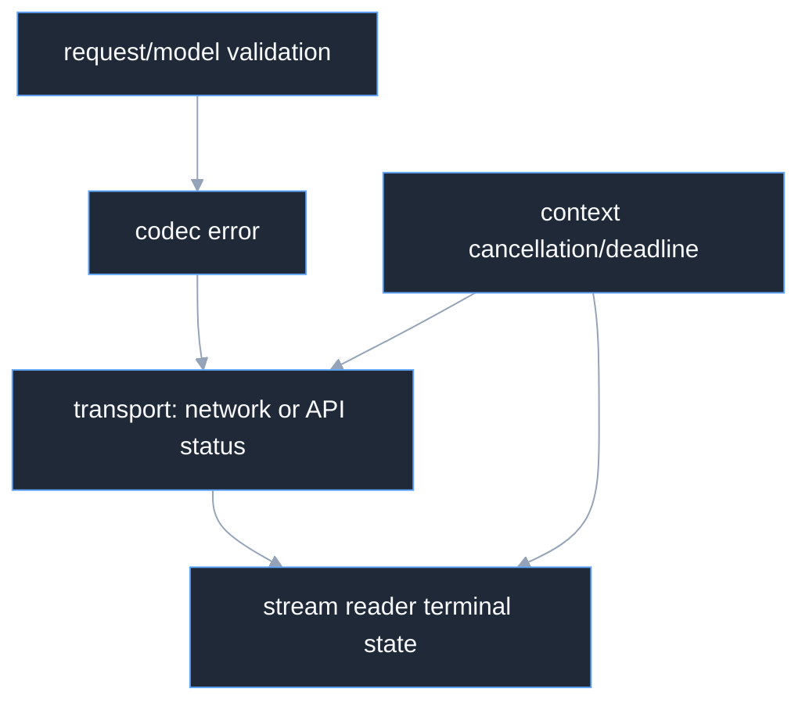

# Overview

Inference errors are typed at the boundary that owns the failure. Request
validation and model capability errors happen before I/O; codecs classify wire
shape; transport maps network and HTTP status; streams preserve the first
terminal failure. Context cancellation is never converted into a retryable
provider failure.

## Layers

Use `errors.As` for stable typed inspection and `errors.Is` for context and
package sentinel errors. Error strings are diagnostics, not a protocol.

## Cancellation

`Invoke` observes the caller context through request construction, authorization,
HTTP, and bounded body reading. `Stream` uses the context for setup and leaves
the long-lived body bounded by that context after response headers arrive.
`StreamReader.Close` releases the body and is safe to call repeatedly.

## Source and proof

- [`failure/errors.go`](https://github.com/looprig/inference/blob/v0.14.0/failure/errors.go)
- [`transport/client.go`](https://github.com/looprig/inference/blob/v0.14.0/transport/client.go)
- [`stream/stream.go`](https://github.com/looprig/inference/blob/v0.14.0/stream/stream.go)

Run `go test ./failure ./transport ./stream ./gateway`.
