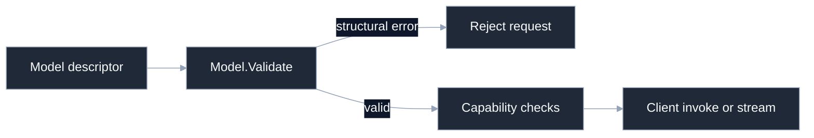

# Models overview

`inference/model.Model` is a secret-free descriptor for one resolved model endpoint. It names the provider and wire dialect, carries a base URL and provider model ID, records provenance and local capabilities, and stores default sampling intent. API keys and system prompts live elsewhere.

## Model lifecycle



## Surface at a glance

| Concern | API |
| --- | --- |
| Wire identity | `ProviderName`, `APIFormat`, `BaseURL`, `Name` |
| Provenance | `OriginCustom`, `OriginCatalog` |
| Local gates | `Capabilities` |
| Capacity | `ContextLimits` |
| Defaults | `Sampling` |
| Construction | `CustomModel` plus `With...` options |
| Stable identity | `Model.Key()` and `ModelKey.Validate()` |

```go
model := model.CustomModel(
	model.ProviderName("acme"), model.APIFormat("acme-json"),
	"https://api.example.test", "chat-1",
	model.WithTools(), model.WithImages(), model.WithStructuredOutput(),
)
if err := model.Validate(); err != nil {
	panic(err)
}
```

Unknown provider and API-format labels are intentionally accepted by structural validation. A composition layer that knows a catalogue or codec pair must apply provider policy separately.

## Proof

- Source: [`inference/model/model.go`](https://github.com/looprig/inference/blob/v0.13.0/model/model.go), [`inference/model/capabilities.go`](https://github.com/looprig/inference/blob/v0.13.0/model/capabilities.go)
- Tests: [`inference/model/model_test.go`](https://github.com/looprig/inference/blob/v0.13.0/model/model_test.go), [`inference/model/apiformat_test.go`](https://github.com/looprig/inference/blob/v0.13.0/model/apiformat_test.go)

Related: [Model](/docs/guides/inference/models/model), [Model validation](/docs/guides/inference/models/validation), [Model selection](/docs/guides/inference/requests/model-selection), and the Harness [models and inference loop guide](/docs/guides/harness/loop/models-and-inference).
