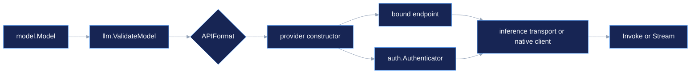

# Provider Overview

The `llm` module owns provider policy above the neutral `inference` request contract. Each constructor below validates the provider and API format before network I/O, resolves an empty model base URL when the package has a reviewed default, and binds the credential scheme used by its transport. The individual pages link directly to the provider package and its tests.

## Choose a provider

The format names are the values in `inference/model`: `openai` is Chat Completions, `openai-responses` is Responses, `anthropic` is Messages, `gemini` is Google `generateContent`, and `bedrock-converse` is the native Bedrock Converse envelope. A row with more than one format selects its route and codec from `model.Model.APIFormat`.

| Package | Provider identity | Formats | Auth | Default endpoint or resolution |
| --- | --- | --- | --- | --- |
| [anthropic](/docs/guides/inference/providers/anthropic/) | `anthropic` | Anthropic | API key | `https://api.anthropic.com/v1` |
| [atomic-chat](/docs/guides/inference/providers/atomic-chat/) | `atomic-chat` | OpenAI | none | `http://127.0.0.1:1337/v1` |
| [azure](/docs/guides/inference/providers/azure/) | `azure` | OpenAI Responses | API key | resource name or explicit base |
| [azure-cognitive-services](/docs/guides/inference/providers/azure-cognitive-services/) | `azure-cognitive-services` | OpenAI, Responses, Anthropic | API key | resource-specific Azure endpoint |
| [baseten](/docs/guides/inference/providers/baseten/) | `baseten` | OpenAI | API key | `https://inference.baseten.co/v1` |
| [bedrock](/docs/guides/inference/providers/bedrock/) | `bedrock` | Anthropic, Bedrock Converse | AWS SigV4 | `bedrock-runtime.{region}.amazonaws.com` |
| [cerebras](/docs/guides/inference/providers/cerebras/) | `cerebras` | OpenAI | API key | `https://api.cerebras.ai/v1` |
| [chutes](/docs/guides/inference/providers/chutes/) | `chutes` | OpenAI | API key plus attestation | API, LLM, NRAS, and JWKS defaults |
| [cloudflare-ai-gateway](/docs/guides/inference/providers/cloudflare-ai-gateway/) | `cloudflare-ai-gateway` | OpenAI, Responses, Anthropic | API token | account and gateway headers |
| [cloudflare-workers-ai](/docs/guides/inference/providers/cloudflare-workers-ai/) | `cloudflare-workers-ai` | OpenAI | API key | account-scoped Workers AI route |
| [cortecs](/docs/guides/inference/providers/cortecs/) | `cortecs` | OpenAI | API key | `https://api.cortecs.ai/v1` |
| [deepinfra](/docs/guides/inference/providers/deepinfra/) | `deepinfra` | OpenAI, Anthropic | API key | format-specific Deep Infra roots |
| [deepseek](/docs/guides/inference/providers/deepseek/) | `deepseek` | OpenAI | API key | `https://api.deepseek.com` |
| [digitalocean](/docs/guides/inference/providers/digitalocean/) | `digitalocean` | OpenAI | API key | `https://inference.do-ai.run/v1` |
| [fireworks](/docs/guides/inference/providers/fireworks/) | `fireworks-ai` | OpenAI | API key | `https://api.fireworks.ai/inference/v1` |
| [frogbot](/docs/guides/inference/providers/frogbot/) | `frogbot` | OpenAI | API key | `https://app.frogbot.ai/api/v1` |
| [gemini](/docs/guides/inference/providers/gemini/) | `google` | Gemini | API key header | `https://generativelanguage.googleapis.com/v1beta` |
| [github-copilot](/docs/guides/inference/providers/github-copilot/) | `github-copilot` | OpenAI, Responses, Anthropic | OAuth-derived token | `https://api.githubcopilot.com` |
| [gitlab](/docs/guides/inference/providers/gitlab/) | `gitlab` | OpenAI, Responses, Anthropic | OAuth/PAT exchange | GitLab AI Gateway proxy roots |
| [gmicloud](/docs/guides/inference/providers/gmicloud/) | `gmicloud` | OpenAI | API key | `https://api.gmi-serving.com/v1` |
| [google-vertex](/docs/guides/inference/providers/google-vertex/) | `google-vertex` and `google-vertex-anthropic` | Gemini, Anthropic | GCP bearer | location and project routing |
| [groq](/docs/guides/inference/providers/groq/) | `groq` | OpenAI | API key | `https://api.groq.com/openai/v1` |
| [helicone](/docs/guides/inference/providers/helicone/) | `helicone` | OpenAI | API key | `https://ai-gateway.helicone.ai/v1` |
| [huggingface](/docs/guides/inference/providers/huggingface/) | `huggingface` | OpenAI | API key | `https://router.huggingface.co/v1` |
| [ionet](/docs/guides/inference/providers/ionet/) | `io-net` | OpenAI | API key | `https://api.intelligence.io.solutions/api/v1` |
| [llama](/docs/guides/inference/providers/llama/) | `llama` | OpenAI | API key | `https://api.llama.com/compat/v1` |
| [llamacpp](/docs/guides/inference/providers/llamacpp/) | `llama.cpp` | OpenAI | none | `http://127.0.0.1:8080/v1` |
| [llmgateway](/docs/guides/inference/providers/llmgateway/) | `llmgateway` | OpenAI, Anthropic | API key | `https://api.llmgateway.io/v1` |
| [minimax](/docs/guides/inference/providers/minimax/) | `minimax` | Anthropic | API key header | `https://api.minimax.io/anthropic/v1` |
| [moonshot](/docs/guides/inference/providers/moonshot/) | `moonshotai` | OpenAI | API key | `https://api.moonshot.ai/v1` |
| [nebius](/docs/guides/inference/providers/nebius/) | `nebius` | OpenAI | API key | `https://api.tokenfactory.nebius.com/v1` |
| [nvidia](/docs/guides/inference/providers/nvidia/) | `nvidia` | OpenAI | API key | `https://integrate.api.nvidia.com/v1` |
| [ollama](/docs/guides/inference/providers/ollama/) | `ollama` | OpenAI | none | `http://localhost:11434/v1` |
| [ollamacloud](/docs/guides/inference/providers/ollamacloud/) | `ollama-cloud` | OpenAI | API key | `https://ollama.com/v1` |
| [openai](/docs/guides/inference/providers/openai/) | `openai` | OpenAI, Responses | API key | `https://api.openai.com/v1` |
| [opencode](/docs/guides/inference/providers/opencode/) | `opencode` | OpenAI, Responses, Anthropic | API key | `https://opencode.ai/zen/v1` |
| [opencode-go](/docs/guides/inference/providers/opencode-go/) | `opencode-go` | OpenAI, Responses, Anthropic | API key | `https://opencode.ai/zen/go/v1` |
| [openrouter](/docs/guides/inference/providers/openrouter/) | `openrouter` | OpenAI | API key | `https://openrouter.ai/api/v1` |
| [ovhcloud](/docs/guides/inference/providers/ovhcloud/) | `ovhcloud` | OpenAI | API key | `https://oai.endpoints.kepler.ai.cloud.ovh.net/v1` |
| [p302ai](/docs/guides/inference/providers/p302ai/) | `302ai` | OpenAI | API key | `https://api.302.ai/v1` |
| [phala](/docs/guides/inference/providers/phala/) | `phala` | OpenAI | API key plus ACI policy | `https://inference.phala.com` |
| [sap-ai-core](/docs/guides/inference/providers/sap-ai-core/) | `sap-ai-core` | OpenAI | service key OAuth | deployment discovery or URL |
| [scaleway](/docs/guides/inference/providers/scaleway/) | `scaleway` | OpenAI | API key | `https://api.scaleway.ai/v1` |
| [snowflake-cortex](/docs/guides/inference/providers/snowflake-cortex/) | `snowflake-cortex` | OpenAI | account token | account or explicit base |
| [stackit](/docs/guides/inference/providers/stackit/) | `stackit` | OpenAI | API key | `https://api.openai-compat.model-serving.eu01.onstackit.cloud/v1` |
| [synthetic](/docs/guides/inference/providers/synthetic/) | `synthetics` | OpenAI | API key | `https://api.synthetic.new/openai/v1` |
| [together](/docs/guides/inference/providers/together/) | `togetherai` | OpenAI | API key | `https://api.together.ai/v1` |
| [venice](/docs/guides/inference/providers/venice/) | `venice` | OpenAI, Responses | API key | `https://api.venice.ai/api/v1` |
| [vercel](/docs/guides/inference/providers/vercel/) | `vercel` | OpenAI, Responses, Anthropic | API key | `https://ai-gateway.vercel.sh/v1` |
| [xai](/docs/guides/inference/providers/xai/) | `xai` | OpenAI, Responses | API key | `https://api.x.ai/v1` |
| [zai](/docs/guides/inference/providers/zai/) | `zai` | OpenAI | API key | `https://api.z.ai/api/paas/v4` |
| [zenmux](/docs/guides/inference/providers/zenmux/) | `zenmux` | OpenAI, Responses, Anthropic | API key | format-specific ZenMux roots |

## Construction and routing

Every model-backed constructor takes a `model.Model`, validates `Provider`, `APIFormat`, model name, and endpoint shape through `llm.ValidateModel`, then binds a transport endpoint. Empty `BaseURL` is not a universal promise: dynamic providers require the resource, account, project, location, deployment, or region that their page names.

When a provider becomes a Loop's selected model, continue with [Harness runtime model selection](/docs/guides/harness/loop/runtime-model-selection). Bounded auxiliary model selection for Hustles is covered by [Hustle model selection](/docs/guides/harness/hustles/model-selection).

For the compatibility-backed packages, `internal/compat.NewProvider` selects the bundled OpenAI Chat, OpenAI Responses, or Anthropic codec and the format-specific path. Bespoke packages retain their own route where the provider puts the model in the URL, signs a request, performs token exchange, or encrypts the body.

## Wire and capability boundaries

Streaming, tools, structured output, images, thinking, and usage are request features, not marketing labels. A provider page claims a feature only when its source selects a codec that encodes it, adds a provider-specific patch, or has a focused test. Shared compatibility providers do not invent a capability mask: request validation and the selected codec remain authoritative. The provider registry rejects an unsupported format before I/O.

| Boundary | Source-backed rule |
| --- | --- |
| Streaming | `inference.Client.Stream` returns a `stream.StreamReader`; compatibility clients use the codec's SSE decoder, while Gemini and Bedrock use their native stream framing. |
| Structured output and tools | The selected codec encodes `inference.OutputSchema`, `Tools`, and `ToolChoice` where that dialect defines them. Provider-specific normalization is documented only on pages that implement it. |
| Capability metadata | `model.Model.Caps` is supplied by the caller and checked by inference request validation; provider metadata is not a capability guarantee. |
| Context counting | A page lists `NewCounter` only when the package has one. The common unsupported-counter result is a typed `llm.CounterSupportError`, not an estimate. |
| Caching | Cache controls appear only for packages with source-level options such as OpenAI, Anthropic, Bedrock, Cloudflare AI Gateway, OpenRouter, or xAI. |

## Secret references and retries

Provider constructors receive already-resolved credential material such as `auth.APIKey`, `bedrock.SigV4Credentials`, an OAuth access token, or an SAP `ServiceKey`. They do not parse a generic secret reference. Applications can resolve a `credentials.Descriptor` and lease through `credentials` and `secrets`, then pass the resulting value to the constructor; labels and reference IDs must not be placed in `model.Model`.

The generic transport reports validation, network, HTTP, codec, and stream failures without a provider-local retry loop. Wrap idempotent calls in the inference retry package only after checking the provider page. GitLab retries once after invalidating its short-lived direct-access token, SAP refreshes OAuth during discovery, and Chutes re-attests when its cached session expires or nonces are exhausted. Those are authentication lifecycle behaviors, not a blanket retry guarantee.

## Source and proof

- [`llm/provider.go`](https://github.com/looprig/llm/blob/107b378c3882c0a99ad98e36d89e542c5461bc55/provider.go) defines provider identities, supported API formats, empty-base policy, and required auth.
- [`llm/validate.go`](https://github.com/looprig/llm/blob/107b378c3882c0a99ad98e36d89e542c5461bc55/validate.go) proves fail-closed model validation.
- [`llm/authpolicy.go`](https://github.com/looprig/llm/blob/107b378c3882c0a99ad98e36d89e542c5461bc55/authpolicy.go) binds provider, transport, credential scheme, issuer, and audience.
- [`inference/transport`](https://github.com/looprig/inference/tree/67df7e6bb20b5232f9cac94938d85a844779169b/transport) and [`inference/retry`](https://github.com/looprig/inference/tree/67df7e6bb20b5232f9cac94938d85a844779169b/retry) define the shared request and retry boundaries.
