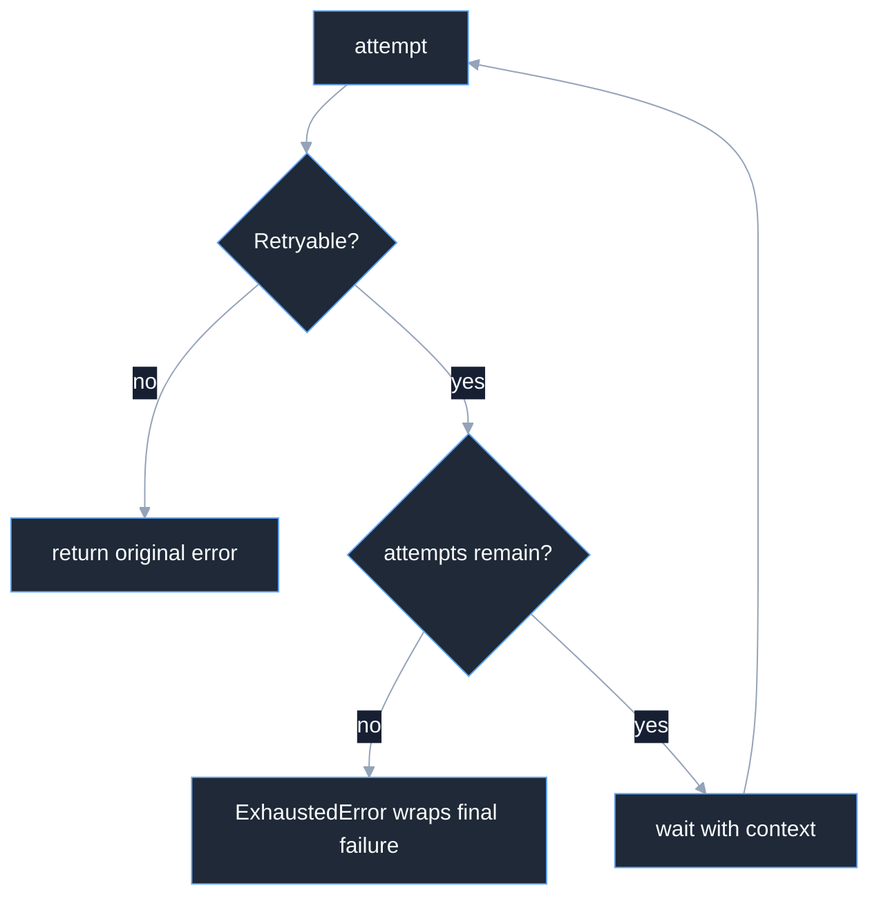

# Retries overview

Use typed failure classification to decide which inference attempts may be
retried. `retry.Client` retries call establishment, not an already-open
stream, and never asks the transport to replay a request body.

## Policy

```go
type Policy struct {
	StableRetries int
	StableDelay   time.Duration
	MaxAttempts   int
	MaxDelay      time.Duration
}
```

`MaxAttempts` includes the first attempt and must be at least one.
`StableRetries` is nonnegative and less than `MaxAttempts`; `StableDelay` is
positive; `MaxDelay` is at least `StableDelay`. The zero policy is invalid and
`retry.New` returns a typed `*retry.ConfigError` rather than inventing defaults.



## Classification

`Retryable` returns true for `*failure.NetworkError`, HTTP `408`, `429`, and
`500` through `599`. It returns false for nil, `context.Canceled`,
`context.DeadlineExceeded`, an existing `ExhaustedError`, and all other
errors. The final typed cause remains discoverable through `ExhaustedError.Unwrap`.

## Backoff

For each failed attempt, the schedule uses `StableDelay` for the stable leg,
then doubles from `2*StableDelay`, capped at `MaxDelay`. Jitter multiplies the
slot by a factor in `[0.9, 1.1)`, an inclusive lower and exclusive upper bound. A positive provider `Retry-After` wins
when larger, capped at five minutes. Waiting selects the caller context, so
cancellation returns immediately without another call.

## Cancellation

`Invoke` stamps `Response.Attempts`. `Stream` stamps establishment attempts in
the terminal `StreamResult`; once `StreamReader` is returned, a mid-stream
failure is terminal and is never retried. If the inner client returns a reader
and an error during establishment, the wrapper closes that reader before the
next attempt. Credential refresh belongs in the call-scoped authorizer supplied
to each attempt, not in this generic decorator.

Related Harness consumer: [Hustle retries](/docs/guides/harness/hustles/retries/).

## Source and proof

- [`retry/retry.go`](https://github.com/looprig/inference/blob/v0.12.0/retry/retry.go)
- [`retry/classify.go`](https://github.com/looprig/inference/blob/v0.12.0/retry/classify.go)
- [`retry/delay.go`](https://github.com/looprig/inference/blob/v0.12.0/retry/delay.go)
- [`retry/invoke_test.go`](https://github.com/looprig/inference/blob/v0.12.0/retry/invoke_test.go)
- [`retry/stream_test.go`](https://github.com/looprig/inference/blob/v0.12.0/retry/stream_test.go)

Run `go test ./retry`.
