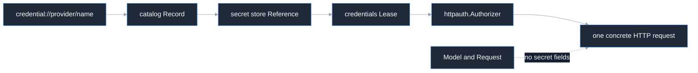

# Secrets overview

Models and requests are secret-free. A provider credential is selected by an
opaque reference, resolved by the credentials layer, and converted into a
call-scoped HTTP authorizer at the final wire boundary.

## References

`secrets.Reference` is a canonical `scheme://path` identifier. It is not a URL,
authority, filesystem path, or secret value. `credentials.Reference` is the
more specific `credential://provider/name` identity used by the credential
catalog.

```go
secretRef, err := secrets.ParseReference("local://provider/openai")
if err != nil {
	return err
}
credentialRef, err := credentials.ParseReference("credential://openai/default")
if err != nil {
	return err
}
fmt.Println(secretRef, credentialRef)
```

`secrets.Secret` has private bytes, copies input on `New`, returns a copy from
`Bytes`, and renders as `[REDACTED]` through string, formatting, Go-syntax, and
structured logging. `Record.Metadata` deliberately omits the secret value.
References, versions, namespaces, and page tokens are bounded and validated;
path traversal and endpoint schemes are rejected.

## Lease

Credentials catalog records contain a credential reference, a secret-store
reference, and a secret-free `Descriptor` describing provider, transport,
scheme, usage class, issuer, audience, and label. A `Source` owns acquisition,
invalidation, and close; a `Lease` is an immutable snapshot with generation,
descriptor, expiry, and an `httpauth.Authorizer`.

```go
lease, err := source.Acquire(ctx)
if err != nil {
	return err
}
authorizer := lease.Authorizer()
response, err := client.InvokeWithAuth(ctx, req, authorizer)
_ = response
return err
```

The lease is call-scoped. A retrying caller acquires or refreshes the authority
for the concrete attempt; the model and request continue to carry no secret
bytes.

## Auth boundary

`httpauth.Authorizer` applies one immutable authority snapshot to one
`*http.Request`. `httpauth.Header` and `httpauth.Bearer` copy bytes from a
`secrets.Secret` only at construction, clear that temporary byte copy, and
retain only the internal string needed to set the header. Authorization removes
case-insensitive stale values before setting the current value. `None()` is an
explicit no-op for unauthenticated local transports; a nil authorizer is an
error.



## Source and proof

- [`secrets/reference.go`](https://github.com/looprig/secrets/blob/v0.1.0/reference.go)
- [`secrets/secret.go`](https://github.com/looprig/secrets/blob/v0.1.0/secret.go)
- [`secrets/store.go`](https://github.com/looprig/secrets/blob/v0.1.0/store.go)
- [`credentials/reference.go`](https://github.com/looprig/credentials/blob/v0.1.0/reference.go)
- [`credentials/source.go`](https://github.com/looprig/credentials/blob/v0.1.0/source.go)
- [`credentials/httpauth/httpauth.go`](https://github.com/looprig/credentials/blob/v0.1.0/httpauth/httpauth.go)
- [`inference/transport/client.go`](https://github.com/looprig/inference/blob/v0.9.2/transport/client.go)

Run `go test ./...` in each of the secrets, credentials, and inference modules.
