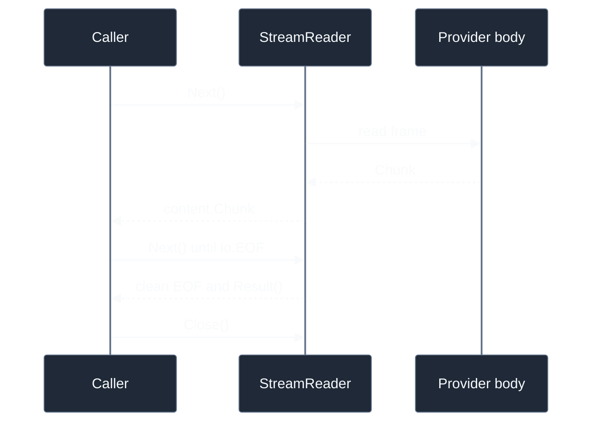

# Streaming overview

Inference streaming has two layers: a wire framer yields `StreamFrame` values, then a semantic decoder maps frames to sealed `content.Chunk` values. A `StreamReader` exposes both as a pull iterator and keeps terminal metadata separate from the last chunk.

## Stream lifecycle



Always call `Close`, even after clean EOF. Any non-EOF failure permanently fails the reader and makes `Result` unavailable. Clean EOF is the only point at which a terminal result producer is consulted.

```go
reader, err := client.Stream(ctx, request)
if err != nil {
	return err
}
defer reader.Close()
for {
	chunk, err := reader.Next()
	if errors.Is(err, io.EOF) {
		break
	}
	if err != nil {
		return err
	}
	consume(chunk) // render or accumulate the provider-neutral chunk
}
```

The Harness [streaming response step](/docs/guides/harness/step/streaming-response) is the canonical consumer when a Harness loop renders these chunks.

## Proof

- Source: [`inference/stream/stream.go`](https://github.com/looprig/inference/blob/v0.14.0/stream/stream.go), [`inference/stream/chunkstream.go`](https://github.com/looprig/inference/blob/v0.14.0/stream/chunkstream.go), [`core/content/chunk.go`](https://github.com/looprig/core/blob/v0.12.0/content/chunk.go)
- Tests: [`inference/stream/stream_test.go`](https://github.com/looprig/inference/blob/v0.14.0/stream/stream_test.go), [`inference/stream/chunkstream_test.go`](https://github.com/looprig/inference/blob/v0.14.0/stream/chunkstream_test.go)

Related: [StreamReader](/docs/guides/inference/streaming/stream-reader), [Chunks](/docs/guides/inference/streaming/chunks), [Terminal stream results](/docs/guides/inference/streaming/terminal-results).
