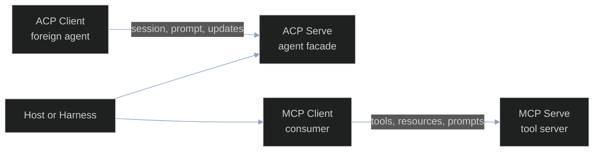

# Protocols overview

ACP and MCP solve different integration problems. ACP connects a host to an agent process and carries sessions, prompts, updates, permissions, files, and terminals. MCP lets a server publish tools, resources, and prompts and lets a client consume them over a negotiated transport. Both are boundaries that a Harness runtime can own, inspect, and close.

## Choose a protocol path

Start from the side of the boundary your application owns:

| Path | Your process owns | Use the path for | Continue |
| --- | --- | --- | --- |
| ACP Serve | an agent facade and its sessions | expose a Harness-backed agent to an ACP client | [ACP Serve](/docs/guides/protocols/acp/serve/) |
| ACP Client | a host that launches a foreign agent | drive an agent over a supervised stdio child | [ACP Client](/docs/guides/protocols/acp/client/) |
| MCP Serve | a tool server | register product-owned tools and serve `tools/call` | [MCP Serve](/docs/guides/protocols/mcp/serve/) |
| MCP Client | a host that consumes a server | discover and call tools, resources, and prompts | [MCP Client](/docs/guides/protocols/mcp/client/) |

The four paths are intentionally distinct. An ACP client is not an MCP client, and an MCP server is not an ACP agent. An application may compose them, but each side keeps its own handshake, capability set, session lifecycle, and error vocabulary.

## Why ACP and MCP stay separate

ACP's typed wire surface has `protocol.AgentConn` for calls a client makes to an agent and `protocol.ClientConn` for calls an agent makes back to its client. MCP's client and server surfaces instead negotiate catalogs and then operate on tools, resources, prompts, and optional sampling or elicitation. Keeping those roles explicit makes ownership visible when a turn crosses a process boundary.

The [Harness guide](/docs/guides/harness/) explains the session, step, tool-call, and gate runtime that can sit behind either boundary. The [Tools guide](/docs/guides/tools/) explains definitions, preparation, permission identities, and results. The [Inference guide](/docs/guides/inference/) explains model requests, streaming, and tool-call content. Protocol pages link to those contracts where a wire event becomes a runtime event.

## How the pages connect

Read the [ACP overview](/docs/guides/protocols/acp/) when you need to expose or launch an agent, then follow these pages:

1. [ACP Serve](/docs/guides/protocols/acp/serve/) shows the agent-side facade and registration boundary.
2. [ACP Client](/docs/guides/protocols/acp/client/) shows the host-side client and its client-served callbacks.
3. [ACP host and agent facades](/docs/guides/protocols/acp/host-agent/) names the narrow `SessionHost`, `LiveSession`, and `Setup` seams.
4. [ACP stdio framing](/docs/guides/protocols/acp/stdio/) covers NDJSON frames, JSON-RPC dispatch, and process supervision.
5. [ACP sessions and lifecycle](/docs/guides/protocols/acp/sessions/) follows session establishment through terminal events and close.
6. [ACP authentication and runtime config](/docs/guides/protocols/acp/auth-and-config/) covers advertised authentication and fresh config catalogs.
7. [ACP gateways and launch proxy](/docs/guides/protocols/acp/gateway-launch/) covers owned, shared, and native launch paths.

Read the [MCP overview](/docs/guides/protocols/mcp/) when you need to publish or consume capabilities, then follow these pages:

1. [MCP Serve](/docs/guides/protocols/mcp/serve/) covers server construction and tool registration.
2. [MCP Client](/docs/guides/protocols/mcp/client/) covers handshake, catalogs, calls, and close.
3. [MCP transports](/docs/guides/protocols/mcp/transports/) compares stdio, Streamable HTTP, and compatibility SSE.
4. [MCP authentication](/docs/guides/protocols/mcp/auth/) covers header providers, OAuth discovery, token storage, and redaction.
5. [MCP discovery and Harness adoption](/docs/guides/protocols/mcp/harness-adoption/) follows catalog generations into Loop toolsets and permissions.
6. [MCP sampling and reconfiguration](/docs/guides/protocols/mcp/sampling-and-reconfiguration/) covers server-requested completion and binding changes.
7. [MCP ACP pass-through](/docs/guides/protocols/mcp/acp-passthrough/) documents the small, tested collaboration seam that forwards an agent message through a broker.

## Source and proof

The ACP claims in this guide are grounded in the released [ACP module](https://github.com/looprig/acp/tree/main/protocol), its [agent facade](https://github.com/looprig/acp/tree/main/agent), and its [protocol tests](https://github.com/looprig/acp/tree/main/protocol). The MCP claims are grounded in the released [MCP module](https://github.com/looprig/mcp/tree/main/pkg), its [transport examples](https://github.com/looprig/mcp/tree/main/examples), and its [package tests](https://github.com/looprig/mcp/tree/main/pkg).

Each page keeps its release evidence ID in frontmatter and names the relevant source and test files in its final section. If a behavior is not present in those code paths, the page does not present it as a protocol guarantee.
