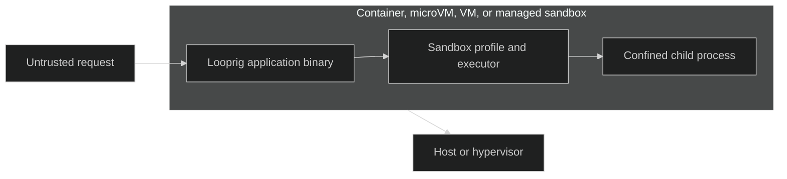

# Docker, MicroVMs, and VMs

A Looprig application is a normal Go program. You can package its application binary in Docker, run it in a microVM or virtual machine, or place it inside a managed code sandbox. The environment around the application and the Looprig sandbox inside it are separate security boundaries.

## Two isolation layers



The outer environment limits the application as a whole. A Docker or OCI container supplies process, filesystem, network, and resource boundaries chosen by the container runtime. A microVM or virtual machine adds a guest kernel and a hypervisor boundary. A managed sandbox supplies the boundary documented by that provider.

Inside that environment, Looprig applies a `Profile` when the application starts a child process. This is useful defense in depth: the outer boundary protects the host from the application, while the Looprig sandbox restricts the tools and commands that one application session may run. Neither layer proves what the other enforced.

## Build one application binary

The sandbox package does not create a deployable executable. Your normal Go build creates the application binary. At runtime, the sandbox compiles a requested `Profile` into an in-memory enforcement specification for the selected operating-system backend.

On Linux, call `sandbox.Init()` as the first line of `main`, before starting goroutines or opening application resources:

```go
package main

import "github.com/looprig/sandbox"

func main() {
	// Dispatch a reserved Linux re-exec child when this process is one.
	// In the ordinary parent process, Init records the call and returns.
	sandbox.Init()

	if err := run(); err != nil {
		panic(err)
	}
}

func run() error {
	// Construct Harness, Tools, and sandbox executors here.
	return nil
}
```

Build for the operating system and architecture used by the container or guest:

```sh
CGO_ENABLED=0 GOOS=linux GOARCH=amd64 go build -trimpath -o bin/agent ./cmd/agent
```

Include every runtime dependency your tools need. For example, an agent that invokes `git`, `rg`, or a shell needs those programs in the image or guest. The Go binary alone cannot provide an external command.

## Docker

This multi-stage Dockerfile builds the application and runs it as a non-root user. Replace `./cmd/agent` with the main package in your project.

```dockerfile
FROM golang:1.26.5-bookworm AS build
WORKDIR /src

# Cache module downloads independently from application source changes.
COPY go.mod go.sum ./
RUN go mod download

COPY . .
RUN CGO_ENABLED=0 GOOS=linux go build -trimpath -o /out/agent ./cmd/agent

FROM debian:bookworm-slim
RUN useradd --create-home --uid 10001 looprig

COPY --from=build /out/agent /usr/local/bin/agent
USER looprig
ENTRYPOINT ["/usr/local/bin/agent"]
```

Build and run it with the ordinary Docker workflow:

```sh
docker build -t my-looprig-agent .
docker run --rm my-looprig-agent
```

Use a fuller runtime image when tools need operating-system packages. Mount credentials, workspaces, and sockets deliberately, with the narrowest read or write access that the application requires. Do not bake secrets into an image layer.

## Containers and native enforcement

Container security settings can prevent an inner sandbox backend from creating namespaces, mounting filesystems, applying seccomp policies, or configuring resource controls. The exact behavior depends on the host kernel, container runtime, and deployment policy.

Do not solve this by granting `--privileged` as a default. That weakens the outer boundary. Instead:

1. decide whether the container alone is the intended outer isolation boundary;
2. grant only the kernel capabilities and devices required by the chosen native backend, when an inner boundary is required;
3. make unavailable guarantees a startup or admission error for high-risk tools; and
4. inspect the achieved `CompileReport`, `Level`, and `Guarantees` in the deployed environment.

A successful container start does not imply `sandbox.LevelFull`. Trust the values returned by the executor, not the packaging format.

## MicroVMs, VMs, and managed sandboxes

The same application binary can run inside a compatible Linux guest. Examples include Firecracker-style microVMs, Kata Containers, Cloud Hypervisor, conventional cloud virtual machines, gVisor-based containers, and managed code sandboxes. These products use different isolation mechanisms, so select them according to your threat model rather than treating them as interchangeable labels.

The guest must provide the matching operating system and CPU architecture, writable paths for the executor scratch root and session workspaces, and any programs launched by Tools. Native Looprig enforcement still depends on the guest kernel and permissions. A microVM can provide a strong outer boundary even when an inner backend reports degraded or unavailable guarantees, but the application must report that distinction truthfully.

## Verify what the runtime enforced

Record the achieved enforcement when an executor is created. Admission code can then reject a tool whose required guarantees are missing.

```go
package runtimecheck

import (
	"fmt"

	"github.com/looprig/sandbox"
)

func inspect(set *sandbox.ExecutorSet) error {
	executor, err := set.For("session-42")
	if err != nil {
		return err
	}

	// Executor.Report explains enforced, narrowed, and unavailable features.
	report := executor.Report()
	// Executor.Guarantees exposes fail-closed booleans for achieved properties.
	guarantees := executor.Guarantees()

	fmt.Printf("level=%d guarantees=%+v report=%+v\n",
		executor.Level(), guarantees, report)

	if !guarantees.ProcessBoundary || !guarantees.WriteBoundary {
		return fmt.Errorf("required sandbox guarantees are unavailable")
	}
	return nil
}
```

Run this check in the deployed container, guest, or managed runtime. A laptop result is not evidence for a production host with different kernel features and security policy.

## Deployment matrix

| Environment | Outer boundary | Native Sandbox considerations |
| --- | --- | --- |
| Native host process | Host account and operating-system policy | Direct access to the host backend, with guarantees determined by the current OS and permissions. |
| Docker or OCI container | Container namespaces, cgroups, filesystem, and runtime policy | The runtime may block namespace, mount, seccomp, or resource operations needed by an inner backend. |
| gVisor container | User-space kernel boundary around the container | Guest-visible kernel behavior differs from a native Linux host, so verify every required guarantee. |
| MicroVM or Kata workload | Guest kernel plus hypervisor boundary | Build for the guest OS and architecture, then verify backend support and writable runtime paths inside the guest. |
| Virtual machine | Guest kernel plus hypervisor boundary | Similar to a physical host from the application perspective, but images still need tools, users, and filesystem policy. |
| Managed code sandbox | Provider-defined process or machine boundary | Confirm supported binaries, networking, persistence, timeouts, and whether nested OS enforcement is permitted. |

Use [profiles and access dimensions](/docs/guides/sandboxing/profiles/), [platform levels and guarantees](/docs/guides/sandboxing/enforcement/platforms/), and [compilation reports](/docs/guides/sandboxing/enforcement/reports/) to define and verify the inner boundary. Use [Harness gates and prepared tools](/docs/guides/sandboxing/integration/) when approved tool calls cross into the executor.

## Source

- [Linux re-exec initialization](https://github.com/looprig/sandbox/blob/main/init_linux.go)
- [Executor level, report, and guarantees](https://github.com/looprig/sandbox/blob/main/internal/exec/executor.go)

## Proof

- [Linux re-exec initialization tests](https://github.com/looprig/sandbox/blob/main/internal/exec/init_linux_test.go)
- [Runnable sandbox policy example](https://github.com/looprig/sandbox/blob/main/examples/policy-enforcement/example_test.go)
