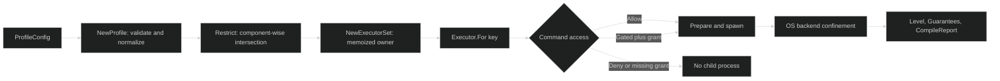

# Sandboxing

Sandboxing is the authority boundary for a command or process that may be influenced by an agent, a tool, or user input. You describe the authority once in a `ProfileConfig`, intersect it with any narrower ceiling, and let an `Executor` turn the result into an OS-specific spawn. The sandbox reports what the selected host actually enforced. It does not turn an unavailable mechanism into a stronger claim.

This is a separate concern from [Tools](/docs/guides/tools) and from the [Harness step that executes tool calls](/docs/guides/harness/step/tool-calls-and-results). A Tool prepares an operation and its requirement. Harness decides whether that requirement is admitted. Sandboxing enforces the approved process boundary and can consume a single-use grant. The Harness [model request step](/docs/guides/harness/step/model-request) and Inference's [model selection contract](/docs/guides/inference/requests/model-selection) remain the places to understand model configuration, not the place to grant host authority.

For the upstream capability vocabulary and candidate approval flow, pair this guide with Tools' [Safety, Permissions, and Gates](/docs/guides/tools/safety).

## The boundary at a glance



`Gated` is a policy decision made before a child exists. `Level`, `Guarantees`, and `CompileReport` describe the separate OS enforcement decision for a spawn. A successful gate does not imply that a host can provide every requested guarantee, and an excellent OS level does not approve a command that policy denied.

## Start here

Read the pages in this order:

1. [Profiles and access dimensions](/docs/guides/sandboxing/profiles) defines `Deny`, `Gated`, and `Allow`, the filesystem roots, `Home`, and `Isolation`.
2. [Restriction and least authority](/docs/guides/sandboxing/profiles/restriction) explains how a base profile and a ceiling become one immutable profile.
3. [Enforcement overview](/docs/guides/sandboxing/enforcement) explains how profiles become native policy.
4. [Platform levels and guarantees](/docs/guides/sandboxing/enforcement/platforms) explains why `LevelFull` is not a promise that every host can make.
5. [Compilation reports](/docs/guides/sandboxing/enforcement/reports) shows how to inspect narrowed or unenforced features.
6. [Filesystem, HOME, and environment](/docs/guides/sandboxing/enforcement/filesystem) covers roots, isolated temporary directories, and environment scrubbing.
7. [Network routes and target grants](/docs/guides/sandboxing/enforcement/network) covers routes, proxy authorization, and target-scoped network authority.
8. [Runtime overview](/docs/guides/sandboxing/runtime) explains how compiled authority reaches a child process.
9. [Executors and ExecutorSets](/docs/guides/sandboxing/runtime/executors) covers ownership, memoization, limits, and cleanup.
10. [RunArgv and confinement](/docs/guides/sandboxing/runtime/argv-and-confinement) covers shell versus direct argv and the exit-code contract.
11. [Prepared processes and lifetime](/docs/guides/sandboxing/runtime/processes) covers live pipes, TTY requests, cancellation, and process-tree teardown.
12. [Typed errors and recovery](/docs/guides/sandboxing/runtime/errors) provides an error classification that survives wrappers.
13. [Harness gates and prepared Tools](/docs/guides/sandboxing/integration) connects sandbox admission to the higher-level gate and Tool contracts.

## A minimal execution

The example uses a profile with command authority `Allow`. It still inspects the achieved guarantees because those values are host observations. On Linux, call `sandbox.Init` as the first line of `main` so the re-exec helper can dispatch safely.

```go
package main

import (
	"context"
	"fmt"
	"os"

	"github.com/looprig/sandbox"
)

func main() {
	sandbox.Init()

	workspace, err := os.MkdirTemp("", "sandbox-workspace-")
	if err != nil {
		panic(err)
	}
	defer os.RemoveAll(workspace)
	scratch, err := os.MkdirTemp("", "sandbox-scratch-")
	if err != nil {
		panic(err)
	}
	defer os.RemoveAll(scratch)

	profile, err := sandbox.NewProfile(sandbox.ProfileConfig{
		WorkspaceRoot:  workspace,
		WorkspaceRead:  sandbox.Allow,
		WorkspaceWrite: sandbox.Allow,
		HostRead:       sandbox.Allow,
		HostWrite:      sandbox.Allow,
		Network:        sandbox.Allow,
		Command:        sandbox.Allow,
		Home:           sandbox.IsolatedHome,
		Isolation:      sandbox.Sandboxed,
	})
	if err != nil {
		panic(err)
	}

	set, err := sandbox.NewExecutorSet(profile,
		sandbox.WithScratchRoot(scratch),
		sandbox.WithMaxExecutors(1),
	)
	if err != nil {
		panic(err)
	}
	defer set.Close()

	executor, err := set.For("demo")
	if err != nil {
		panic(err)
	}
	output, exitCode, err := executor.RunArgv(context.Background(), workspace, []string{"printf", "hello\\n"})
	if err != nil {
		panic(err)
	}
	fmt.Printf("exit=%d output=%q level=%d guarantees=%+v\\n",
		exitCode, output, executor.Level(), executor.Guarantees())
}
```

The code owns the `ExecutorSet`, not the caller-owned scratch parent. `Close` removes the set's child, revokes executor grants, and makes future work fail closed. See [executor ownership](/docs/guides/sandboxing/runtime/executors) before sharing one set across workers.

## Source

- [Public sandbox facade](https://github.com/looprig/sandbox/blob/v0.9.1/sandbox.go)

## Proof

- [Executable policy and enforcement example](https://github.com/looprig/sandbox/blob/v0.9.1/examples/policy-enforcement/example_test.go)
