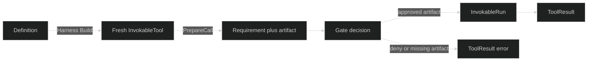

# Tools

Tools are the effect boundaries used by a Looprig agent. Each tool describes a small operation, validates its untrusted JSON arguments, and returns a model-facing result. The package keeps the concrete implementations in focused subpackages, while the root package provides the definitions that a Harness composition root can register.

This guide is the developer reference for the standard Tools category. It covers:

- `AskUser` for a user decision,
- `Bash` for bounded shell commands,
- `EditFile` and `WriteFile` for workspace mutation,
- `Fetch` and `WebSearch` for declared network access,
- `Glob`, `Grep`, and `ReadFile` for workspace reads,
- `Skill` for scoped skill loading,
- the Task tools bundle, exposed as `TaskCreate`, `TaskUpdate`, `TaskGet`, and `TaskList`, and
- the supervised process companion tools `ProcessOutput`, `ProcessInput`, and `ProcessStop`.

Tools are separate from the [Sandboxing and Interfaces](/docs/start/sandbox-and-interfaces) guide. A tool prepares a request and names the capability it needs. The sandbox or another consumer-owned access source enforces the resulting decision. Tools do not invent grants, discover an implicit permission file, or expose host paths as model data.

## The Tool Boundary

The public root builders return a `tool.Definition`. Harness validates the definition's requirements, calls `Build` with validated bindings, and receives fresh `tool.InvokableTool` instances. A concrete effectful tool also implements `tool.CallPreparer`. Its `PrepareCall` returns a typed request and a sealed `tool.PreparedArtifact`. The gate evaluates the request, then `InvokableRun` consumes the artifact. A call that has no artifact fails closed.

The result is a `tool.ToolResult`, normally a text block containing the operation's output or a stable error string. A non-zero shell exit, an HTTP 404, a missing task, or a process cursor gap is represented in the result contract. It is not automatically a Go error. Preparation errors are different: malformed arguments and unresolvable targets return a Go error before a gate prompt or effect.



## Start Here

Read [Definitions, Preparation, and Results](/docs/guides/tools/core-concepts) for the common contract, then [Registering Tools With Harness](/docs/guides/tools/core-concepts/registration) for composition. [Safety, Permissions, and Gates](/docs/guides/tools/safety) explains how requirements, candidates, grants, path containment, and workspace coordination fit together. The [Permission Rules and Stores](/docs/guides/tools/safety/permissions) page documents durable approvals. Browse the standard constructors in [Built-in tools](/docs/guides/tools/built-in-tools).

For the runtime that consumes these calls, see Harness's [tool calls and results step](/docs/guides/harness/step/tool-calls-and-results). For the model request that carries tools, see Inference's [tool request model](/docs/guides/inference/requests/tools) and [tool-use content blocks](/docs/guides/inference/content-blocks/tool-use). Model selection still belongs to Inference, so pair the Harness [model request step](/docs/guides/harness/step/model-request) with Inference's [model selection](/docs/guides/inference/requests/model-selection) when composing a turn.

## A Minimal Definition Example

The complete executable fixture is `examples/definitions/example_test.go` in the Tools repository. It demonstrates a pure bundle beside a workspace-bound command definition.

```go
// Definitions are blueprints. Build creates the concrete tools only after
// Harness has supplied the bindings required by each blueprint.
pure := standardtools.TaskDefinitions()
effectful := standardtools.Bash(bash.WithRunner(commandRunner{}))

fmt.Println(pure.Name(), pure.Requirements() == 0) // Tasks true
fmt.Println(effectful.Name(), effectful.Requirements() == tool.RequiresWorkspace) // Bash true

built, err := effectful.Build(ctx, bindings)
if err != nil {
	panic(err)
}
info, err := built[0].Info(ctx)
if err != nil {
	panic(err)
}
fmt.Println(info.Name, len(built)) // Bash 1
```

The next pages explain why this separation matters and how to choose the narrowest definition for a consumer.

## Source

- [Root definition builders](https://github.com/looprig/tools/blob/main/definitions.go)

## Proof

- [Definition behavior tests](https://github.com/looprig/tools/blob/main/definitions_test.go)
- [Executable definition fixture](https://github.com/looprig/tools/blob/main/examples/definitions/example_test.go)
