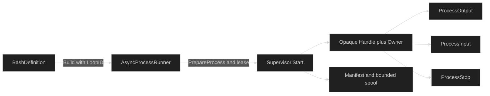

# Process Supervision

The `process` package is the Tools-owned runtime for long-running commands. It owns opaque process identity, state transitions, bounded output, process quotas, manifests, restore reconciliation, and the three follow-up tools. It is runner-free: the product composition root supplies the `tool.AsyncProcessRunner` to `BashDefinition`, while the supervisor owns the admitted process after `PrepareProcess` and the workspace lease are handed to `Start`.

## One Session Resource

Supervised Bash and the process companion definitions use the same `process.SupervisorResourceKey`:

- `BashDefinition` resolves the async runner with the validated `bindings.LoopID` and builds the supervised Bash tool.
- `ProcessOutputDefinition`, `ProcessInputDefinition`, and `ProcessStopDefinition` resolve the same session resource from `bindings.Process.Registry`.
- `process.NewSupervisorResource` creates one runner-free supervisor and its manifest store.
- `SupervisorResource.Activate` late-binds Harness lifecycle and completion services, then restores persisted manifests before calls are used.

The registry is keyed per session. Definitions built against the same registry share the supervisor. Different session registries produce different supervisors. The companion tools require process services but do not require a workspace binding.

## Identity Is Authority

Every admitted process has an immutable `process.Identity`:

- `Handle` is URL-safe random data with 128 bits of entropy. It contains no PID, path, timestamp, or owner data.
- `Owner` is the exact `SessionID` and `LoopID` allowed to inspect, write to, or stop the process.
- `Origin` stores the creating Bash execution ID for audit only. Follow-up calls have their own execution IDs and authorize through `Owner`, never `Origin`.

A missing handle and a handle owned by another session or loop are deliberately indistinguishable. `ProcessOutput`, `ProcessInput`, and `ProcessStop` report `not_found` for either case.



## Admission and Quotas

`Supervisor.Start` rejects shutdown admission, validates a prepared process, reserves loop and session running-process slots, reserves aggregate in-memory and spool ceilings, allocates stable lifecycle and completion IDs, and persists a starting manifest before returning the handle. A failed start releases the reservation, lease, and single-use prepared process.

The zero `process.Config` is valid and normalizes to bounded defaults: 8 running processes per loop, 32 per session, 1 MiB in-memory retention per process, 64 MiB spool retention per process, a 32 KiB inline result cap, 64 pending waiters, 1 MiB pending input, and a 5 second graceful shutdown period. Explicit negative or inconsistent limits fail with `invalid_settings`.

Use [Process Lifecycle, Storage, and Restore](/docs/guides/tools/processes/lifecycle) for terminalization and restart behavior, and [Process Output, Input, and Stop Tools](/docs/guides/tools/processes/tools) for the model-facing follow-up calls. Harness's [tool-call lifecycle](/docs/guides/harness/step/tool-calls-and-results) and Inference's [streaming tool-call deltas](/docs/guides/inference/streaming/tool-call-deltas) carry the surrounding model exchange.

## Runnable Example

The [process lifecycle fixture](https://github.com/looprig/tools/blob/main/examples/processes/example_test.go) uses a controlled `tool.Process`, starts it through `Supervisor.Start`, shuts it down, and restores a persisted running manifest as `lost_on_restore`.

```go
supervisor, err := process.NewSupervisor(
	process.Config{GracefulShutdownPeriod: time.Millisecond},
	process.NewManifestStore(manifestDir),
	spoolDir,
	nil,
	nil,
)
if err != nil {
	panic(err)
}

handle, err := supervisor.Start(ctx, owner, origin, prepared, lease, nil, nil,
	process.StorageCeiling{}, process.YieldSettings{})
if err != nil {
	panic(err)
}
fmt.Println(handle.Valid())
```

## Source

- [Root process definitions](https://github.com/looprig/tools/blob/main/definitions.go)
- [Supervisor and admission](https://github.com/looprig/tools/blob/main/process/supervisor.go)
- [Shared session resource](https://github.com/looprig/tools/blob/main/process/session_resource.go)

## Proof

- [Process definition tests](https://github.com/looprig/tools/blob/main/process/definitions_test.go)
- [Supervisor admission tests](https://github.com/looprig/tools/blob/main/process/supervisor_test.go)
- [Runnable process fixture](https://github.com/looprig/tools/blob/main/examples/processes/example_test.go)
