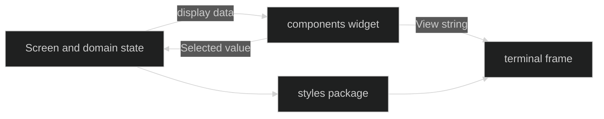

# Components

The `github.com/looprig/tui/components` package contains small Bubble Tea and string-rendering widgets. They are presentation components, not session controllers. `InputBox` owns a textarea editor. `SlashComplete`, `FileComplete`, and `ValueComplete` own filtered cursor state. `SessionComplete` owns secret-free session records. Package `tui` computes domain candidates and dispatches actions; these widgets render and select them.

## Component boundary

Components copy caller-owned slices where a live tray must not change underneath keyboard input. Empty candidate lists return `nil` from their constructors, which is the hidden-panel signal used by the screen. Selection methods wrap or select within the visible window, while rendering methods clamp to terminal display columns without changing the selected value.

## Input and completion

[InputBox](/docs/guides/tui/components/input/) documents the auto-growing editor, its newline bindings, and the modern panel options. [Completion Trays](/docs/guides/tui/components/completion/) covers slash, file, and typed runtime choices. [Session Completion](/docs/guides/tui/components/sessions/) covers the two-line record renderer used by session browsing.

The widgets do not expose a public keymap or layout engine. A host should route Bubble Tea messages to the documented methods and let the main screen decide which action a selection means. This keeps completion display reusable without making the component package own command policy.

## Display-only data

`FileItem.Path` remains the exact completion payload while control runes are sanitized only in the rendered label. `ValueItem.ID` is the opaque selection payload; `Label`, `Description`, and `Aliases` are matching metadata. `SessionItem` is already formatted and secret-free. Treat these structs as view data and do not put credentials, full prompts, or unredacted tool arguments in them.

## Component pages

- [InputBox](/docs/guides/tui/components/input/)
- [Completion Trays](/docs/guides/tui/components/completion/)
- [Session Completion](/docs/guides/tui/components/sessions/)

## Source

- [Input component](https://github.com/looprig/tui/blob/main/components/input.go)
- [Slash completion](https://github.com/looprig/tui/blob/main/components/slashcomplete.go)
- [Value completion](https://github.com/looprig/tui/blob/main/components/valuecomplete.go)
- [File completion](https://github.com/looprig/tui/blob/main/components/filecomplete.go)
- [Session completion](https://github.com/looprig/tui/blob/main/components/sessioncomplete.go)

## Proof

- [Input tests](https://github.com/looprig/tui/blob/main/components/input_test.go)
- [Slash completion tests](https://github.com/looprig/tui/blob/main/components/slashcomplete_test.go)
- [Value completion tests](https://github.com/looprig/tui/blob/main/components/valuecomplete_test.go)
- [File completion tests](https://github.com/looprig/tui/blob/main/components/filecomplete_test.go)
- [Session completion tests](https://github.com/looprig/tui/blob/main/components/sessioncomplete_test.go)
- [TUI module release record](https://github.com/looprig/tui/releases/tag/v0.15.1)
