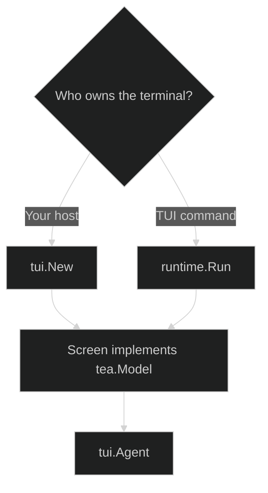

# Getting Started

There are two supported composition shapes. Embed `tui.New` when your application already has a Bubble Tea program or another terminal host. Call `runtime.Run` when the TUI is the process-level entry point. Both paths use the same `tui.Agent`, event, gate, and close contracts.

## Two entry shapes

`tui.New` returns a `tui.Screen`, which satisfies the Bubble Tea model methods and exposes the final-agent and handoff seams used by a process runner. `runtime.Run` opens the agent, builds the screen, runs Bubble Tea, restores standard streams, and closes whichever agent is live when the model exits.

## Before you start

Provide an `Agent` implementation backed by your session layer. It must be able to submit `content.Block` values, subscribe to Harness events, report its active loop, answer gates, interrupt a turn, and close. If the application supports `/clear`, provide an `OpenAgent` function that creates a replacement using the same context and session policy.

For a durable session, prefer `sessionadapter.NewWithReplay` for a new session whose primer events were committed before the screen subscribed, or `sessionadapter.Restore` for a restored session. `sessionadapter.New` is the explicit no-replay constructor for ephemeral or already-empty sessions.

## Next pages

- [Create a TUI Screen](/docs/guides/tui/getting-started/create) shows the screen constructor and option seams.
- [Run a TUI Entry Point](/docs/guides/tui/getting-started/run) shows the process-level runner.
- [Events and Projections](/docs/guides/tui/runtime/events) explains the whole-session stream.
- [Harness Sessions and Gates](/docs/guides/tui/integration/harness) wires the adapter to Harness.

## Source

- [Root API](https://github.com/looprig/tui/blob/main/api.go)
- [Root API compile-time proof](https://github.com/looprig/tui/blob/main/api_test.go)

## Proof

- [Root API compile-time proof](https://github.com/looprig/tui/blob/main/api_test.go)
- [TUI module release record](https://github.com/looprig/tui/releases/tag/v0.16.1)
