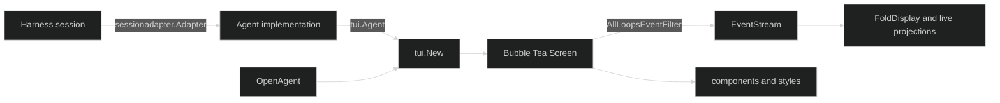

# TUI

The `github.com/looprig/tui` module is the reusable terminal surface for a Looprig application. It gives an application a Bubble Tea screen, a narrow `Agent` seam, a session adapter for Harness, small completion and input components, and a shared dark-terminal style vocabulary. The package owns presentation and terminal plumbing. Your composition root still owns agent construction, session stores, credentials, workspaces, and the process exit point.

## The TUI boundary

The root `tui` package keeps its public contract deliberately small. `tui.New` constructs a `tui.Screen` from an implementation of `tui.Agent`, an `tui.OpenAgent` function used by `/clear`, an `tui.AgentBanner`, and optional browser or session metadata. `tui.Agent` contains the operations the screen needs: submit input, observe events, answer gates, interrupt, compact, and close a session. The TUI does not import a concrete coding agent.

The package also re-exports the event-facing types that a composition root needs, including `EventStream`, `DisplayProjection`, `SessionPresentation`, `SessionBrowser`, `RuntimeCatalog`, `RuntimeController`, `Status`, and `ToolCallView`. These aliases preserve the type identity of the presentation implementation while keeping consumers on the stable root import path.

## Choose an entry point

Start with [Create a TUI Screen](/docs/guides/tui/getting-started/create/) when another process already owns Bubble Tea and needs a model. Start with [Run a TUI Entry Point](/docs/guides/tui/getting-started/run/) when your command is the process owner and should get logging, signal handling, stdout capture, and bounded teardown from `runtime.Run`.

The [Runtime](/docs/guides/tui/runtime/) section explains the event and lifecycle contracts shared by both entry points. [Session Adapter](/docs/guides/tui/runtime/session-adapter/) is the bridge from Harness sessions to `tui.Agent`; it is the normal choice for a durable session. [Restore and Replay](/docs/guides/tui/runtime/restore/) covers cold repaint after a restored session.

## How data moves

The screen consumes one whole-session `EventStream`. `tui.AllLoopsEventFilter` asks Harness for both Enduring and Ephemeral events from every loop, so a focused child loop can stream live output. The live reducer and `tui.FoldDisplay` use the same event-driven projection rules. A restore folds durable history first, then releases buffered live deliveries in order.

User input travels in the opposite direction. The screen calls `Agent.Submit` or `Agent.SubmitToLoop`, receives an input correlation ID, and waits for events to render the authoritative turn. A permission, AskUser, form, or open-URL prompt is answered through an explicit gate method. A missing gate returns a fail-secure error rather than guessing which loop should receive the reply.

## Related Looprig contracts

The screen is a consumer of [Harness sessions and events](/docs/guides/harness/), not a replacement for them. Use [Tools](/docs/guides/tools/) to understand preparation, permission requirements, and tool results that become TUI gate cards and tool summaries. Use the [Protocols](/docs/guides/protocols/) guides when the agent behind the TUI speaks ACP or MCP. The TUI only renders the resulting session contract.

There are no separate public TUI pages for keymaps or layout engines. Those details belong to the internal presentation implementation and Bubble Tea integration. The public surfaces are the `Screen`, `Agent`, components, styles, and adapters documented here.

## Source

- [Root API](https://github.com/looprig/tui/blob/main/api.go)
- [Root API compile-time proof](https://github.com/looprig/tui/blob/main/api_test.go)

## Proof

- [Root API compile-time proof](https://github.com/looprig/tui/blob/main/api_test.go)
- [TUI module release record](https://github.com/looprig/tui/releases/tag/v0.15.1)
