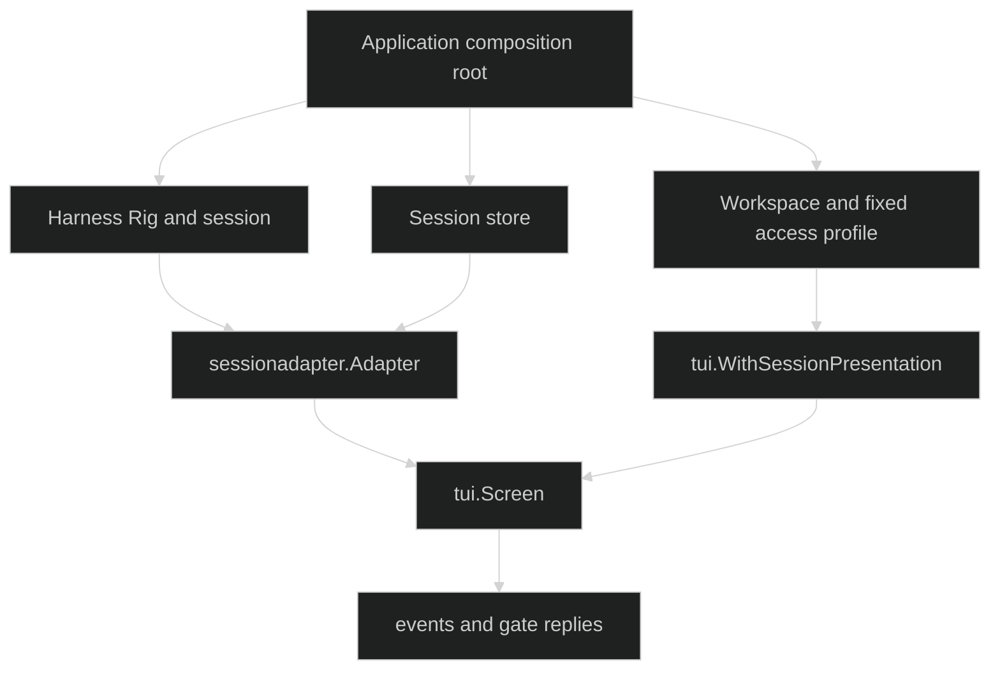

# Integration

The TUI integrates at three narrow boundaries. Harness supplies a `session.SessionController` and event contract. The application supplies synchronous workspace and access-profile metadata. A session store supplies a durable event replayer when the screen needs a cold repaint or gap repair. Each owner remains explicit.

## Integration boundary

The adapter does not instantiate the Rig or call restore by itself. The composition root performs session creation or restore, then wraps the resulting controller. The TUI renders what the session contract publishes and what the consumer explicitly presents.

## Harness and restore

[Harness Sessions and Gates](/docs/guides/tui/integration/harness/) shows `sessionadapter.NewWithReplay`, `sessionadapter.Restore`, and the `restore.Decider` wiring used before Bubble Tea starts. It also explains the gate coordinates that keep permission replies on the correct loop.

## Workspace metadata

[Workspaces and Session Presentation](/docs/guides/tui/integration/workspaces/) documents `SessionPresentation`, the fixed profile badge, pre-gate diagnostics, and resumed-session refresh. The TUI displays workspace context. It does not grant access or mutate the active profile.

## Durable replay

[Session Stores and Durable Replay](/docs/guides/tui/integration/session-stores/) documents the `ReplayOpener` interface, journal sequence recovery, and the difference between `New`, `NewWithReplay`, and `Restore`.

For the capabilities being rendered, read [Tools](/docs/guides/tools/) and [Harness](/docs/guides/harness/).

## Source

- [Root integration aliases](https://github.com/looprig/tui/blob/main/api.go)
- [Harness session adapter](https://github.com/looprig/tui/blob/main/sessionadapter/adapter.go)
- [Restore decider](https://github.com/looprig/tui/blob/main/restore/decider.go)
- [Session adapter example](https://github.com/looprig/tui/blob/main/examples/sessionadapter/example_test.go)

## Proof

- [Adapter behavior tests](https://github.com/looprig/tui/blob/main/sessionadapter/adapter_test.go)
- [Restore decider tests](https://github.com/looprig/tui/blob/main/restore/decider_test.go)
- [Session adapter example](https://github.com/looprig/tui/blob/main/examples/sessionadapter/example_test.go)
- [TUI module release record](https://github.com/looprig/tui/releases/tag/v0.16.1)
