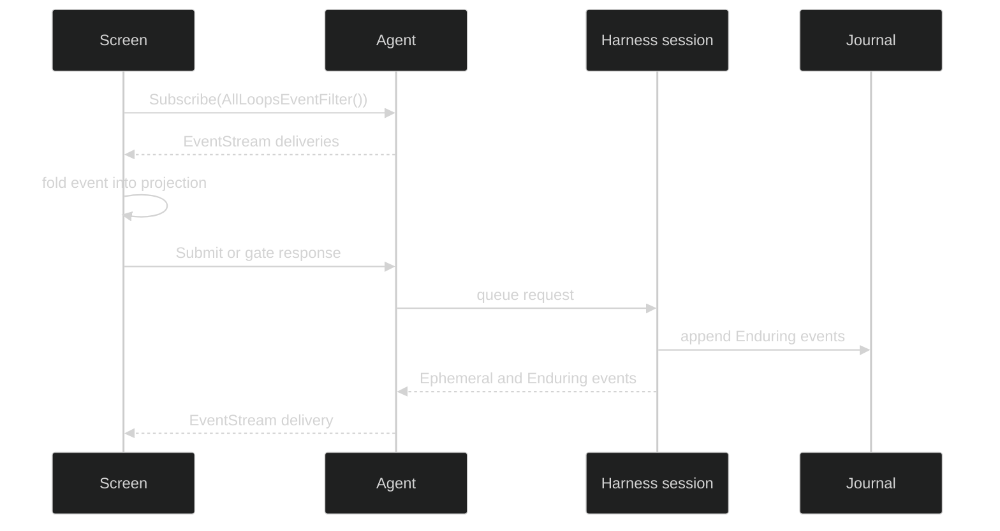

# Runtime

The TUI runtime is an event-driven Bubble Tea model. It does not poll a model provider or read a journal directly from the screen. It receives a whole-session `EventStream`, folds events into the focused display, and sends typed requests through `tui.Agent` when a user submits input, interrupts, changes a per-loop runtime choice, or answers a gate.

## Runtime shape

The initial `Screen.Init` focuses the composer, schedules the startup notice, begins a restore barrier, and attaches one all-loop subscription. The update loop re-arms the reader after each delivery. A subscription closes intentionally when the agent closes or with a typed loss error when the hub forces it closed.

## Event-first presentation

`Agent.Submit` and `Agent.SubmitToLoop` are fire-and-forget requests. Their returned IDs correlate to later lifecycle and content events. The screen does not optimistically commit an assistant turn from the request result. This keeps queued input, turn state, tool cards, and gate prompts authoritative from the event stream.

The focused loop is a view choice. `AllLoopsEventFilter` delivers every loop, and the projection keeps each loop's state so focus can move without reopening a subscription. A child loop can therefore stream while it is focused, while the session's active loop remains a separate routing concept.

## Runtime pages

- [Events and Projections](/docs/guides/tui/runtime/events/) covers `Agent`, `EventStream`, filters, and `FoldDisplay`.
- [Commands and Gates](/docs/guides/tui/runtime/commands/) covers input, compaction, interrupt, runtime controls, and gate replies.
- [Restore and Replay](/docs/guides/tui/runtime/restore/) covers the cold-restore barrier and durable backlog.
- [Lifecycle and Handoffs](/docs/guides/tui/runtime/lifecycle/) covers statuses, close ownership, and `/clear` replacement.
- [Session Adapter](/docs/guides/tui/runtime/session-adapter/) covers the Harness implementation of the agent seam.

## Source

- [Runtime runner](https://github.com/looprig/tui/blob/main/runtime/run.go)
- [Screen model](https://github.com/looprig/tui/blob/main/internal/presentation/screen.go)
- [Runtime behavior tests](https://github.com/looprig/tui/blob/main/runtime/run_test.go)

## Proof

- [Screen behavior tests](https://github.com/looprig/tui/blob/main/internal/presentation/screen_test.go)
- [Runtime behavior tests](https://github.com/looprig/tui/blob/main/runtime/run_test.go)
- [TUI module release record](https://github.com/looprig/tui/releases/tag/v0.15.1)
