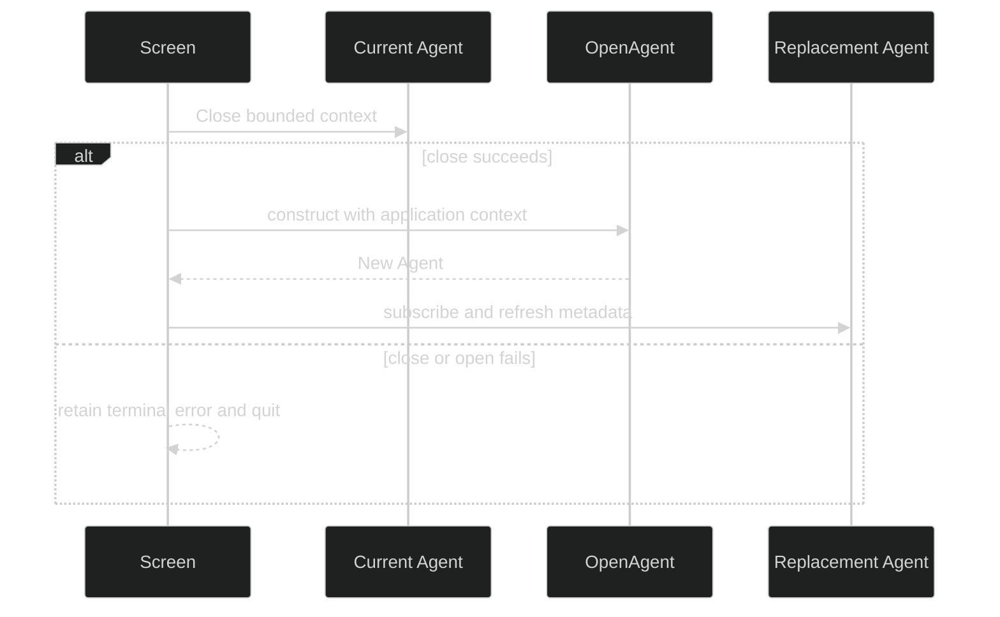

# Lifecycle and Handoffs

The screen has an explicit turn lifecycle and a separate ownership lifecycle. A turn can be idle, running, interrupting, or resetting for `/clear`. Agent ownership moves from the current session to a replacement only after the current session closes. The process runner then closes whichever agent the final model reports.

## Status states

The public `tui.Status` constants are:

| State | Meaning | Input behavior |
| --- | --- | --- |
| `StatusIdle` | No turn is in flight. | Enter submits immediately. |
| `StatusRunning` | A turn is active. | Enter queues input. |
| `StatusInterrupting` | An interrupt was sent. | Wait for a terminal event. |
| `StatusResetting` | `/clear` is closing and reopening a session. | Submission and queueing are blocked. |

`tui.RenderStatusLine` renders a standalone status indicator for integrations that need the same label outside the full screen.

## Ownership

`Agent.Close` is the single session shutdown operation. The TUI closes its subscription and calls close through a bounded context. Close is expected to be idempotent because the screen's quit path and `runtime.Run` both provide a best-effort backstop. The agent owns session lifetime, workspace leases, snapshots, and garbage collection. The TUI does not create a second root context or ticker for them.

`AgentHolder` exposes the current live agent from a final model. `TerminalErrorHolder` carries a fatal transport or handoff cause that Bubble Tea's normal nil quit result cannot express. `HandoffFinalizer` is the barrier the process runner crosses before a composition root closes stores that a late replacement might still need.

## Clear handoff

There is no rollback after closing the old agent. If opening fails, the old session cannot be resumed. If a partial replacement arrives after a failed handoff, the coordinator closes it exactly once. This fail-closed behavior is why `OpenAgent` must honor cancellation and why the runner retains the final model until handoff cleanup completes.

## Finalization

At process exit, `runtime.Run` promotes a `TerminalErrorHolder` error when Bubble Tea itself returned nil, closes the current `AgentHolder` agent with a five-second bound, and calls `HandoffFinalizer` before returning its exit code. These interfaces are small on purpose. The composition root depends only on the lifecycle facts it needs.

## Source

- [Status constants](https://github.com/looprig/tui/blob/main/internal/presentation/status.go)
- [Agent holder and handoff interfaces](https://github.com/looprig/tui/blob/main/internal/presentation/agentholder.go)
- [Command lifecycle](https://github.com/looprig/tui/blob/main/internal/presentation/commands.go)
- [Screen lifecycle](https://github.com/looprig/tui/blob/main/internal/presentation/screen.go)
- [Process teardown](https://github.com/looprig/tui/blob/main/runtime/run.go)

## Proof

- [Screen lifecycle tests](https://github.com/looprig/tui/blob/main/internal/presentation/screen_test.go)
- [Runtime teardown tests](https://github.com/looprig/tui/blob/main/runtime/run_test.go)
- [Command lifecycle tests](https://github.com/looprig/tui/blob/main/internal/presentation/commands_test.go)
- [TUI module release record](https://github.com/looprig/tui/releases/tag/v0.16.1)
