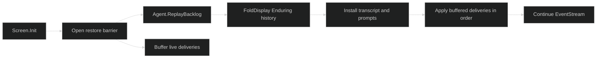

# Restore and Replay

Restoring a session is a presentation barrier, not a second live session. The TUI first obtains the restored agent's durable Enduring backlog, folds it into the same projections used by live events, and then applies deliveries that arrived while the backlog was being read. This prevents a restored conversation from painting stale history over a new event.

## Restore barrier



`Agent.ReplayBacklog` returns a materialized, session-ordered slice. A new session returns an empty backlog and skips the repaint. A read failure becomes a non-fatal restore notice while the live subscription continues. Ephemeral timing is not journaled, so restored thinking durations can differ from a live render without making the committed transcript unequal. A permission card's diff preview is also live-only, so a prompt reconstructed from the backlog shows its requirements and actions but no diff unless a live delivery supplies one.

## Pure repaint

```go
live := tui.FoldDisplay(enduringEvents)
restored := tui.FoldDisplay(replayedBacklog)
if !restored.EqualTranscript(live) {
	return errors.New("restored display differs from live committed transcript")
}
fmt.Println(restored.CommittedLen(), restored.PendingPrompts())
```

`EqualTranscript` intentionally compares committed content, tool cards, ordering, and prompt-independent transcript state while normalizing live-only thinking timing. `PendingPrompts` covers the prompt dimension that transcript equality excludes. Use this pair in restore verification and examples, not in a render hot path.

## Adapter restore

`sessionadapter.Restore` performs the durable replay required to reconstruct the adapter's public backlog and open-gate index before returning an `Agent`. It takes a Harness `session.SessionController` and a narrow `ReplayOpener`. `NewWithReplay` uses the same path for a newly created session when primers were committed before the client subscribed.

The adapter retains the highest consumed journal sequence. If the live subscription loses a hub buffer range, it opens a new journal replayer at the inclusive sequence, repairs the gap, drops overlap, and forwards newer deliveries. This keeps recovery in journal order without making the TUI own a cursor.

## Source

- [Display fold and restore projection](https://github.com/looprig/tui/blob/main/internal/presentation/restore.go)
- [Screen restore barrier](https://github.com/looprig/tui/blob/main/internal/presentation/screen.go)
- [Session adapter restore](https://github.com/looprig/tui/blob/main/sessionadapter/adapter.go)
- [Replay subscription](https://github.com/looprig/tui/blob/main/sessionadapter/replaying_subscription.go)

## Proof

- [Restore projection tests](https://github.com/looprig/tui/blob/main/internal/presentation/restore_test.go)
- [Adapter tests](https://github.com/looprig/tui/blob/main/sessionadapter/adapter_test.go)
- [Restore and replay example](https://github.com/looprig/tui/blob/main/examples/restore/example_test.go)
- [TUI module release record](https://github.com/looprig/tui/releases/tag/v0.21.1)
