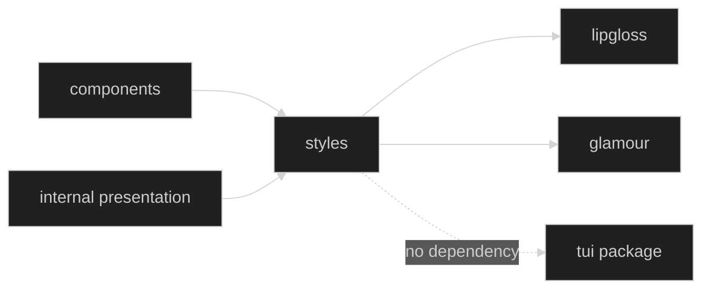

# Styling

The `github.com/looprig/tui/styles` package is a leaf package over Lip Gloss and Glamour. It owns shared terminal styles, color tokens, background fill helpers, markdown configuration, and semantic tool-node rendering. It does not import `tui`, `components`, or Harness, so a component can use the same visual vocabulary without creating a package cycle.

## Leaf boundary

The public variables are shared style values. They are exported for component composition, not as a runtime theme registry. A host can use the tokens directly, but should preserve the semantic distinction between user rails, action cards, status text, tool nodes, and selection fills.

## Shared vocabulary

The package exposes the `AccentBar`, `Dot`, `SubagentCursor`, and workflow markers used by transcript rows. It also exposes role styles such as `UserStyle`, `ThinkingStyle`, `StatusStyle`, `ToolCallStyle`, and `ToolResultStyle`, plus card and tray styles. `NoticeStyle(level)` maps info, warning, and error levels to a safe style, with unknown values falling back to neutral info.

`FillLineBackgroundWith` is the modern full-width fill primitive. It reopens the background after inner ANSI resets and pads to display width, so a styled markdown span cannot punch a hole in a composer or card panel.

## Styling pages

- [Styles and Layout Tokens](/docs/guides/tui/styling/styles) catalogs the semantic styles and background helpers.
- [Markdown Rendering](/docs/guides/tui/styling/markdown) covers Glamour configuration and responsive table rendering.

There is no public keymap or layout package in the TUI module. Key bindings and frame layout are internal presentation policy. Compose public style values around a `Screen` or component instead of depending on internal view structs.

## Source

- [Shared styles](https://github.com/looprig/tui/blob/main/styles/styles.go)
- [Card styles](https://github.com/looprig/tui/blob/main/styles/card.go)
- [Styles package tests](https://github.com/looprig/tui/blob/main/styles/styles_test.go)

## Proof

- [Styles behavior tests](https://github.com/looprig/tui/blob/main/styles/styles_test.go)
- [Markdown table tests](https://github.com/looprig/tui/blob/main/styles/markdown_tables_test.go)
- [TUI module release record](https://github.com/looprig/tui/releases/tag/v0.16.1)
