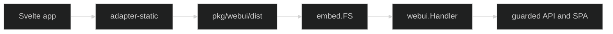

# Embedding

## Choose the embedding boundary

The app build writes its pages and assets to `pkg/webui/dist`. The Go package exposes `embed.FS` for callers that need the embedded tree and `Handler()` for ordinary HTTP serving. A real asset is served as-is; an unknown client route falls back to `dist/index.html` so browser routing can resolve paths such as `/sessions/{sid}`.

```go
package main

import (
  "net/http"

  "github.com/looprig/client/pkg/webui"
)

func main() error {
  return http.ListenAndServe(":8080", webui.Handler())
}
```

Keep the [Client SDK](/docs/guides/web-ui/client-sdk) framework-neutral inside the app, then choose [Static bundle](/docs/guides/web-ui/embedding/static-bundle) for the build and [Go webui package](/docs/guides/web-ui/embedding/go-webui) for serving.

## Build and serve flow

The build produces one static shell, Go embeds the `dist` subtree, and the composed handler sends `/api/` to the BFF while the SPA handles every other path. [Application integration](/docs/guides/web-ui/embedding/app-integration) documents the final guarded composition.



The embedding boundary contains no protocol implementation. It only serves the built app and preserves the same-origin relationship that lets `createBFFClient` call relative `/api/v1` paths.

## Source

The exported `embed.FS`, `Handler`, asset confinement, and SPA fallback are implemented in [`pkg/webui/webui.go`](https://github.com/looprig/client/blob/main/pkg/webui/webui.go). Build output and the static adapter are configured in [`app/vite.config.ts`](https://github.com/looprig/client/blob/main/app/vite.config.ts).

## Proof

The Go package and Vite configuration establish a direct build-to-embed path: both pages and assets target `pkg/webui/dist`, and the server reads that same subtree through `embed.FS`. Continue to [Go webui package](/docs/guides/web-ui/embedding/go-webui) for request handling details.
