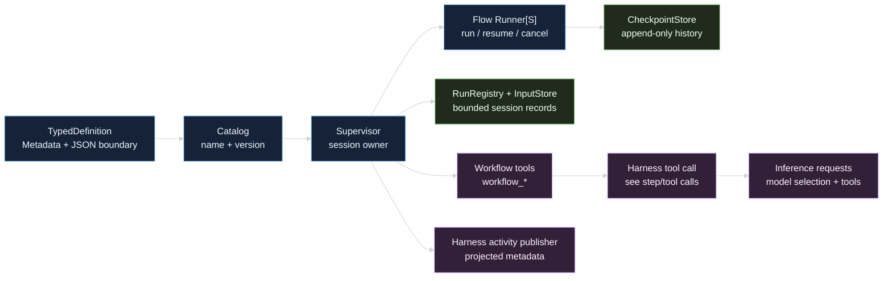

# Workflows

The `github.com/looprig/workflows` module is the storage-neutral bridge between a versioned developer definition and a session-owned execution. A definition supplies metadata, strict JSON input boundaries, and a typed [Flow](/docs/modules/flow) runner. A `Catalog` resolves the definition by name and version. A `Supervisor` owns the session lease, durable run records, checkpoint adoption, cancellation, and projected activity. The optional workflow tool bundle exposes that runtime to a model or another Harness tool caller.

This guide is for the developer who needs to answer four questions:

- What is the stable definition that can be registered and resumed?
- Which part belongs to the Flow graph, and which part belongs to Workflows?
- Where do run metadata, checkpoints, input bytes, and public history live?
- How can Harness expose, recover, cancel, and observe a run safely?

## The boundary at a glance

Workflows composes several contracts. It does not replace the graph engine, the inference client, or the Harness tool runner.

| Concern | Workflows owns | Neighboring module |
| --- | --- | --- |
| Definition identity | `Metadata`, strict input and resume schemas, `Catalog` | The graph implementation is supplied by [Flow](/docs/modules/flow) |
| Graph execution | Delegation through `Definition.Start`, `Resume`, `Get`, and `Cancel` | Flow's `Runner[S]`, tasks, vertices, and checkpoint store |
| Session execution | `RunRegistry`, `InputStore`, `Supervisor`, leases, CAS transitions | [Harness](/docs/modules/harness) supplies session services |
| Model-facing surface | `workflow_*` invokable tools and bounded JSON results | [Tools](/docs/modules/tools) and the Harness tool call path |
| Model access inside a task | Not assumed by this package | [Inference](/docs/modules/inference) request and response contracts |
| User-visible progress | Projected `WorkflowActivityMetadata` only | Harness converts it to its workflow activity event |

The useful mental model is a wrapper, not two competing runtimes:



## A workflow is a definition plus a run

The definition is immutable after registration. Its `Metadata` identifies a lowercase name, an immutable version string, a description, an input schema, an optional resume schema, and display metadata for graph vertices. `TypedDefinition[S]` binds that metadata to a `*flow.Runner[S]`, a `flow.CheckpointStore`, decoders, and an optional status summarizer.

The run is session-owned durable metadata. It records the workflow name and version, the Workflows run ID, the Flow `GraphRunID`, the input reference, status, checkpoint revision, projected activity cursor, timestamps, and artifact namespace descriptors. The registry record is intentionally bounded. The input bytes and Flow checkpoint state are not copied into a public tool result.

## Choose the page for the job

| If you are trying to... | Read |
| --- | --- |
| Define schemas, typed state, decoders, and registration | [Workflow definitions and schemas](/docs/guides/workflows/workflow-runtime/definitions) |
| Start a session owner and understand adoption | [Workflow runtime and supervisors](/docs/guides/workflows/workflow-runtime/runtime) |
| Inspect checkpoints, registry records, and activity cursors | [State, checkpoints, and history](/docs/guides/workflows/workflow-runtime/state-and-history) |
| Pause a vertex, resume with user input, or recover after restart | [Interruption, resume, and recovery](/docs/guides/workflows/workflow-runtime/interruption-and-resume) |
| Reason about statuses, CAS transitions, cancellation, and failure | [Statuses, cancellation, and failure](/docs/guides/workflows/workflow-runtime/lifecycle) |
| Expose runs through the seven `workflow_*` tools | [Workflow tools](/docs/guides/workflows/workflow-tools) |
| Bind a supervisor to Harness services and activity publication | [Harness integration](/docs/guides/workflows/workflow-tools/harness-integration) |
| Build the underlying graph and understand Flow's role | [Flow graph composition](/docs/guides/workflows/flow) |

For the surrounding call path, compare [Harness model requests](/docs/guides/harness/step/model-request), [Harness tool calls and results](/docs/guides/harness/step/tool-calls-and-results), [Inference model selection](/docs/guides/inference/requests/model-selection), and [Inference tools](/docs/guides/inference/requests/tools). Those pages explain the caller and provider boundaries. The Workflows pages explain what happens after a workflow tool call has been admitted.

## Minimal composition

The following is the shape of a definition before it is put behind a session supervisor. The graph construction itself is covered in [Flow graph composition](/docs/guides/workflows/flow).

```go
package main

import (
	"context"
	"encoding/json"
	"fmt"

	"github.com/looprig/flow/pkg/flow"
	"github.com/looprig/workflows"
)

type state struct{ Count int `json:"count"` }

func buildDefinition(store flow.CheckpointStore) workflows.Definition {
	// The graph is compiled once. Workflows supplies the versioned JSON boundary.
	graph := flow.NewGraph[state](flow.GraphID{1})
	vertexID := flow.VertexID{2}
	task := flow.NewFuncTask(func(_ context.Context, count int) (int, error) {
		return count + 1, nil
	})
	must(flow.AddVertex(graph, vertexID, task,
		func(value state) int { return value.Count },
		func(value *state, output int) error { value.Count = output; return nil },
	))
	runner, err := graph.Compile(vertexID, vertexID, flow.WithStore(store))
	must(err)
	metadata, err := workflows.NewMetadata("counter_flow", "v1", "Increment a counter.",
		json.RawMessage(`{"type":"object","properties":{"count":{"type":"integer"}},"required":["count"],"additionalProperties":false}`),
		nil, []workflows.VertexMetadata{workflows.NewVertexMetadataForID(vertexID, "increment")})
	must(err)
	typed, err := workflows.NewTypedDefinition(metadata, runner, store,
		workflows.StrictJSONDecoder[state], nil, nil)
	must(err)
	catalog := workflows.NewCatalog()
	must(catalog.Register(typed))
	definition, err := catalog.Resolve("counter_flow", "v1")
	must(err)
	return definition
}

func main() {
	definition := buildDefinition(flow.NewMemStore())
	input, err := definition.ValidateInput(json.RawMessage(`{"count":1}`))
	must(err)
	result, err := definition.Start(context.Background(), input)
	must(err)
	fmt.Println(result.Run.Status, string(result.State))
}

func must(err error) {
	if err != nil {
		panic(err)
	}
}
```

This is runnable with the published `flow` and `workflows` modules. A caller should not manufacture a `ValidatedInput` value. Call `ValidateInput`, then pass its returned token to `Start`; the token prevents input validated by one registered definition from being used by another.

## Source

- [doc.go](https://github.com/looprig/workflows/blob/main/doc.go)

## Proof

- [examples/docs_contract_test.go](https://github.com/looprig/workflows/blob/main/examples/docs_contract_test.go)
